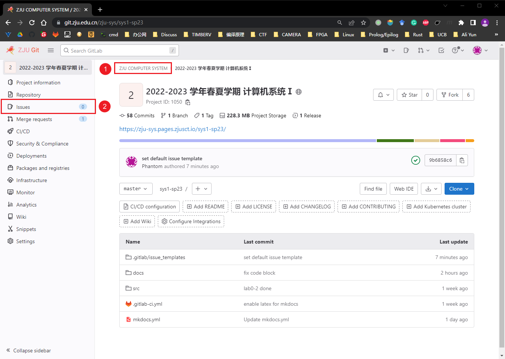
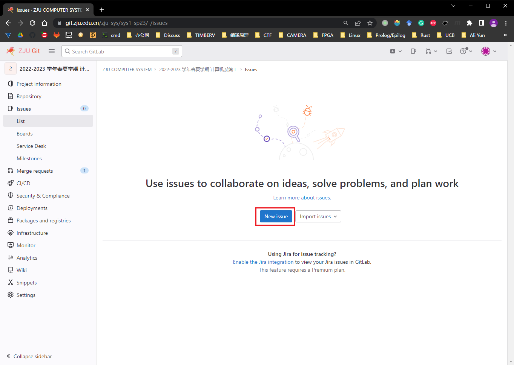
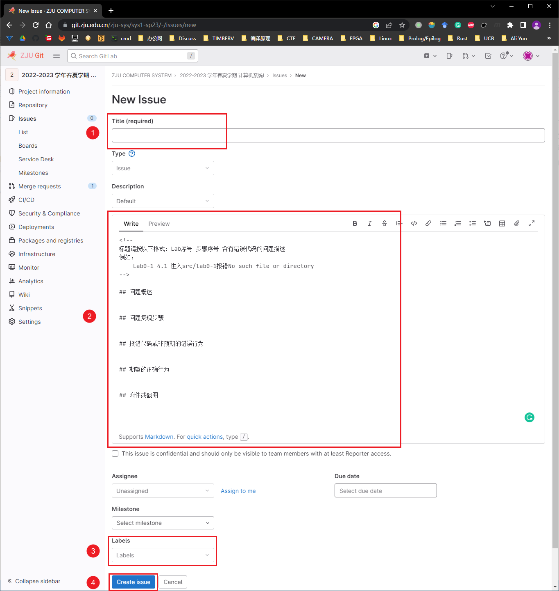

# 提问的正确姿势

我们意识到同学们的问题是相似的，为了提高解答同学们疑问的效率，请同学们使用 issue 来提出自己的问题。这样有相似问题的同学能够直接检索到相关的问题，无需等待 TA 的回复了。

同时，如果你已经解决了相似的问题，我们也十分欢迎同学们来回复其他同学的 issue。

1. 在 [ZJU Git](https://git.zju.edu.cn/) 中注册一个账号
2. 接下来进入[官方仓库](https://git.zju.edu.cn/zju-sys/sys1/sys1-sp{{ year }})页面，点击左侧的 `Issues`
    1. 首先检查当前你是否正在浏览 ZJU COMPUTER SYSTEM 账户下的仓库
    2. 无误的话，点击 Issues 项

    

3. 点击 New issue
    

4. 填写 issue 表单并提交
    1. 标题请按照 `Lab序号 步骤序号 含有错误代码的问题描述` 编写，方便其他同学能够检索到关键信息；
    2. 在编辑框中描述你的问题；
    3. 选择 issue 的类型，即 Question；如果你发现了手册中的错误，选择 Bug；其他建议选择 Suggestion；
    4. 提交你的 issue。

    
