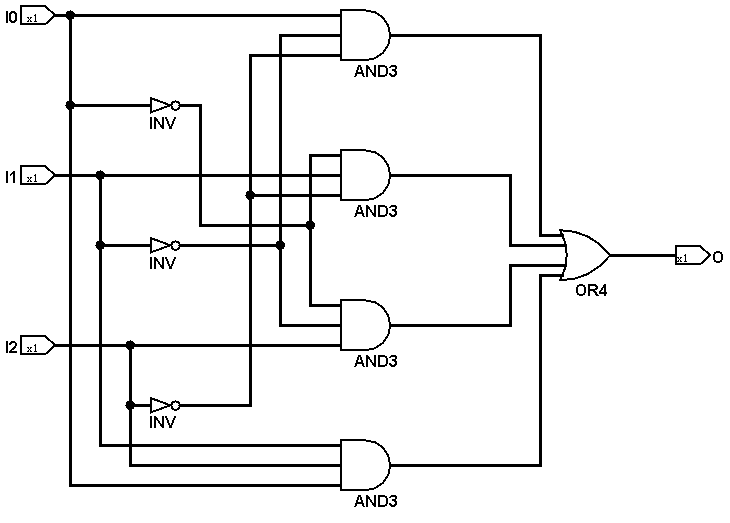
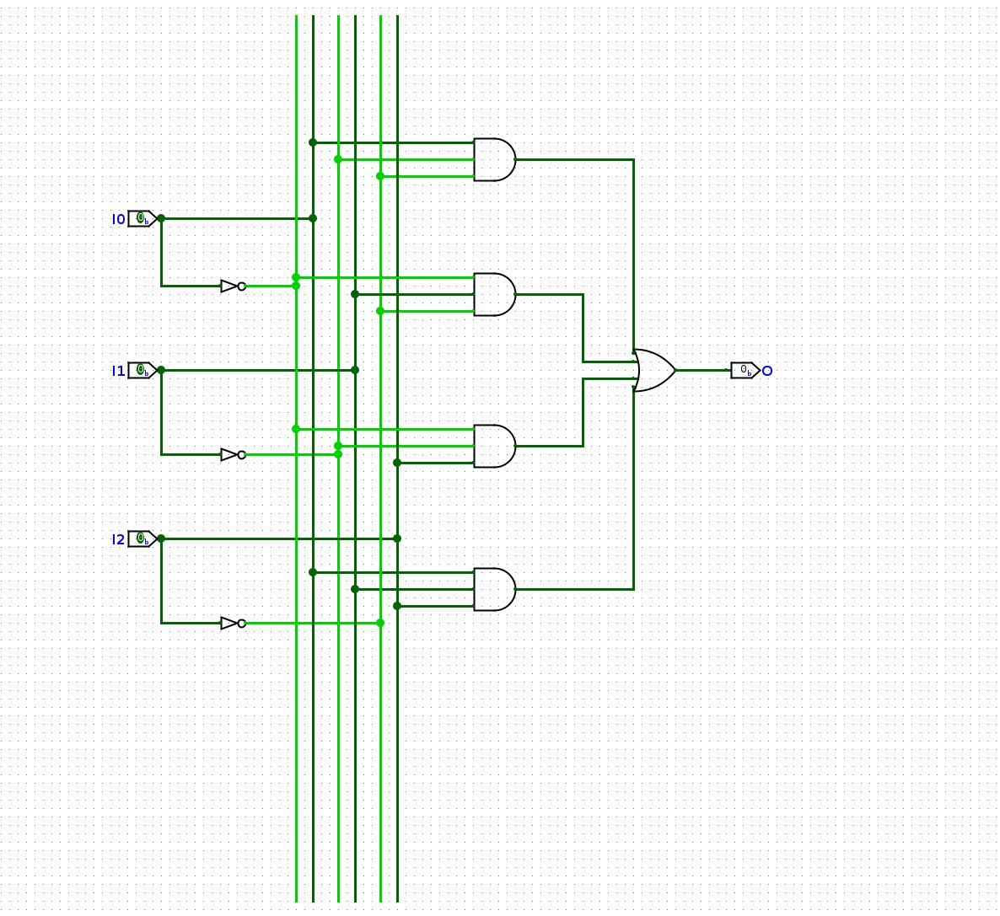

# 实验 0-1：数字电路仿真环境准备

## 实验目的

- 了解基本元器件电压特性
- 掌握用于设计和仿真数字逻辑电路的 Logisim 的基本使用方法
- 理解硬件语言在电路级别的映射关系


## 实验环境

- EDA工具：[Ngspice](https://ngspice.sourceforge.io)，[Logisim-evolution](https://github.com/logisim-evolution/logisim-evolution)
- 操作系统：Windows 10+ 22H2，Ubuntu 24.04+
- VHDL：Verilog

## 背景知识

### Linux 使用基础

在 Linux 环境下，人们通常使用命令行接口来完成与计算机的交互。终端 (Terminal) 是用于处理该过程的一个应用程序，通过终端你可以运行各种程序以及在自己的计算机上处理文件。在类 Unix 的操作系统上，终端可以为你完成一切你所需要的操作。下面我们仅对实验中涉及的一些概念进行介绍，你可以通过下面的链接来对命令行的使用进行学习：

1. [竺可桢学院 2023 年辅学课程「实用技能拾遗」](https://slides.tonycrane.cc/PracticalSkillsTutorial/2023-fall-ckc/#/)
2. [The Missing Semester of Your CS Education](https://missing-semester-cn.github.io/2020/shell-tools)，[Video](https://www.bilibili.com/video/BV1x7411H7wa?p=2)
3. [GNU/Linux Command-Line Tools Summary](https://tldp.org/LDP/GNU-Linux-Tools-Summary/html/index.html)
4. [Basics of UNIX](https://github.com/berkeley-scf/tutorial-unix-basics)

### SPICE

SPICE 是一种电路模拟软件，它可以模拟各种模拟电路的行为和性能。SPICE 的全称是 Simulation Program with Integrated Circuit Emphasis，是一种广泛使用的电路仿真工具。它由美国加州大学伯克利分校的电气工程与计算机科学系开发。

SPICE 可以模拟各种电路元件，例如电阻、电容、电感、二极管、晶体管等。用户可以使用 SPICE 来分析电路中的电流、电压、功率等参数，了解电路的性能和特性。

通过模拟电路的行为，SPICE 可以帮助工程师设计和验证电路的功能、性能和稳定性，从而减少在实际制造前需要进行的实验次数，降低了开发成本和时间。SPICE 的开发对电路模拟技术的发展做出了重要贡献，并被广泛应用于电路设计、电子产品制造、学术研究等领域。

SPICE 有很多不同的版本，我们后续实验使用的 Ngspice 是目前最广泛使用的开源版本实现。

### Logisim

Logisim 是一种数字逻辑电路仿真工具，用于模拟数字电路的行为和性能。它可以用于设计和验证各种数字电路，例如计算机处理器、逻辑门电路、寄存器、时序电路等。

Logisim 通常提供了直观的用户界面，其中包含各种数字逻辑元件的图标，例如 AND 门、OR 门、XOR 门、触发器、计数器等。用户可以使用这些图标来构建数字逻辑电路，然后使用仿真功能来验证电路的功能和性能。由于支持通过鼠标拖动来直观地绘制电路，因此被广泛应用于电子工程、计算机科学、通信系统等领域相关课程教学。

我们使用的 Logisim-evolution 是原版 Logisim 的扩展版本，增加了许多新特性和改进，使得它更加易用和强大。

## 实验步骤

### Linux环境配置

为了避免不必要的干扰因素，我们建议同学们的实验环境尽可能的和手册中给出的环境一致。

在后续的课程实验（包括系统II、III）中，几乎所有操作都需要在 Linux 环境下运行。根据 24 级经验，为了防止在计算机系统 II 中出现交叉编译错误问题，我们统一使用 Ubuntu 24.04 版本。我们建议各位同学通过以下任一方式配置你的实验环境：

1. 对于使用 macOS 的同学，我们建议使用虚拟机运行 Ubuntu 24.04
2. 对于使用 Windows 的同学，我们建议将系统更新至最新 22H2 版本，然后直接在微软应用商店中安装 Ubuntu 24.04 的 Windows Subsystem for Linux (WSL)

请参考[环境配置指南 for Windows](./setup.md) 和[环境配置指南 for Apple silicon Mac](./setup-mac.md) 进行安装，确保配置完成后你在终端中能够成功运行一个带 GUI 的应用。

!!! tip
    对于使用虚拟机的同学，你可以使用虚拟机的扩展功能来共享宿主机和虚拟机的文件系统。

    对于使用 WSL 的同学，WSL 和 Windows 的文件系统是互通的：
    
    - 打开 Windows 资源管理器，输入路径 `\\wsl.localhost\Ubuntu-24.04` 即可进入 WSL 的文件系统
        - e.g. WSL 的 home 在 `\\wsl.localhost\Ubuntu-24.04\home\<username>`
    - 在 WSL 中，Windows 的文件系统挂载在 `/mnt` 下，例如 C 盘就是 `/mnt/c`
        - e.g. 你的桌面的路径是 `/mnt/c/Users/<username>/Desktop`

完成环境配置后，在合适的路径下启动一个终端，安装 git 并克隆本仓库：

!!! Tip
    建议将我们的代码仓库放在你的家目录或其他 WSL 路径底下，避免将仓库放在挂载目录（如 /mnt/d/xxx）来避免可能的工具编译问题。

```shell
sudo apt install git
git clone https://git.zju.edu.cn/zju-sys/sys1/sys1-sp{{ year }}.git
```

!!! note "关于 apt"
    apt 是 Ubuntu 24.04 惯用的包管理工具，可以执行 `sudo apt install <应用名>` 来安装对应的软件，apt 会自动在自己的软件源序列中搜索有无该应用，然后自动下载安装该应用，并将应用加入环境变量。相比于 windows 需要手动下载安装包、运行安装、配置环境路径、设置快捷方式等，要方便很多。

    在使用 apt 安装软件的时候会出现诸如 `Unable to locate package` 的报错，说明 apt 无法在当前软件源中找到需要下载的该应用，此时可以执行 `sudo apt update` 或者 `sudo apt upgrade` 来更新 apt 的软件源，也许可以解决该问题。必要的时候需要科学上网或者使用国内镜像源（如 [ZJU mirror](https://mirrors.zju.edu.cn/docs/ubuntu/), [清华 Tuna](https://mirror.tuna.tsinghua.edu.cn/help/ubuntu/) 等，可在各自官网找到合适自己版本的配置方式）。


### 反相器的电压传输特性

#### 工具安装

在终端中输入以下命令进行安装：

```shell
sudo apt install ngspice
```

#### SPICE 仿真

进入到本仓库下的 `src/lab0-1` 目录，执行以下命令，运行成功会观察到弹出黑色背景的对话框：

```shell
cd sys1-sp{{ year }}/src/lab0-1
ngspice inv.sp
```

下面我们简单介绍下 inv.sp 中的内容，本段内容不要求掌握，仅方便理解。

???+ info "inv.sp 内容"

    ```spice
    X0 Vout Vin VGND VGND sky130_fd_pr__nfet_01v8 w=650000u l=150000u
    X1 Vout Vin VPWR VPWR sky130_fd_pr__pfet_01v8_hvt w=1e+06u l=150000u
    ```

    SPICE 网表采用了结构化的描述方法，上面列出的是描述电路结构最核心的两条语句。该反相器基于 Skywater 130nm 工艺，使用了两个 MOSFET 组成，分别叫做 X0、X1。接下来的四组数据对应连接 MOSFET 的 drain、gate、source、body 四个端口的连线，也就是说电路的原理图如下图所示：

    <center>
    { width="300" }
    </center>

    接下来是所使用的 MOSFET 的具体名称，最后是 MOSFET 的参数，值得注意的是他们的沟道长度是 150nm 并不是 130nm。

    在弹出的窗口中，蓝色的曲线代表 Vin，红色的曲线代表 Vout。Vin 在仿真的过程中会均匀的从 0V 增长至 1.8V。

注：Ngspice 工具的使用不做要求。

### Logisim 电路仿真

#### 工具安装

首先安装 java 运行环境，并下载 logisim-evolution：

```shell
sudo apt install openjdk-17-jre
wget https://git.zju.edu.cn/zju-sys/sys1/sys1-sp23/uploads/bed18108ed82dc45f20f435403d8fdef/logisim-evolution-3.8.0-all.jar
```

#### 绘制电路原理图

在下载目录下，执行 `java -jar logisim-evolution-3.8.0-all.jar` 命令启动 Logisim 并绘制下图所示的电路图：

<center>
{ width="500" }
</center>

- 当鼠标悬停在顶部图标上方时，会显示对应的功能名称
- 选中逻辑器件后，此时再将鼠标移动到画布区域会出现对应的阴影，点击即可放置器件
- 双击画布上器件即可为其添加标签（也就是其名称），按图中依次添加 I0、I1、I2、O
    - 注意，图中 AND3、INV、OR4 不是标签，而是方便理解的标注，是通过文本工具添加的
- 当鼠标移动到器件的端口上时会出现绿色圆圈提示，此时点击并向外拖动鼠标会生成连线，按住左键不放移动至另一个端口即可完成连线
- 对于多输入的逻辑器件，先选择普通的双输入器件，然后在左侧的 Properties 栏中修改 Number Of Inputs 项的值

#### 电路图绘制技巧

按上图一比一绘制电路固然可以得到正确结果，但是对着眼花缭乱的线路查找连接关系即费时费力，又容易出错，因此可以参考下图的绘制方法：

<center>
{ width="500" }
</center>

我们可以看到每个输入端口 I 都产生直接的输入信号 I 和经过反相器的取反信号 ~I，然后 AND3 电路从 I0、I1、I2 的输入信号和各自反向信号对 (I0, \~I0)、(I1, \~I1)、(I2, \~I2) 中分别选择一个信号 AND 起来。

中间竖着的六条信号线就分别是 I0、\~I0、I1、\~I1、I2、\~I2，然后我们的 AND 门的三个输入就可以连出三条横线连接六条竖线中对应的正负输入信号，是不是一目了然多了？

#### 电路仿真

默认情况下输入端口的值为 0，选择上方的小手工具（快捷键 <kbd>Ctrl-1</kbd>），然后再点击输入端口，观察输入端口、输出端口各自的变化。

#### 保存设计 {: save_circuit}

**重要**：点击左上角 File > Save，把当前设计保存到文件中。后续实验还会使用，请妥善保管。

## 实验报告要求

### 反相器的电压传输特性 <font color=Red>20%</font> 

1. 截图除安装外的相关实验步骤 <font color=Red>5%</font>
2. 描述执行 `ngspice inv.sp` 得到的输入输出关系 <font color=Red>5%</font> 
3. 观察 Vout，思考如果给 Vin 接入一个正弦变化的电压，输出的 Vout 是什么样的，可以手绘 Vout-T 的结果加以文字描述 <font color=Red>5%</font> 
4. 你认为对于该反相器，逻辑 0 和逻辑 1 的阈值应该设定为多少 V，即 Vin 输入的电压范围是多少可以认为输入的电压是 0/1 信号，Vout 输出的电压范围是多少可以认为输出的电压是 0/1 信号 <font color=Red>5%</font> 

### Logisim 电路仿真 <font color=Red>30%</font> 

1. 截图除安装、保存外的相关实验步骤 <font color=Red>10%</font>
2. 遍历全部可能的输入，填写以下表格并总结该电路实现的功能 <font color=Red>20%</font>
3. 尝试总结输入输出关系和电路组成结构之间存在什么内在联系（选做）

<center>
<table style="text-align:center">
    <thead>
        <tr> <th colspan="3">Input</th> <th>Output</th> </tr>
        <tr> <td>I0</td> <td>I1</td> <td>I2</td> <td>O</td> </tr>
    </thead>
    <tbody>
        <tr> <td>0</td> <td>0</td> <td>0</td> <td>?</td> </tr>
        <tr> <td>0</td> <td>0</td> <td>1</td> <td>?</td> </tr>
        <tr> <td>0</td> <td>1</td> <td>0</td> <td>?</td> </tr>
        <tr> <td>0</td> <td>1</td> <td>1</td> <td>?</td> </tr>
        <tr> <td>1</td> <td>0</td> <td>0</td> <td>?</td> </tr>
        <tr> <td>1</td> <td>0</td> <td>1</td> <td>?</td> </tr>
        <tr> <td>1</td> <td>1</td> <td>0</td> <td>?</td> </tr>
        <tr> <td>1</td> <td>1</td> <td>1</td> <td>?</td> </tr>
    </tbody>
</table>
</center>

## 验收和代码提交 <font color=Red>40%</font> 

### 验收检查点

- 反相器的截图 <font color=Red>20%</font>
- Logisim 电路图和生成的工程文件 <font color=Red>20%</font>

### 提交文件

- 提交 [Logisim 保存设计](#保存设计)一节保存下来的 circuit 文件

