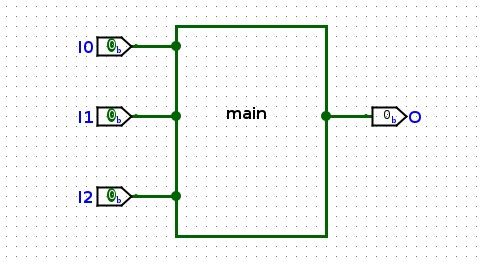
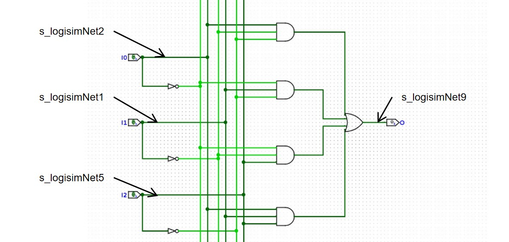
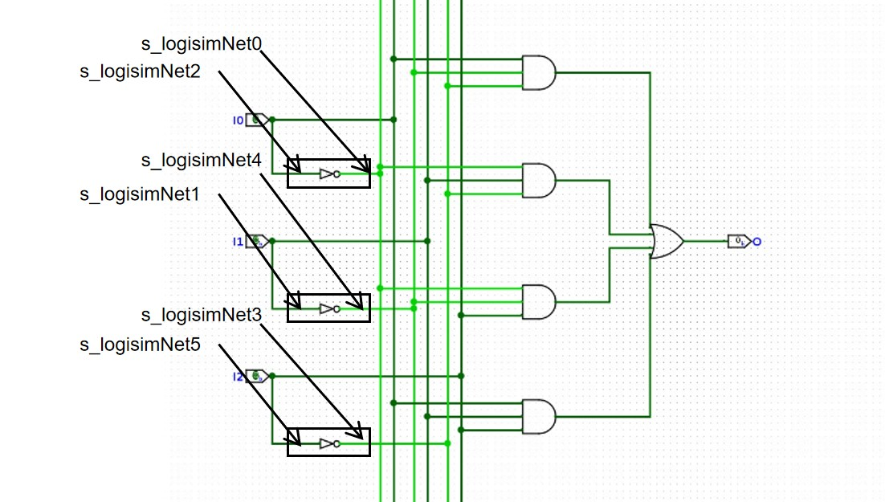
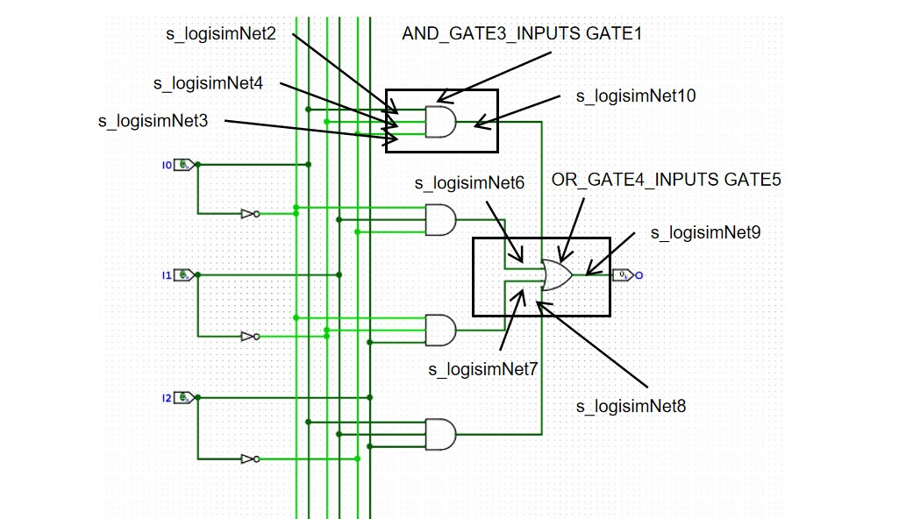

# Verilog 和电路的对应关系

所谓硬件描述语言，就是描述硬件的语言，它的语句和硬件的电路结构是息息相关，甚至是一一对应的，现在我们来比对一下 Lab0-1 绘制的电路图和得到的 Verilog 文件，来看看 Verilog 是如何描述这里的逻辑电路的。

## module, input, output

```Verilog
module main( 
    I0,
    I1,
    I2,
    O );

   input I0;
   input I1;
   input I2;
   output O;
   ....
endmodule
```

`module main ... endmodule` 表示这是一个叫做 main 的电路模块，它的内容从 module 关键字开始，到 endmodule 关键字结束。之后的 I0、I1、I2、O 是电路模块的输入输出引脚序列，表示有四个 1 bit 的引脚，以及每个引脚的名字。之后的 `input`、`output` 进一步定义每个引脚是输入引脚还是输出引脚，因此这段 Verilog 硬件描述语言指出当前描述的电路模块名叫 main，它有三个输入引脚分别是 I0、I1、I2，一个输出引脚 O。对应的电路图如下：

<center>
{ width="500" }
</center>

此外模块引脚输入输出的定义也可以用如下的方式声明在模块声明中，相对来说更加简洁明了：
```Verilog
module main( 
    input I0,
    input I1,
    input I2,
    output O );
    ...
endmodule
```

在 Verilog 语言中回车、换行、空格与缩进等和 C 语言中一样没有意义，仅出于可读性的考虑，而不是像 Python 那样有缩进换行的需求。

## wire

`wire` 语句负责定义一条线路，并且给线路提供一个名字。我们在 Lab0-1 中绘制的每一条连线都会被转换为下面的一个 `wire` 声明语句。

```Verilog
/*******************************************************************************
** The wires are defined here                                                 **
*******************************************************************************/
wire s_logisimNet0;
wire s_logisimNet1;
wire s_logisimNet10;
wire s_logisimNet2;
wire s_logisimNet3;
wire s_logisimNet4;
wire s_logisimNet5;
wire s_logisimNet6;
wire s_logisimNet7;
wire s_logisimNet8;
wire s_logisimNet9;
```

## assign 语句
`assign` 模块将 wire 连接起来。所谓 wire 可以认为就是一根导线，它有输入和输出两端，且输入的信号和输出的信号保持一致。I0、I1、I2 作为 input 可以认为是特殊的 wire，它的输入端要保留给外部连接模块的电路，所以只有它们的输出端可以在模块内部使用；O 作为 output 则是输出端保留给外部电路，输入端可以在模块内部使用（但是 O 的输出端也可以在模块内部使用，比较特殊）。

`assign s_logisimNet1 = I1` 将 I1 的输出端和 s_logisimNet1 的输入端相连，所以 s_logisimNet1 的输出信号就是 I1 输入的信号。`assign O = s_logisimNet9` 将 s_logisimNet9 的输出端和 O 的输入端相连，这样 O 输出的信号或者说 main 模块输出的信号就是 s_logisimNet9 输出的信号。

这里的 s_logisimNet1、s_logisimNet2、s_logisimNet5、s_logisimNet9 并不仅仅是箭头指向的那一条横线，实际上整个深绿色的线网络的电平都是保持一致的，都是同一个 wire 的范围。

```Verilog
assign s_logisimNet1 = I1;
assign s_logisimNet2 = I0;
assign s_logisimNet5 = I2;
assign O = s_logisimNet9;
```

<center>
{ width="500" }
</center>

以下的 assign 连接语法都是有意义的，我们可以将模块的输入的信号输入连接到某根线路、将一根线路的输出连接到另一根线路的输入、将一根线路的输出连接到模块的输出。

此外我们也可以将一位立即数 0 和 1 输入到线路中。`assign wire3 = 1'b1` 的意思是将高电平 Vcc 输入到 wire3 中，使得 wire3 输出是高电平，立即数 1'b1 相当于 Vcc；`assign wire3 = 1'b0` 的意思是将低电平 GND 输入到 wire3 中，使得 wire3 因为接地输出是低电平，立即数 1'b0 相当于 GND：

```Verilog
assign wire2 = I0;
assign wire1 = wire2;
assign O = wire1;
assign wire3 = 1'b1;
assign wire4 = 1'b0;
```

以下的 assign 连接语法是没有意义的，或者说是错误的：

```Verilog
assign I0 = wire1;      // problem1

assign wire2 = wire3;   // problem2
assign wire3 = wire2;   // problem2
assign wire7 = wire7;   // problem2

assign wire4 = wire5;   // problem3
assign wire4 = wire6;   // problem3

assign 1'b0 = wire8;    // problem4
assign 1'b1 = wire8;    // problem4

assign wire9 = wire8;   // problem5
// 但是 wire8 从来没有被 assign 输入过
```

* problem1：I0 作为输入端口在模块内部只有输出端，不可以被模块内部的线路输入。不过 O 虽然是输出端口，但是它的输出也是可以在模块内部使用的
* problem2：不可以形成环路，wire2 和 wire3 相互赋值、wire7 自己给自己赋值会形成环形电路，环形电路很微妙，其中的门道我们之后再介绍，但是在当前的情形下我们会看到这组电路孤立于其他的电路之外，没有有效的输入信号，这仅仅只会触发 warning，所以要格外小心
* problem3：一个线路被多个线路输入，这会导致 multi-driven 问题，从逻辑上来讲一个 wire4 只有一个输入没法接受多个连线的输入，从物理实现上将如果我们真的允许这样做连线会导致短路
* problem4：1'b0 是 GND，1'b1 是 Vcc 输出，将 CMOS 管的输出连接到 Vcc 或者 GND 都没有意义，还会导致短路等问题
* problem5：线路没有被赋值，如果一个线路没有被赋值，那么它处于高阻态，是没有输出的，被它连接输入的所有其他线路都会没有输入进而没有输出。这种线路类似于 C 语句中没有被初始化的变量，用它参与计算是危险的，但这仅仅只会触发 warning 要格外小心

所以谨记以下 wire 的电气特性：

1. wire 必须被有且仅有一个 assign 输入
2. wire 可以有 0 到多个 assign 输出

我们再回过头来看 input 和 output：

因为 input 的 wire 只能有一个输入且这个输入必须预留给外部模块，所以在 module 内部不可以再被输入了，不然会有 multi-driven 的电气问题；但是因为可以有 0 到多个输出，所以 input 可以给内部任何有需要的线路做输入，也可以不给任何线路做输入，这就相当于 C 语言定义了一个变量但是不使用，不会有实际的危害，也不会有 warning。

而 output 必须要有一个输入，即必须要被连接，否则外部得不到输出；但是不连接也不会有 error，需要编程人员自己注意。因为 output 可以有 0 到多个输出，所以在预留了一个给外部模块之后还可以继续输出给内部模块。

## 反相器电路/非门电路

在 C 语言中我们可以用 `a=~b` 来将一个数据取反赋值给另一个变量，这里的语义就是将一个线路的输出取反然后作为另一个线路的输入。对应到电路上取反就是经过一个非门电路，就是将 b 线路连接到反向器的输入，然后将反向器的输出连接到另一个线路上。下面的三条语句就对应了 Lab0-1 线路中的三个非门的线路连接。

```Verilog
assign s_logisimNet0 = ~s_logisimNet2;
assign s_logisimNet4 = ~s_logisimNet1;
assign s_logisimNet3 = ~s_logisimNet5;
```

<center>
{ width="500" }
</center>

## 与门，或门，模块调用

所谓模块就是某一电路组成，对于 AND3 门电路和 OR4 门电路 Logisim 生成了 AND_GATE_3_INPUTS 模块（定义在 verilog/gates/AND_GATE_3_INPUTS.v）和 OR_GATE_4_INPUTS 模块（定义在 verilog/gates/OR_GATE_4_INPUTS.v）来实现，它的模块声明如下：

```Verilog
module AND_GATE_3_INPUTS(
    input input1,
    input input2,
    input input3,
    output result
);

module OR_GATE_4_INPUTS(
    input input1,
    input input2,
    input input3,
    input input4,
    output result
);
```

对于 C 函数我们在考虑调用某一函数的时候不在乎函数内部的实现，而只在乎它的输入输出关系；对于 Verilog 的硬件设计模块在使用的时候也不在乎内部的设计细节和物理实现，只在乎它的输入输出关系，例如对于 AND_GATE_3_INPUTS 模块只需要知道有三个输入 input1、input2、input3 和一个输出 result，可以实现和 AND3 门电路一致的功能即可。

之后我们用 `AND_GATE_3_INPUTS GATES_1` 实例化一个名字叫做 GATES_1 的 AND_GATE_3_INPUTS 模块，然后对模块的输入输出进行连接。`.input1(s_logisimNet2)` 说明将 GATES_1 的 input1 引脚和 s_logisimNet2 线路连接，余下引脚连接同理，如果是 input 引脚就是线路提供输入，如果是 output 引脚就是线路获得输出。

同理实例化一个叫做 GATE_5 的 OR4 或门，然后将 s_logisimNet10、s_logisimNet6、s_logisimNet7、s_logisimNet8 作为输入，s_logisimNet9 作为输出连接到或门。

```Verilog
AND_GATE_3_INPUTS GATES_1 (
    .input1(s_logisimNet2),
    .input2(s_logisimNet4),
    .input3(s_logisimNet3),
    .result(s_logisimNet10)
);

OR_GATE_4_INPUTS GATES_5 (
    .input1(s_logisimNet10),
    .input2(s_logisimNet6),
    .input3(s_logisimNet7),
    .input4(s_logisimNet8),
    .result(s_logisimNet9)
);
```

<center>
{ width="500" }
</center>

需要注意：

* 因为每个导线都需要有且仅有一个输入，所以每个模块的输入端口都需要被连接，如果没有连接会报错 error
* 因为每个导线都需要有且仅有一个输入，所以一旦一根线路被模块的输出端口驱动了，就不可以再被其他模块的输出端口或者 assign 语句驱动了
* 因为每个导线都可以有 0 到多个输出，所以每个模块的输出端口可以不被连接而保持悬空，这是无害的。需要注意如果我们希望 result 端口悬空，不能这样连接：
    ```Verilog
    OR_GATE_4_INPUTS GATES_5 (
        .input1(s_logisimNet10),
        .input2(s_logisimNet6),
        .input3(s_logisimNet7),
        .input4(s_logisimNet8)
    );
    ```

    这样一般认为你忘记处理 OR4 模块的 result 输出端口了，所以应该如下连接，显式声明悬空该端口：

    ```Verilog
    OR_GATE_4_INPUTS GATES_5 (
        .input1(s_logisimNet10),
        .input2(s_logisimNet6),
        .input3(s_logisimNet7),
        .input4(s_logisimNet8),
        .result()
    );
    ```

模块还有另一种不需要显示声明连接端口的连接方式，这里 GATE1 的输入输出没有声明连接的端口，所以线路连接的端口默认和 AND_GATE_3_INPUTS 声明端口的顺序保持一致，也即第一连线 s_logisimNet10 连接到第一个端口 input1，依此类推。

```Verilog
// declaration
module AND_GATE_3_INPUTS(
    input1,
    input2,
    input3,
    result
);
    input input1;
    input input2;
    input input3;
    output result;
    ...
endmodule

//connection
AND_GATE_3_INPUTS GATE1 (s_logisimNet10, s_logisimNet6, s_logisimNet7, s_logisimNet8);
```

注意：

* 声明端口的连接方法和不声明端口的连接方法不可以混用

不声明端口虽然使用起来比较简洁，但是有很多问题：

1. 如果端口数目很多，不声明端口容易导致端口连错
2. 如果模块的端口顺序进行了修改和调整，所有不声明端口的模块实例都要做对应的调整
3. 不声明端口的连接方式无法做输出端口的悬空
4. 不声明端口会导致模块实例连线的时候缺乏端口语义，不利于编程者的开发维护

所以除非模块非常简单，不然推荐使用声明端口的连接方法

## 模块和运算符

非门的连接有如下两种等价的方法：第一种直接展现电路连接；而第二种用类似 C 语言的写法，有更强的逻辑语义，但是最后还是会落脚于第一种的电路连接，仅仅是给我们描述非门电路提供更简洁地表达方式而已：

```Verilog
NOT GATE1(wire1, wire2);
assign wire1 = ~wire2;
```

对于 AND2 与门和 OR2 或门也有对应的运算符语法糖：
```Verilog
AND2 GATE1(wire3, wire1, wire2);
assign wire3 = wire1 & wire2;

OR2 GATE2(wire3, wire1, wire2);
assign wire3 = wire1 | wire2;
```

当然 AND_GATE_3_INPUTS 和 OR_DATE_4_INPUTS 模块内部就是用 | 和 & 表示的与门或门组建而成的。

## 核心思想

**在使用 Verilog 语言描述电路之前脑子里一定要先有电路！！！！！**

如果我们是对照着 Lab0-1 的电路设计图编程硬件描述语言，那么就不会出现第 3、5 节中提到的输入输出接错、连接回路、多驱动等各类问题，因为大家对照着电路图已经有明确的连接关系和电流方向了。但如果很多同学只是想当然的做 assign 连接，而不考虑电气特性，这些问题就会接踵而至。当然漏连、忘连是另一回事情。

很多同学在学习完 ~、|、& 这样的 Verilog 表达式之后就很容易将 Verilog 当作 C 语言来写。例如提供一个输入输出关系，然后让你设计一套电路并用 Verilog 表示出来，那么有些同学容易这样：

1. 将输入输出关系转换为一个卡诺图
2. 化简卡诺图得到逻辑表达式
3. 根据逻辑表达式的与或非关系，像写 C 语言一样直接写 &、|、~ 语句

这样即使你对硬件特性一无所知，并且丢弃了最终的硬件结构，也可以轻松地写出正确的 Verilog 模块。“只要把 Verilog 用 C 的逻辑来写就好了”，这就是很多同学学习 Verilog 走上歧路，最后学不好 Verilog 的原因。将来我们会学习更多 Verilog 的语句，它们更像 C 语言，抽象程度更高，更脱离底层的硬件描述，很多偷懒的同学很容易“义无反顾”地投入这些语句的怀抱。

但是这样你只学习了 Verilog 语句逻辑上的输入输出运算关系，并没有掌握它电气实现上的物理含义。如果按照 C 的思路编程，一来容易把 Verilog 语句的逻辑含义想当然地和 C 语句的逻辑含义画上等号，导致逻辑上就产生理解错误；二来这样编程仅仅能保证语句在逻辑验证上是正确的，但不能保证在电气设计上也是正确的，容易产生各种各样的电气错误，最后导致设计出来明明功能正确的硬件实现出来却是无法运行的。

这种反直觉的情况会很大程度上挫败同学们学习硬件的自信心，让他们认为硬件设计是一件玄学的事情，是无法学会的，最后痛苦地逃离硬件设计的领域，并且留下深刻的阴影。而这一切往往是因为它们没有将 Verilog 语言和电路特性深刻理解起来，而仅仅偷懒的停留在类似 C 语言的逻辑层面。

Verilog 语言作为一门工具语言在过去计算机专业的硬件课程中是不会被专门教学的，迫使同学只能在摸索中自学这门语言，在一个个陷阱和泥潭中淌出一条也许可行的道路，绝大多数同学往往中道崩殂最后和硬件无缘。这是一件很可惜的事情，我们不是没有经验，我们本可以做得更好。这也是我们在实验课中加入 Verilog 语言教学的初衷，我们希望大家可以切实感受到硬件设计的生趣，一起投身到硬件设计的队伍中来。
