# 实验 0-2：FPGA 实验环境准备

## 实验目的

- 掌握 FPGA 设计软件 Vivado 的基本使用方法
- 掌握 FPGA 和 Verilog 语言的最基础使用方法
- 学习布尔表达式和对应 Verilog 语言的转换

## 实验环境

- EDA工具：[Ngspice](https://ngspice.sourceforge.io)，[Logisim-evolution](https://github.com/logisim-evolution/logisim-evolution)
- 操作系统：Windows 10+ 22H2，Ubuntu 24.04
- VHDL：Verilog

## 背景知识

### FPGA

FPGA 器件属于专用集成电路中的一种半定制电路，是可编程的逻辑列阵，能够有效的解决原有的器件门电路数较少的问题。

FPGA 的基本结构包括可编程输入输出单元，可配置逻辑块，数字时钟管理模块，嵌入式块 RAM，布线资源，内嵌专用硬核，底层内嵌功能单元。

### Verilog

Verilog HDL 是一种硬件描述语言，用于从算法级、门级到开关级的多种抽象设计层次的数字系统建模。被建模的数字系统对象的复杂性可以介于简单的门和完整的电子数字系统之间。数字系统能够按层次描述，并可在相同描述中显式地进行时序建模。

Verilog HDL 语言具有下述描述能力：设计的行为特性、设计的数据流特性、设计的结构组成以及包含响应监控和设计验证方面的时延和波形产生机制。所有这些都使用同一种建模语言。

此外，Verilog HDL 语言提供了编程语言接口，通过该接口可以在模拟、验证期间从设计外部访问设计，包括模拟的具体控制和运行。

## 实验步骤

### 将原理图导出为 Verilog {: #export-to-verilog}

启动 Logisim，依次选择 File > Open 打开在上个实验中绘制的电路原理图文件。（也可以执行`java -jar logisim-evolution-3.8.0-all.jar /<path_to_file>/xxx.circ`打开保存的设计文件，<path_to_file>是你保存时的文件路径）

依次选择上方状态栏的 FPGA > Synthesize & Download。在弹出的窗口中：

- 将 Target board 修改为 FPGA4U
- 选择右上角的 Settings，将 Hardware description language used for FPGA-commander 修改为 Verilog，同时修改的 Workspace location 为希望 Verilog 文件生成的文件路径
- 点击 Execute 按钮，此时会弹出一个带有 FPGA 图片的窗口，点击 Done 即可
    - 如果报错没有添加 label，先回到画布给端口添加 label：I0、I1、I2、O（注意 label 必须与要求相同）
    - 可能弹出窗口 “Design is not completely mapped”，选择 “Yes” 继续即可

根据 log 中的记录找到生成的 Verilog 文件，路径为 `<Workspace location>/<工程名>/main/verilog`。

其中，在 circuit 目录下的 main.v 文件中应当包含如下内容，**注意**后续实验要求模块名和端口名必须和给出的样例相同：

```verilog
module main( I0,
             I1,
             I2,
             O );
```

!!! warning "注意"
    需要将 circuit 和 gates 目录下的生成的所有 Verilog 文件拷贝至本仓库的 `src/lab0-2/submit` 目录下，后续实验会用到。

使用 tree 指令查看 src 文件夹结构，应当呈现如下结果：
```shell
.
└── src
    └── lab0-2
        ├── Makefile
        └── submit
            ├── AND_GATE_3_INPUTS.v
            ├── main.v
            ├── OR_GATE_4_INPUTS.v
            └── readme.md
```

* src: 实验源代码
* src/lab0-2: lab0-2 实验的源代码
* src/lab0-2/submit: lab0-2 实验需要同学们实现的源代码存放目录，实验结束请提交这部分代码
* src/lab0-2/Makefile: lab0-2 实验的 makefile 脚本

请根据 src/submit/readme.md 的指示修改 AND_GATE_3_INPUTS.v 和 OR_GATE_4_INPUTS.v 文件以满足后续需要。

??? tip "附：一些常见的 Linux 命令参考"
    `$`开头的行代表输入的指令，没有的`$`的行代表指令执行的结果，`#`后的内容为注释。

    ```shell
    $ pwd   # 查看当前路径
    $ cd <path> # 切换路径 
    # 例：cd /tmp 是进入根目录下的tmp文件夹，/代表根目录
    # 除了上面的绝对路径外，还可以使用相对路径：
    # 例：cd .. 在linux中，.代表当前目录，..代表上一级的父文件夹，~代表用户Home目录
    $ ls <path> # 显示指定路径下的文件
    $ cp <src file path> <dest path>    # 拷贝文件
    # 例：cp logisim_evolution_workspace/lab0.1/main/verilog/circuit/main.v sys1-sp{{ year }}/src/lab0-2/sim/src
    # 其中，
    #   logisim_evolution_workspace/lab0.1/main/verilog/circuit/main.v 为要复制的文件路径
    #   sys1-sp{{ year }}/src/lab0-2/sim/src 为目标文件夹路径
    ```

    ```shell
    $ pwd       # 显示当前路径
    /home/<your name>
    $ ls        # 查看当前路径下所有文件
    lab0.1.circ  logisim-evolution-3.8.0-all.jar  logisim_evolution_workspace  sys1-5
    # cp格式：cp 指定目录下文件  目标路径（仓库下要求目录）
    $ cp logisim_evolution_workspace/lab0.1/main/verilog/circuit/main.v sys1-sp{{ year }}/src/lab0-2/submit   
    # 进入路径，确认拷贝完成
    $ cd sys1-sp{{ year }}/src/lab0-2/submit
    $ ls        # 这里拷贝的文件是main.v
    main.v
    # ~/表示绝对路径，即不受到前面已经进入的路径的干扰；输入完不要按回车，按tab可以显示该目录下文件作为提示
    $ cp ~/logisim_evolution_workspace/lab0.1/main/verilog/gates/
    # 这里是按tab作为提示的结果
    AND_GATE_3_INPUTS.v  OR_GATE_4_INPUTS.v
    #已经在该目录下,可以在最后用“.”来移入当前路径
    $ cp ~/logisim_evolution_workspace/lab0.1/main/verilog/gates/AND_GATE_3_INPUTS.v .

    # 可以按方向键↑来复原上一条指令
    # Tab可起到提示作用，可以多按几次来尝试
    ```

!!! tip "关于 Verilog 与电路的关系，见[本实验附录](lab0-2-appendix.md)"

### Verilator 仿真测试

用 Verilog 语言设计完硬件之后，我们需要检测硬件功能是否正确。一种方法我们直接用电器元件搭建需要的硬件，然后用示波器、接线板、电源、电线检测功能，但无疑这个测试的资金和时间成本是很高的，如果测试失败排除错误也是很困难的。

所以我们希望有一种方法可以用计算机模拟 Verilog 描述的逻辑电路的运行，然后检查模拟的逻辑电路输入输出是否正确，这个过程称之为**仿真**。现在我们介绍如何用 Verilator 工具进行仿真。

#### 环境配置

过去 Lab0-2 依赖的代码全部是在 src/lab0-2 文件夹下的，但为了防止部分同学篡改我们给出的测试代码，也为了帮助同学们将注意力集中在自己编程的代码上，我们特意将同学需要设计实现的代码和我们事先提供的其余代码进行分离，同学们需要实现的代码保留在 src/lab0-2，其余代码被存放到外部依赖仓库 sys-project。

进入 sys1-sp{{ year }} 根目录，运行以下指令，然后可以得到如下的文件目录：

```shell
git submodule update --init repo/sys-project    # 将 sys-project 仓库同步到 repo/sys-project 路径下
cd repo/sys-project                             # 进入 sys-project 子仓库
git checkout other                              # sys-project 切换到 other 分支
tree                                            # 查看当前的文件夹结构
```

```text
.
├── repo
│   └── sys-project
│       └── lab0-2
│           ├── sim
│           │   └── testbench.v
│           ├── syn
│           │   ├── nexysa7.xdc
│           │   └── top.v
│           └── tcl
│               └── vivado.tcl
│
```

* repo: submodule 外部依赖库，用于存放 sys1-sp{{ year }} 仓库依赖的其他仓库
    * sys-project: 所以是 sys1-sp{{ year }} 的 src 依赖的其他实现提供的代码，请不要手动修改里面的代码
        * lab0-2: 实验依赖的助教提供的源代码
            * sim: 仅用于仿真测试的源代码
            * syn: 仅用于综合下板的源代码
            * tcl: 用于综合下板的 Vivado 执行脚本

#### Verilator 安装

我们可以直接运行 `sudo apt install verilator` 来安装 Verilator 工具，不过这个直接下载安装的 Verilator 工具对于 Verilog 的支持不够全面，所以建议手动安装最新版本。

运行如下指令，所以 sys1-sp{{ year }} 会自动拉取较新的 Verilator 源代码，然后执行 makefile 的脚本编译安装 Verilator，这个版本的 Verilator 暂时可以满足后续全部的仿真需求：

```shell
git submodule update --init repo/verilator
cd repo
make verilator
```

!!! tip "常见问题"

    - 如果 repo/verilator 仓库 clone 出现网络连接失败可以考虑科学上网

    - `make verilator` 如果出现类似于 `autoconf: not found, g++: command not found` 等报错说明当前环境缺少一些工具，考虑先运行以下命令安装：

        ```shell
        sudo apt-get install git perl python3 make autoconf g++ flex bison ccache
        sudo apt-get install autoconf automake libtool
        sudo apt-get install help2man
        ```

    - 其他问题一般可以在 [Verilator Issue](https://github.com/verilator/verilator/issues) 和 [Verilator 官方文档](https://verilator.org/guide/latest/) 找到解答

#### 仿真激励文件介绍

我们使用的是开源的 RTL 仿真器 Verilator，它会将硬件代码转化成主机可执行的 C++ 模型，然后运行 C++ 程序进行电路模拟。此外它还可以帮我们检查 Verilog 的语法错误、接线错误、语义错误等，帮助我们在编译期间尽可能多的排除 bug。

我们使用的仿真激励文件位于`repo/sys-project/lab0-2/sim/testbench.v`，其基本的仿真激励模型如下：

```verilog
module Testbench;

    reg I0,I1,I2;
    wire O;

    initial begin
        // 设置输入的值
        I0 = 1'b0; I1 = 1'b0; I2 = 1'b0;
        // 等待 5 个单位时间修改输入激励的值
        #5;
        I0 = 1'b0; I1 = 1'b0; I2 = 1'b1;
        ...
        #5;
        // 结束仿真
        $finish;
    end

    main dut( 
        .I0(I0),
        .I1(I1),
        .I2(I2),
        .O(O) 
    );
    // 被仿真的模块，接受不同的输入，然后观察输出是否正确

    `ifdef VERILATE
		initial begin
            // 生成波形文件 build/verilator/Testbench.vcd
			$dumpfile({`TOP_DIR, "/Testbench.vcd"});
            //记录 dut 模块以及内部模块的线路信号变化
			$dumpvars(0, dut);
            // 开始记录信号
			$dumpon;
		end
    `endif
    
endmodule
```

reg 是寄存器的意思，可以认为是一个能提供固定输出的变量。如果我们忽略 `initial begin ... end` 块中的内容可以看到这是一个简单的电路，三个寄存器 I0、I1、I2 提供输出给需要测试的 main 模块，然后 main 模块输出到线路 O。

为了检验 main 模块是否功能正确，我们需要遍历 I0、I1、I2 从 000 到 111 的 8 个输入组合，然后依次检查对应的 O 输出是不是和 Lab0-1 的真值表的内容保持一致。

`initial` 块可以给 reg 寄存器赋值，让它们输出需要的值，所以：

- 在 inital 块内用 `I0 = 1'b0; I1 = 1'b0; I2 = 1'b0;` 将 I0、I1、I2 分别赋值为低电平
    - 然后 main 接收三个低电平输入仿真模拟得到对应的输出 O
- 之后我们用 `#5;` 语句延迟 5 个时间单位
- 然后用 `I0 = 1'b0; I1 = 1'b0; I2 = 1'b1;` 修改输入为 001 进行第二组测试
- ……依次类推直到 8 组测试都测试完毕

之所以要延迟 5 个时间单位是为了让 I0、I1、I2 在给定输入下的输出可以维持 5 个单位的固定电平，便于通过波形观察 O 的输出电平。如果立刻修改 I0、I1、I2 的输出会导致 O 的值立刻变换，使得上一组输入对应的输出无法观察得到。

最后用 `$finish;` 表示仿真结束。

第二个 initial 模块中的 \$dumpfile、\$dumpvars、\$dumpon 等用于将模块内部的波形导出到指定文件中。Verilog 除了支持硬件描述、线路连接之外，还有一些特殊的 $func 函数来实现特殊的调试功能。

#### 仿真 Verilog 设计

进入到本仓库的 `src/lab0-2` 目录下执行以下命令，首先安装实验所需的依赖，然后将 Verilog 转换成 C++ 模型并执行，最后使用 gtkwave 查看仿真期间产生的波形（保存在 lab0-2/build/verilate/Testbench.vcd 中）：

```shell
sudo apt install g++ make gtkwave perl-doc
make
make wave
```

??? Tip "如果 `make` 过程产生了报错"
    `make` 过程可能产生关于 43 行 `VIVADO_SETUP` 和 53 行 `DIR_PROJECT` 的报错，这是为了方便大家使用 Vivado Batch，如果暂时不需使用，只需要按照注释随意设置一个路径或注释掉即可。若需要使用 batch 模式，由于文件系统的限制，你可能需要将 `DIR_PROJECT` 设置为 Windows 下的路径，或将仓库复制进入 Windows 并进入挂载目录后执行 `make bitstream`。

    若 Vivado 安装在 Windows 下，`DIR_PROJECT` 可能需要设置为 WSL 中挂载的 Windows 文件系统路径，例如：
    ```
    DIR_PROJECT := /mnt/c/path_to_project
    ```

gtkwave 启动后，首先从左侧依次展开我们的设计，然后选中 dut 模块，从下方的窗口中将我们感兴趣的 I0、I1、I2、O 信号拖动到右侧的 Signals 窗口，这样它们我们就可以在窗口中查看它们在仿真过程中的值了。我们可以人工对照 I1、I2、I3、O 的输入输出，看是不是和 Lab0-1 的真值表保持一致。

!!! tip "如果 wsl 内的 GTKWave 不稳定，可以在 Windows 本机内安装查看波形"

### Vivado 使用

FPGA(Field Programmable Gate Array) 是一块小型的可编程序列，里面提供了一系列可以组装的电器元件，诸如 LUT（查找表）、MUX（选择器）、FF（寄存器）、BRAM（块存储器）、加法器、乘法器等。

我们仿真验证设计的硬件正确之后，就可以着手实现我们的硬件了。我们只需要将 Verilog 转换为电路设计格式 bitstream 然后发送给 FPGA 芯片，FPGA 芯片就会按照 bitstream 的指示将这些电器元件组装起来，得到等效功能的电路。

#### Vivado 下板工作流程

Vivado 的作用就是将电路从 Verilog 的字符串描述形式转换为 FPGA 可以理解的 bitstream 的描述形式。为了让大家对 Vivado 的工作流有一个比较具体的了解，我们来简要分析一下 Vivado 是如何把 Verilog 一步步转化为 bitstream 的。

??? "Step 1. 下载安装 Vivado"
    进入 Xilinx 官网下载 Vivado2022.2 版本，安装请参考[环境配置指南](setup.md)。

??? "Step 2. 创建 Vivado 工程"
    首先启动 Vivado，新建工程，命名为 sys1-lab0。

    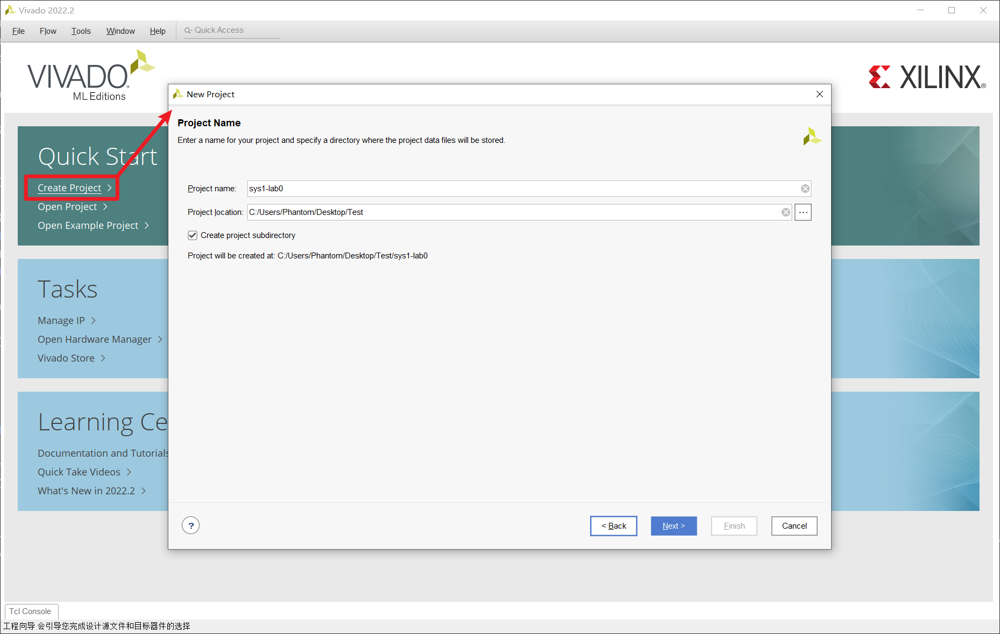

    选择无代码的RTL工程。

    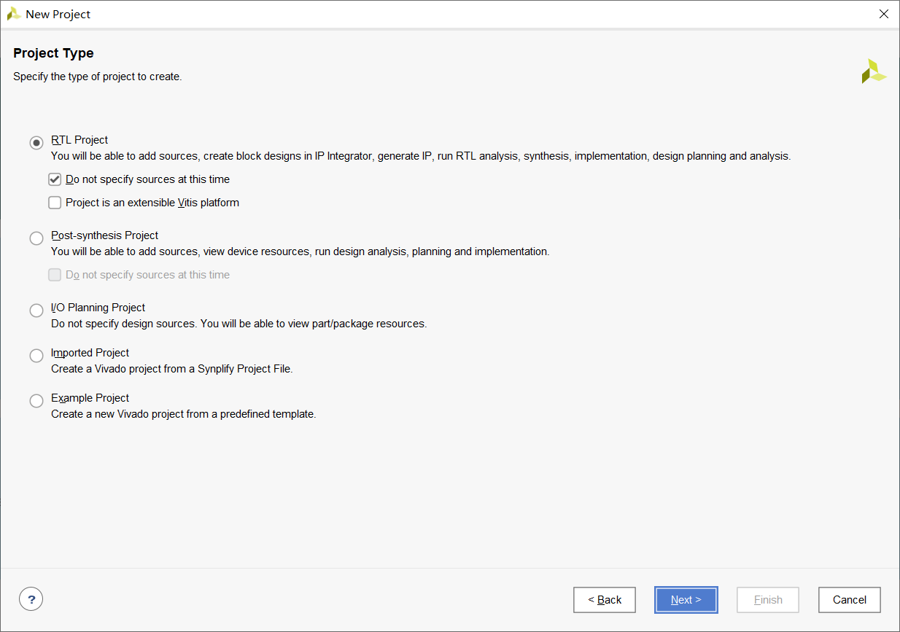

    开发板型号下方搜索并选择 xc7a100tcsg324-1。

    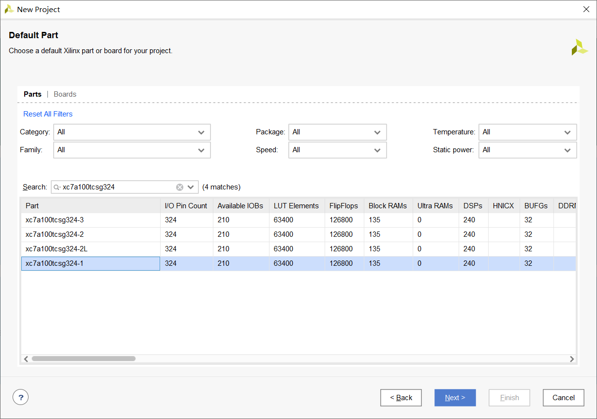

    点击 Add Source 选择 Add or create design sources，将 /src/lab0-2/submit 的 Verilog 文件添加进工程。

    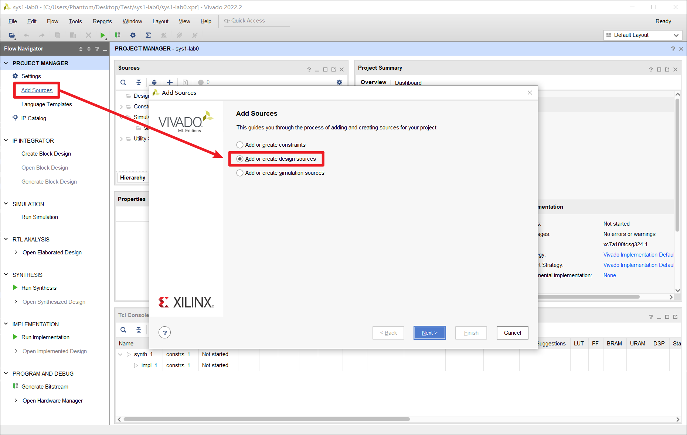

    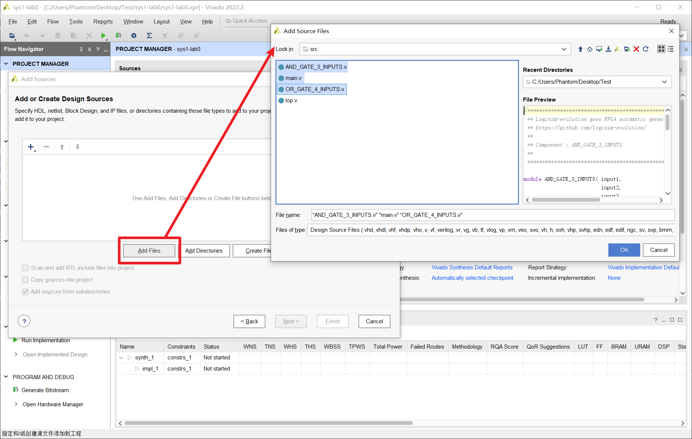

    Design Sources 自动显示了我们的 Verilog 硬件模块的层次。最顶层的模块是 main 模块，它内部有 5 个子模块分别是 GATE_1 - GATE_5，模块类型分别是 AND_GATE_3_INPUTS 和 OR_GATE_4_INPUTS。

    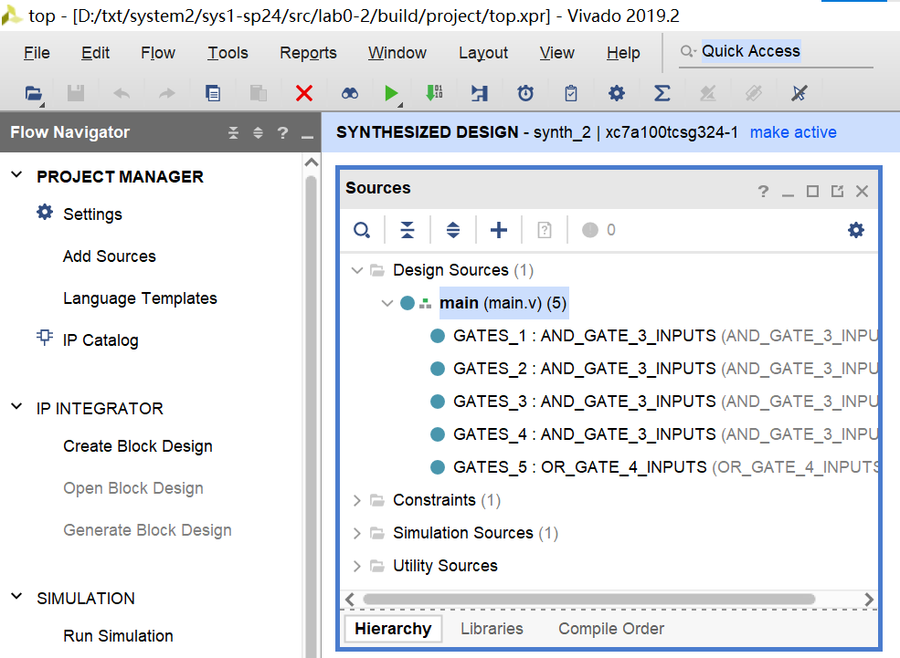

??? "Step 3. 综合 (synthensis)"
    右键需要综合的模块，然后选择 Set as Top，该模块就会变为顶层模块，之后的 synthensis 操作只针对该模块和它内部的模块进行。例如，我们设置 AND_GATE_3_INPUTS 为顶层模块则只综合 AND3 电路，而不综合 OR4 电路和 main 电路。

    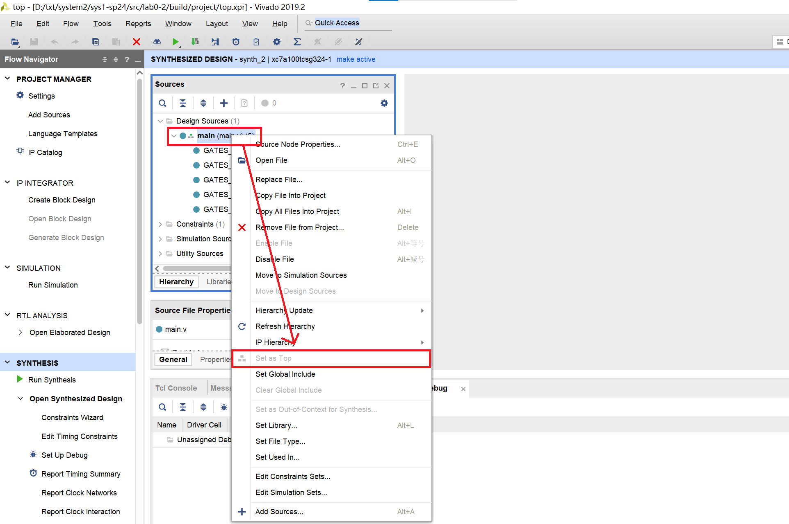

    点击左侧 SYNTHENSIS > Run Sythensis，然后点击 OK 就可以开始电路的综合。

    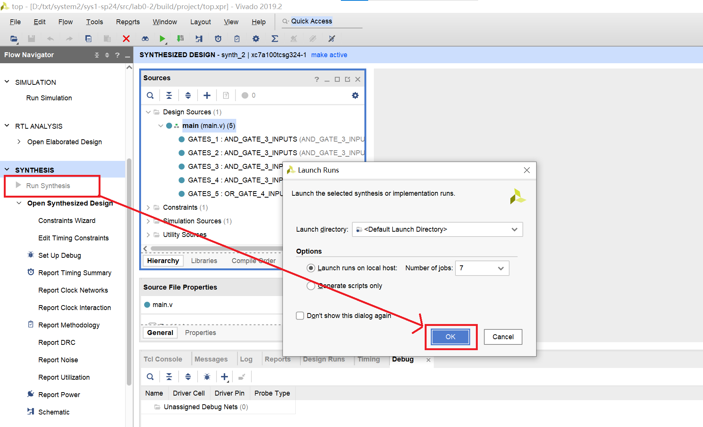

    综合过程大致分为两步：

    * 第一步将 Verilog 描述的电路转化为实现无关的与或非逻辑表达式的形式，可以简单地认为转换为仅由与或非门组成的简单电路
    * 第二步将实现无关的与或非门电路转换为 FPGA 实现相关的电路

    例如 FPGA 提供了 LUT3 电器元件，改电器元件有一个 8 bit 的可编程数组 array，FPGA 可以根据需要在数组内填入需要的 0、1 值。LUT3 接收输入 `I={I2,I1,I0}` 作为索引，然后将数组中的第 I 位的值 `array[I]` 作为 O 的输出。

    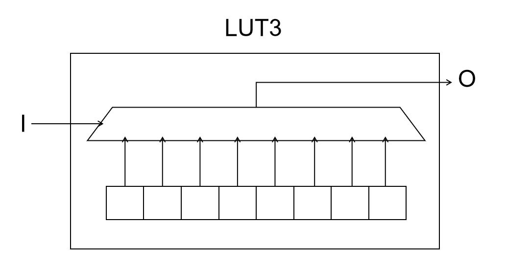

    我们可以回忆一下 main 模块对应的真值表，要求输入 `I={I2,I1,I0}` 则输出为 `table[I]` 的值，所以我们只需要将真值表中对应的输出值依次填入 LUT3 就可以得到和 main 模块输入输出关系相同的电路，换句话说这个 LUT3 电路等价于我们设计的 main 电路，可以用这个 LUT3 电路实现我们设计的 main 电路。

    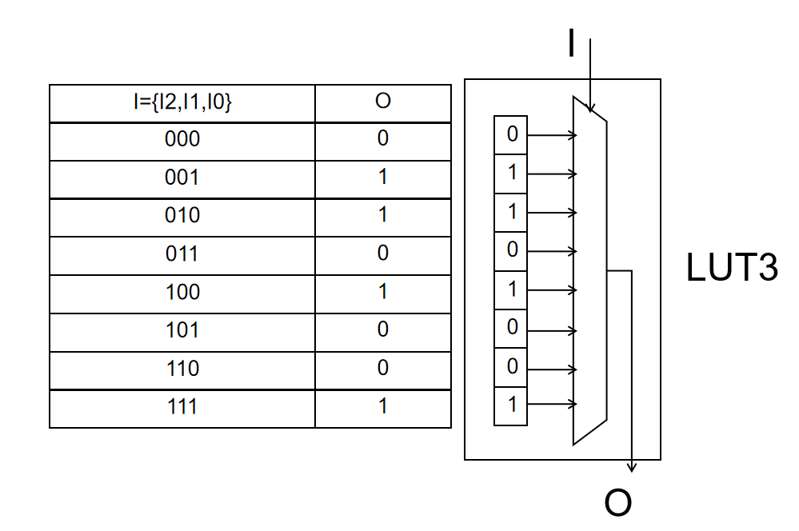

    sythensis 完毕后点击 SYNTHENSIS > Sechematic 即可查看综合得到的电路图实现，可以看到 main 模块最后确实被综合成了一个 FPGA 的 LUT3 电路。

    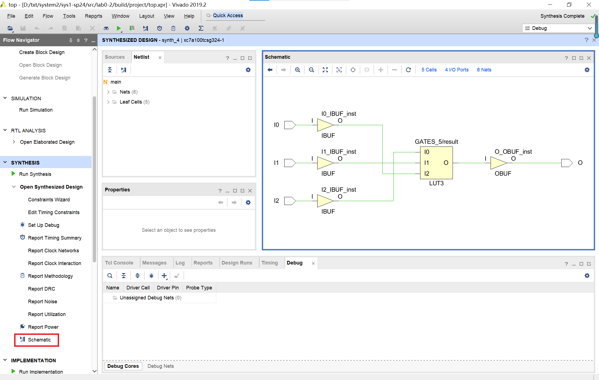

??? "Step 4. 设置输入输出引脚"
    虽然我们得到了 main 模块的电路设计，但是在 FPGA 板子中用 LUT3 电器元件组件这个电路是没有意义的，因为我们人既不能控制 main 的输入，也不能看到 main 的输出。这就好比我们有一台电脑但它既没有鼠标键盘，也没有显示屏，因此我们需要给 main 电路提供人可以控制的输入输出。

    点击 Add Sources > Add or create design sources > Add Files 将 repo/sys-project/lab0-2/syn/top.v 加入工程。

    该模块输入为 SW0、SW1、SW2，输出为 LED0，然后用 SW0、SW1、SW2 为 main 提供输入，用 LED0 接收 main 的输出。

    ```verilog
    module top(
        input SW0,
        input SW1,
        input SW2,
        output LD0
        );

        main ldut( 
            .I0(SW0),
            .I1(SW1),
            .I2(SW2),
            .O(LD0) 
        );
    endmodule
    ```

    然后点击 Add Source > Add and create constraints 将 repo/sys-project/lab0-2/syn/nexysa7.xdc 引脚约束文件加入工程。

    我们的 Nexysa7 开发板除了核心的 FPGA 芯片外，还有很多配合使用的 IO 外设比如开关、LED 灯、按钮等，它们通过主板线路和 FPGA 的指定引脚相连为 FPGA 芯片提供输入输出。

    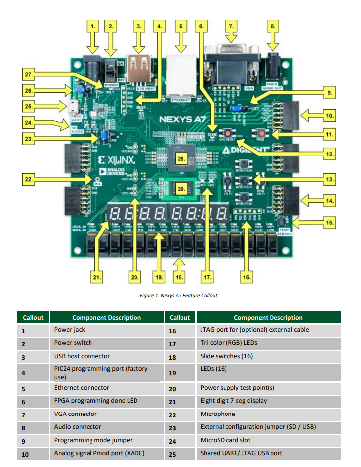

    通过查阅 [Nexysa7 手册](https://digilent.com/reference/_media/reference/programmable-logic/nexys-a7/nexys-a7_rm.pdf)可以看到开关 SW0-SW15 的输入连接到了 FPGA 芯片的 J15-V10 引脚，当开关打开时对应的芯片引脚输入高电平，反之输入低电平；FPGA 芯片的 H17-V11 的输出连接到 LED 灯 LD0-LD15，当输出高电平时 LED 灯亮起，反之 LED 灯熄灭。

    

    现在我们希望用开关 SW0-SW2 的输入作为我们 top 模块的 SW0-SW2 接口的输入，希望 top 模块的输出 LED0 发送到 LED 灯 LD0 上，于是我们在 nexysa7.xdc 文件中指定芯片外部输入输出引脚和顶层 top 模块的输入输出的连接关系。

    ```verilog
    ## IO
    set_property PACKAGE_PIN {J15} [get_ports {SW0}]
    # 将顶层模块的端口 SW0 和芯片的 J15 引脚绑定
    set_property IOSTANDARD {LVCMOS33} [get_ports {SW0}]
    # 引脚的驱动电平为 3.3 V
    set_property PACKAGE_PIN {L16} [get_ports {SW1}]
    set_property IOSTANDARD {LVCMOS33} [get_ports {SW1}]
    set_property PACKAGE_PIN {M13} [get_ports {SW2}]
    set_property IOSTANDARD {LVCMOS33} [get_ports {SW2}]
    set_property PACKAGE_PIN {H17} [get_ports {LD0}]
    set_property IOSTANDARD {LVCMOS33} [get_ports {LD0}]
    ```

    既然我们现在以 top 模块为顶层模块，所以右键 top，选择 Set as top，将 top 模块转换为顶层模块，然后重新 sythensis。
??? "Step 5. 构建 (implementation)"
    通过 synthensis 步骤我们用 FPGA 可以提供的资源搭建了 top 电路，然后通过 implementation 将这些资源和连线映射到 FPGA 真实的电器元件上。

    点击左侧 IMPLEMENTAION > Run Implementation，然后点击 OK 就可以开始电路的构建：

    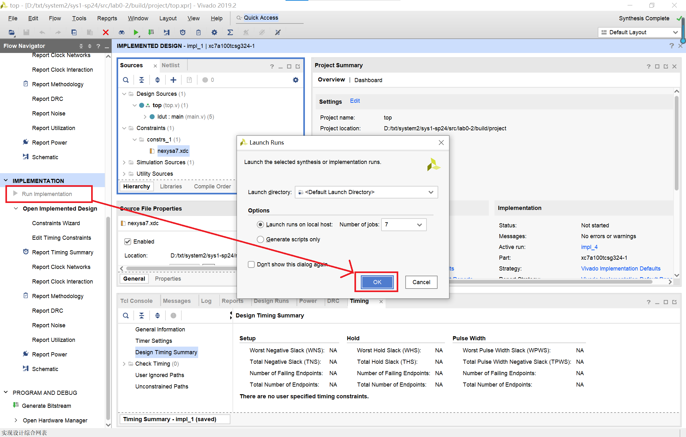

    执行完毕后点击弹窗的 OK 来 Open Implementation Design 得到最后 FPGA 的布线情况：

    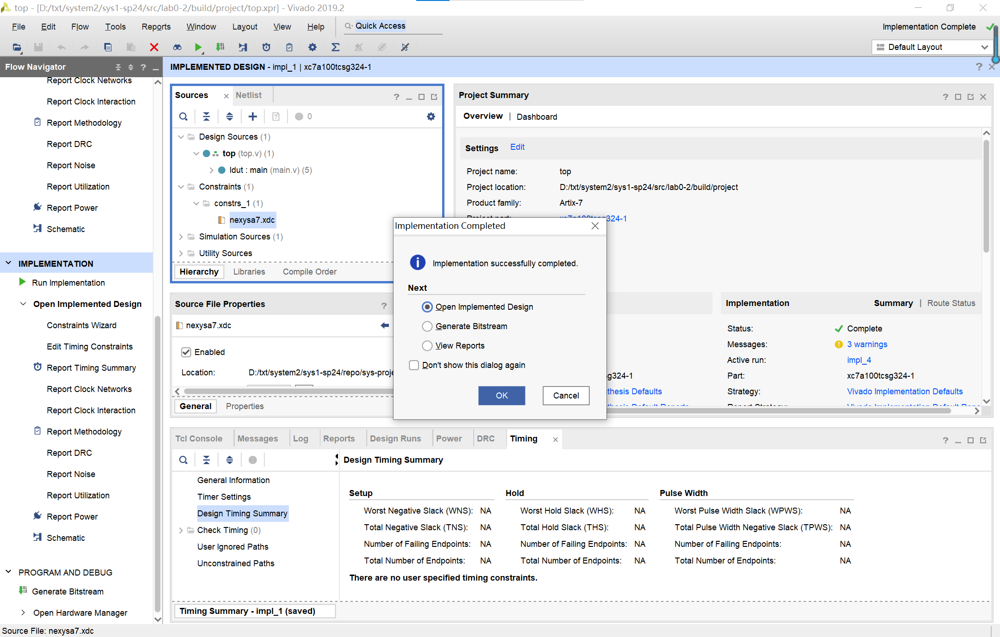
    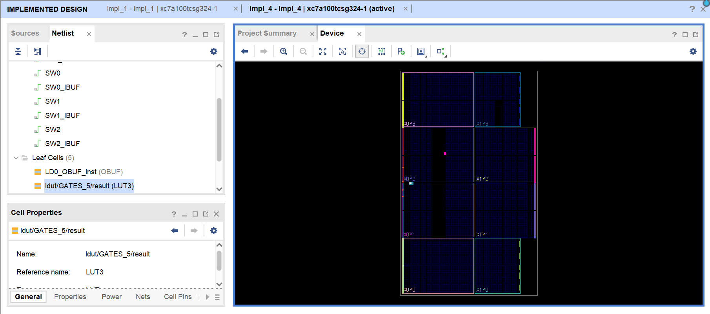

    我们来看布线的细节：

    1. 开关、LED 灯外设连接的芯片 IO 引脚配套的 IO buffer 被对应的启用，用于接收开关的输入和发送 LED 灯的输出
    2. top 模块的 LUT3 电路被分配到了 FPGA 内部的一块 LUT6 电器元件（原理和 LUT3 一致，但是内部数组是 64）上
    3. 还有从 IO 输入输出到 LUT6 输入输出的一些连线，图上没有体现

    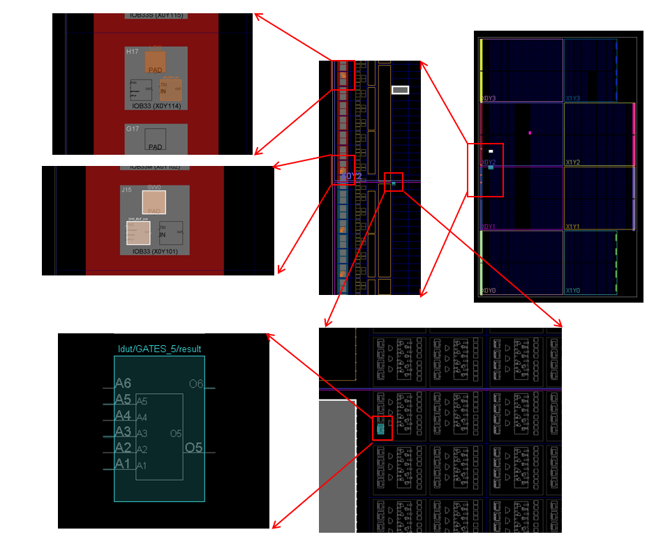

    所以 implementation 主要的任务是：

    1. 启用 IO 相关的引脚 buffer
    2. 将顶层模块 synthensis 得到的电气元件映射到 FPGA 芯片的物理资源，设置 LUT6 内部的 array 的值
    3. 将 IO buffer、启用的物理资源连接起来
    4. 对物理资源做适当的优化，删除多余的物理资源，合并可重用的物理资源等，修改物理资源的布局改善电气特性
    
??? "Step 6. 生成比特流 (gerenate bitstream)"
    implementation 已经得到了 FPGA 布线的全部细节，现在我们需要将布线细节打包为特定格式的 bitstream 文件，然后发送给 FPGA 芯片，芯片就会自动按照 bitstream 指定的方式进行资源的组装。

    bitstream 需要包含的内容包括但不限于：

    1. 需要被启用的 IO 引脚
    2. 物理资源输入输出之间的连接关系
    3. LUT6 内部 array 填充的值

    点击左侧 PROGRAM AND DEBUG > Generate Bitstream，然后选择 OK，就可以生成我们需要的 bit 流文件 top.bit，该文件保存在 project 的 top.runs/impl_1 目录。

??? "Step 7. 下板验证"
    最后我们将生成的 bitstream 下载到开发板中，得到最开始生成的电路，然后就可以用开关操纵输入，通过 led 等观察输出，进而验证我们设计的电路是不是真的正确了。

    * 将开发板的 jtag-uart 通用线的 jtag 口插入板子的 jtag-uart 端口（①），将 USB 口插入 pc 机的 USB 口（②）
    * 打开电源开关（③）

    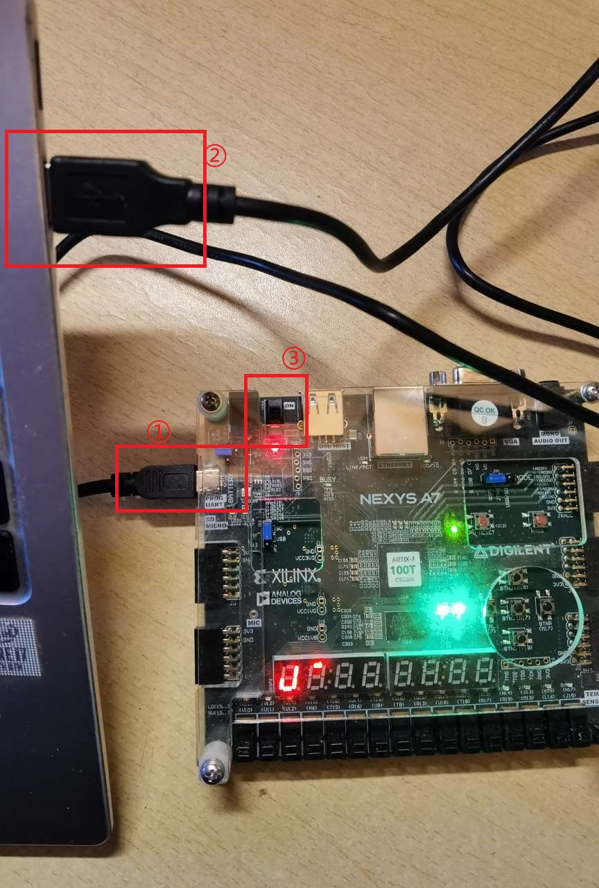

    * 点击 PROGRAM AND DEBUG > Open Hardware Manager > Open Target > Auto Connect 连接开发板

    ??? tip "Auto Connect 时遇到 localhost(0) 的解决办法"
        可先尝试执行命令，安装驱动：
        ```bash
        # On Linux
        cd /path/to/your/Vivado/2022.2/data/xicom/cable_drivers/lin64/install_script/install_drivers
        sudo ./install_drivers
        # On Windows 使用管理员权限打开 cmd 后输入
        # cd D:\\path\to\your\Vivado\2022.2\data\xicom\cable_drivers\nt64
        # install_drivers_wrapper.bat
        ```

        **若在 WSL2 内**安装 Vivado，可先参考[本 issue](https://git.zju.edu.cn/zju-sys/sys1/sys1-sp24/-/issues/39)。

        ??? note "WSL2 内安装 Vivado 可能遇到的问题与解决方法"

            如果在执行 `usbipd attach --wsl --busid ?-?` 时
            
            * 报错 `Attach Request for ?-? failed - Device in error state`，可以尝试在管理员模式下运行 Poweshell，然后执行以下命令：
            ```Powershell
            usbipd bind -b ?-? --force
            usbipd attach --wsl --busid ?-?
            ```

            * 报错 `Mounting '<path>\usbipd-win\WSL' within WSL failed`，说明你的 WSL 可能出现了问题。请参考[环境配置](./setup.md)重新安装 Ubuntu24.04-LTS。（注意备份原 WSL 中的文件）


    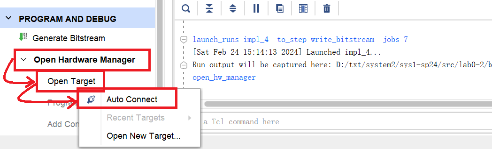

    * 选中 Hardware 中的 xc7a100t 开发板为我们要下载 bitstream 的开发板
    * 点击 Program Device 准备载入 bitstream
    * 在目录中寻找准备下板的 bitstream 文件 top.bit
    * 最后点击 Program 下板

    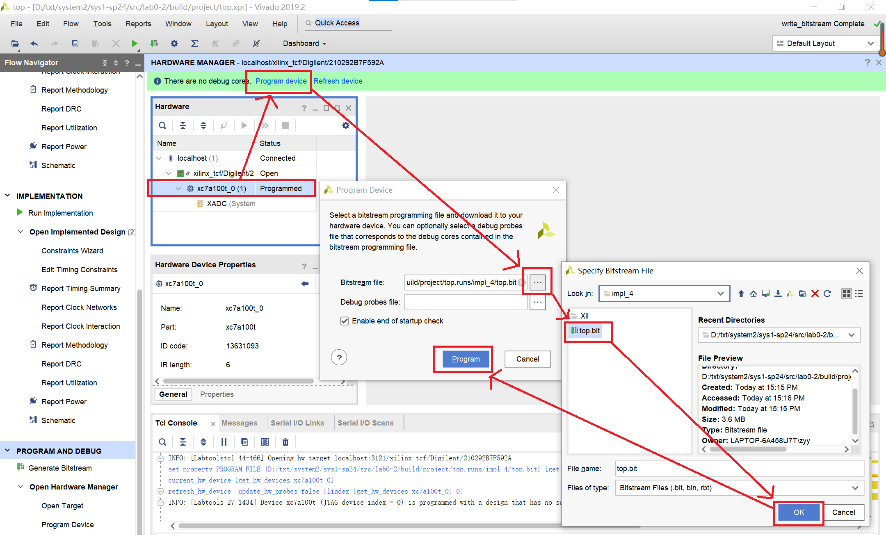

    现在已经下板成功了，大家可以自由操纵 SW0-SW2 观察 LED 灯的现象了。

#### Vivado 仿真

我们之前学习了如何用 Verilator 仿真，但实际上 Vivado 也可以仿真。具体见下：

??? "Vivado 内仿真流程"
    1. 点击左侧 Add Source > Add or create simulation sources > OK，然后载入仿真文件 repo/sys-project/lab0-2/sim/testbench.v，仿真文件的作用之前已经介绍过了
    2. 右键 Simulation Source 的 testbench，然后 Set as top，不然的话默认 top 是顶层模块，之后就会仿真模拟 top 而不是 testbench

    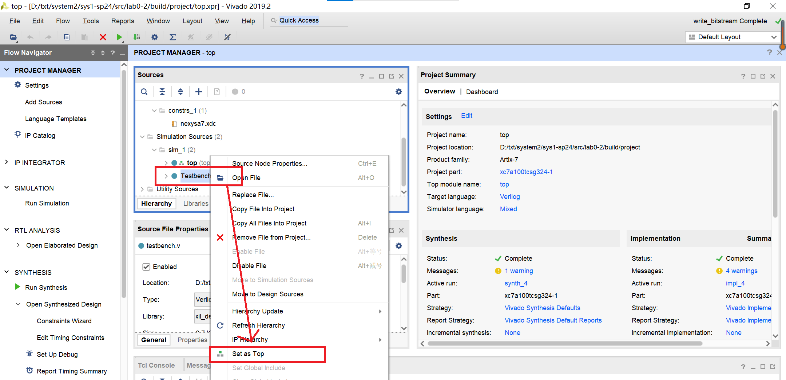

    3. 点击左侧 SIMULATION > Run Simulation > Run Behavioral Simulation，查看仿真波形

    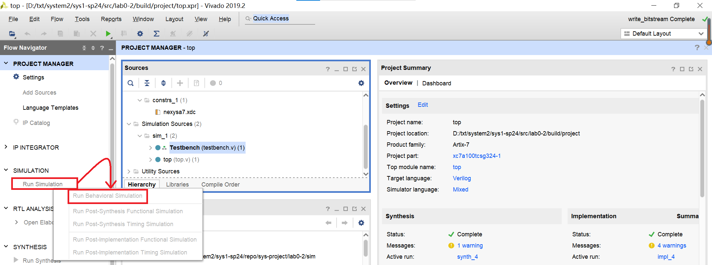

    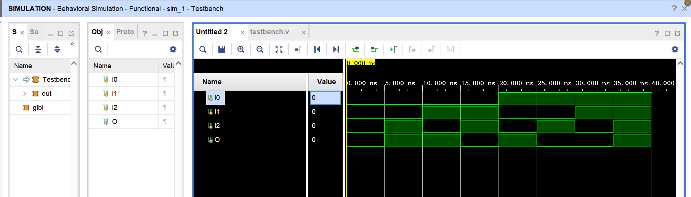

#### Vivado Batch 模式
Vivado 也提供了一个可以完全通过命令行使用的 batch mode，这样前面下板的一系列复杂操作就可以通过命令来执行了，不必再通过 GUI 页面逐个设置并点击。

进入到本仓库的 `src/lab0-2` 目录下，将 Makefile 中的 VIVADO_SETUP 变量按照参照注释中的说明替换为你本机的实际位置。

然后执行以下命令，首先将 Verilog 代码综合为用于编程 FPGA 的 Bitstream 二进制文件，然后打开 Vivado 的图形化界面将其下载到板子上。

```shell
make bitstream
make vivado
```

`make bitstream` 命令会启动 Vivado，然后 Vivado 命令行自动执行 repo/sys-project/lab0-2/tcl/vivado.tcl，完成工程建立、.v/.xdc 文件载入、synthensis、implementation、write bitstream 等一系列过程。有兴趣的同学可以对照着 Vivado GUI 流程的各步操作自行推断 Vivado.tcl 脚本的作用，应该是较为明了的。

生成的 project 和 bitstream 在 src/lab0-2/build/project。

`make vivado` 可以启动 Vivado 图形界面，可以在这里打开 project 和下载 bitstream 到开发板。


## 实验报告

### Verilog 练习 <font color=Red>30%</font>

!!! Warning

    在开始编写大家的第一份 Verilog 代码前，你可以先查看此前 Logisim 自动生成的代码来帮助你了解 Verilog 代码的基本结构。并且建议先阅读[附录](./lab0-2-appendix.md)，**请时刻铭记你在写的是一种硬件描述语言而非C语言**。

- 写出如下表达式对应的 Verilog 代码（补全 src/lab0-3/syn <font color=Red>10%</font>、src/lab0-3/submit <font color=Red>10%</font>）
- 编写引脚约束文件并进行上板验证，其中将开关 R15、M13、L16、J15 作为输入，LED 灯 H17 作为输出（给出上板结果 <font color=Red>10%</font>）:  


$$
F(A,B,C,D) = \overline{B}\,\overline{C}\,\overline{D}+\overline{A}C\overline{B}+\overline{A}BD+CD+AC
$$


### 仿真练习 <font color=Red>20%</font>

- 为该模块设计仿真激励文件（补全 src/lab0-3/sim <font color=Red>10%</font>），分别用 Verilator 和 Vivado 进行仿真，解释仿真设计的思路，并提供仿真的波形截图，两部分思路截图<font color=Red>各5%，共10%</font>
- 尝试 Verilator、Vivado 波形窗口的各个按键，尝试理解每个按键的功能

## 验收和代码提交 <font color=Red>60%</font> 

### 验收检查点

- 仿真代码解释和仿真波形展示 <font color=Red>20%</font> 
- 代码解释 <font color=Red>20%</font>
- 下板验证 <font color=Red>20%</font>

### 提交文件

- 5.1 练习编写的源代码文件和引脚约束文件
- 5.2 练习编写的仿真文件
