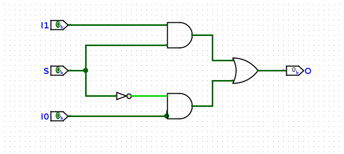
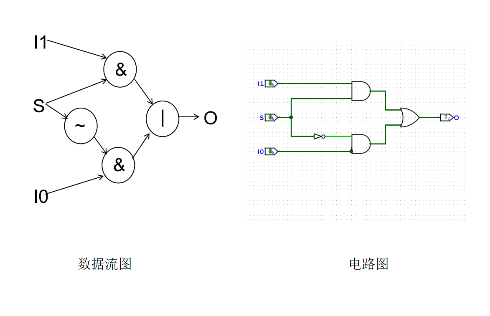
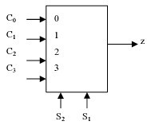
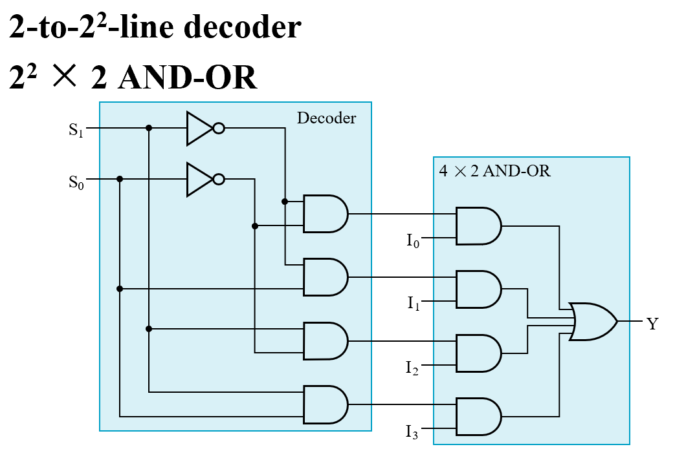
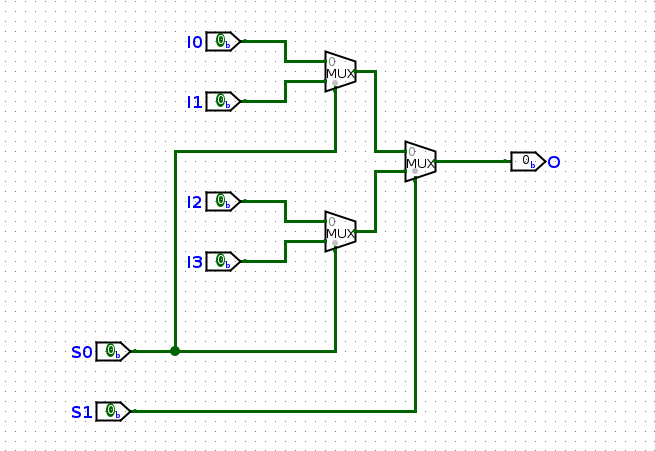
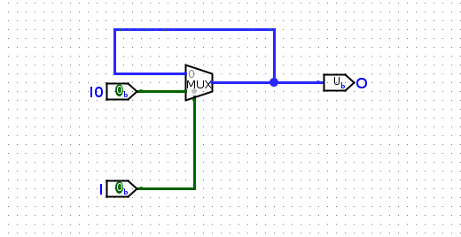
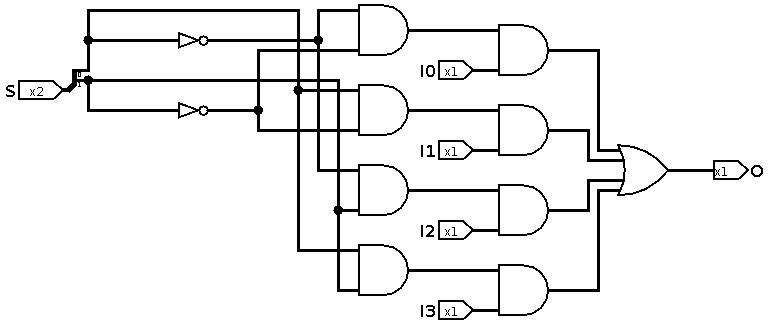
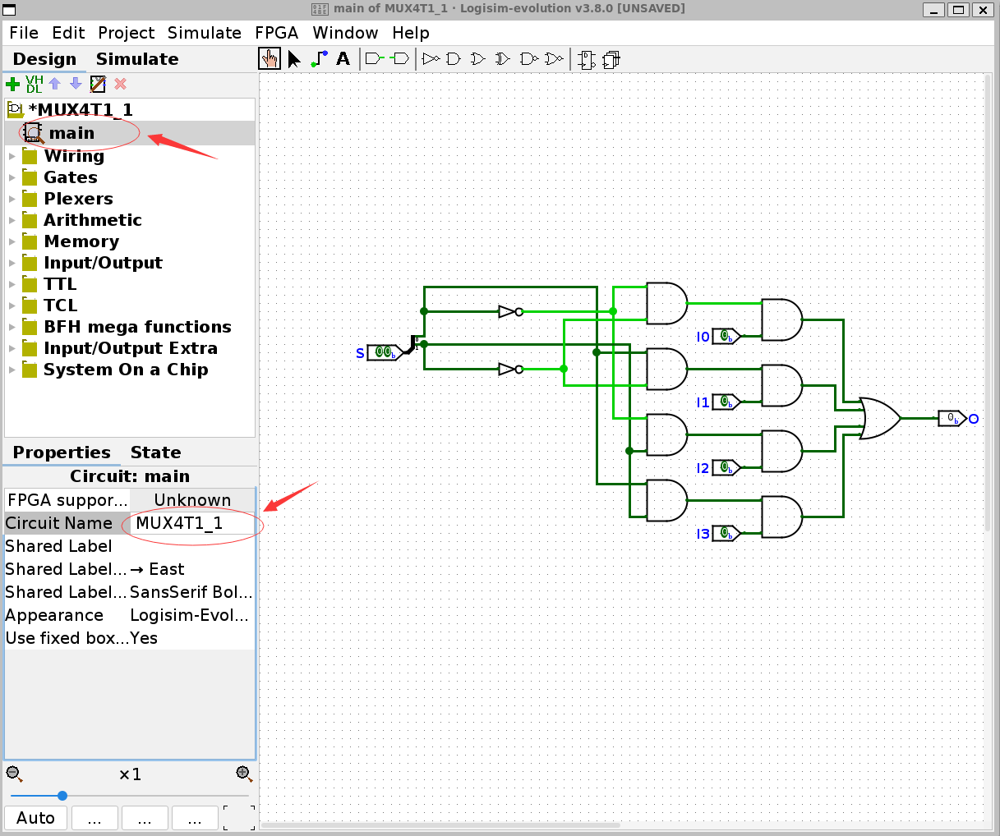

# 实验 1-1：八选一多路选择器

## 实验目的

- 掌握用于设计和仿真数字逻辑电路的 Logisim 的基本使用方法，并使用其进行电路设计
- 掌握多路复用器和加法器的内部结构和功能
- 利用原理图所产生的 Verilog 代码进行学习

## 实验环境

- EDA工具：[Ngspice](https://ngspice.sourceforge.io)，[Logisim-evolution](https://github.com/logisim-evolution/logisim-evolution)
- 操作系统：Windows 10+ 22H2，Ubuntu 22.04+
- VHDL：Verilog

## 背景知识

### 多路选择器(Multiplexer)

N 选一多路选择器是一种设备，包括输入信号 $I_0, I_1, I_2, \cdots, I_N$，选择信号 $S_0, S_1, \cdots, S_{log_N}$，输出信号 $O$。当输入信号 $S=\{S_{log_N}, \cdots, S_1, S_0\}$ 等于 $i$ 时，输出信号 $O=I_i$。它在数字系统中有着非常重要的应用。

### 二选一多路选择器

二选一多路选择器（简称二路选择器）真值表如下：

<center>

| I0 | I1 | S | O |
|:--:|:--:|:-:|:-:|
| x  | y  | 0 | x |
| x  | y  | 1 | y |

</center>

可以化简得到逻辑表达式如下：

$$O = S I_1 + \bar{S} I_0$$

对应的电路图如下：

<center>

</center>

现在我们尝试用 Verilog 语言实现二路选择器。

??? abstract "结构化描述法"
    Verilog 三种描述范式之一，通过内置的 AND、OR、NOT 模块直接描述与或非门电路和连线的方法描述门级电路：

    ```Verilog
    module Mux2To1(
        input I0,
        input I1,
        input S0,
        output O
    );
        wire S0_not;
        NOT not0 (S0_not, S0);
        wire I0_s;
        wire I1_s;
        AND and0(I0_s, I0, S0_not);
        AND and1(I1_s, I1, S0);
        OR or0(O, I0_s, I1_s);
    endmodule
    ```

    该方法的线路和模块和电路图的各个门级电路一一对应，可以非常准确的还原电路图关系，适合早期电路思维的形成和锻炼，但是写起来非常不灵活，不适用于大型电路的编程。

??? abstract "数据流描述法"
    该方法使用与、或、非、异或等运算符来代替与或非门进行电路描述，[Lab0-2](./lab0-2.md) 中我们已经介绍过“与或非门”模块和“与或非运算符”之间的对应关系了，这里可以直接做替换：

    ```Verilog
    module Mux2To1(
        input I0,
        input I1,
        input S0,
        output O
    );
        wire S0_not;
        assign S0_not = ~S0;
        wire I0_s;
        wire I1_s;
        assign I0_s = I0 & S0_not;
        assign I1_s = I1 & S0;
        assign O = I0_s | I1_s;
    endmodule
    ```

    甚至我们可以用递归表达式展开的方式写作：

    ```Verilog
    module Mux2To1(
        input I0,
        input I1,
        input S0,
        output O
    );
        assign O = (I1 & S0) | (I0 & (~S0));
    endmodule
    ```

    在 Verilog 中运算符的优先级是`() > ~ > & > |`的，所以这里可以省去括号得到：

    ```Verilog
    module Mux2To1(
        input I0,
        input I1,
        input S0,
        output O
    );
        assign O = I1 & S0 | I0 & ~S0;
    endmodule
    ```

    比较复杂的逻辑可以适当保留括号，以便于阅读代码。

    可以看到这种写法和二路选择器的逻辑表达式完全一致，和对应的 C 语言的写法也高度一致。这种写法一定程度上抛弃了结构化描述法门级电路的直观性，更接近于电路想要表达的逻辑表达式本身。我们 Lab0-2 就讲述了任何 I-O 转换关系都可以直接用数据流描述法的方式编程得到。

    我们希望大家可以时刻保持电路的视角看待问题，I1 是线路 I1 的输出，S0 是线路 S0 的输出，I1&S0 是 I1 和 S0 的输出连接进入 AND 与门之后的 AND 与门的输出。

    下图可以直观地看到数据流图和电路图之间的一一对应关系了：

    <center>
    
    </center>

    进一步的：

    1. 一个类 C 的运算符其实是一个简化描述的电路
    2. 一个运算符的操作数是这个电路的输入
    3. 一个运算符运算表达式的值是这个电路的输出
    4. 运算表达式的嵌套是门电路的级联

    数据流描述法和结构化描述最大的不同**并不在于**一个是用类 C 的语法，一个使用 module 的语法，**而在于**：

    * 数据流描述法的语句是从**电路输入到电流输出**的顺序描述电路的，是有电流方向性的、动态、面向过程的视角
    * 结构化描述法的语句是**以模块为单位按照任意**顺序描述电路的，是没有电流方向性、静态、面向对象的视角

??? abstract "行为描述法"
    这里引入了很多高度抽象的类 C 语句来提高编程的灵活性：

    ```
    module Mux2To1(
        input I0,
        input I1,
        input S0,
        output O
    );
        assign O = S ? I1 : I0;
    endmodule
    ```

    在 C 语言中，`?:` 三目运算符语法为 `exp0 ? exp1 : exp2`，如果表达式 exp0 的布尔值是 0 则返回表达式 exp2 的值，如果表达式 exp0 的布尔值是 1 则返回表达式 exp1 的值。

    Verilog 借鉴了这个语法用来实现二路选择器：exp1 在这里是第一个电路的输出，exp2 是第二个电路的输出，exp0 是构造选择子的电路的输出；于是 `?:` 在 C 语言中的语义就和二路选择器的功能保持一致了。

从结构化描述，到数据流表述，再到行为描述，Verilog 语言的灵活程度、表达能力、编程效率不断提高。在不久的将来，在我们设计的电路不断复杂的同时，行为描述会成为主要的编程方式。但同时 Verilog 语言的抽象程度、远离门级电路的程度也在不断提高，我希望同学们可以永远从电路的视角编程和阅读 Verilog 语言，不要脱离 Verilog 语言的本质。

### 四选一多路选择器

四选一多路选择器的实现结构一般有两种方式：

<center>

</center>

第一种根据卡诺图化简或者译码器得到逻辑表达式：

$$O = \bar{S_0}\bar{S_1}I_0 + S_0\bar{S_1}I_1 + \bar{S_0}S_1I_2 + S_0S_1I_3$$

对应的电路图：

<center>

</center>

第二种使用二路选择器级联得到四路选择器得到逻辑表达式：

$$\text{Mux}(S,I_1,I_0) := SI_1 + \bar{S}I_0$$

$$O = \text{Mux}(S_1, \text{Mux}(S_0, I_3, I_2), \text{Mux}(S_0, I_1, I_0))$$

电路图：

<center>

</center>

可以看到使用**梯形**表达二路选择器得到的电路图比直接用与门或门得到的电路要远远简单，这就是模块化和抽象的妙处。

两种方式的结构化描述和数据流描述虽然写起来很繁琐，但是思路都是简单的，所以这里只介绍行为描述的方法。

#### 二路选择器模块的级联
我们可以将二路选择器封装为 Mux2To1 模块，然后将多个 Mux2To1 模块组装起来：
```Verilog
module Mux4To1(
    input I0,
    input I1,
    input I2,
    input I3,
    input S0,
    input S1,
    output O
);

    wire I01;
    wire I23;

    Mux2To1 mux0(I0,I1,S0,I01);
    Mux2To1 mux1(I2,I3,S0,I23);
    Mux2To1 mux2(I01,I23,S1,O);

endmodule
```
这里我们看到如果是 N 路选择器就要写 `input I0 ... input IN` 共 N 行，太繁琐了，这里 Verilog 提供了更简洁的方法。

??? tip "Verilog 线路组语法"
    ##### 单一线路
    直接定义一根线路 a，数据类型为 wire
    ```Verilog
    wire a;
    ```

    ##### 线路数组

    定义一组线路 a，数据类型为 `wire [NUM1:NUM2]`，其中 NUM1 和 NUM2 可以是任意正整数。`wire [NUM1:NUM2]` 说明这组线路的线路条数为 `|NUM1 - NUM2| + 1`。但是一般来说定义一组长度为 LEN 的线路，使用数据类型 `wire [LEN-1:0]`。

    ##### 线路数组索引

    可以用 `a[i]` 依次索引 a 中的各根线路，其中 $i \in [NUM1, NUM2] \cup [NUM2, NUM1]$，数据类型为 wire。

    ```Verilog
    wire [0:0] a;
    //从左到右依次为 a[0]
    wire [3:0] a;
    //从左到右依次为 a[3] a[2] a[1] a[0]
    wire [0:3] a;
    //从左到右依次为 a[0] a[1] a[2] a[3]
    wire [7:1] a;
    //从左到右依次是 a[7] a[6] a[5] a[4] a[3] a[2] a[1]
    wire [3:9] a;
    //从左到右依次是 a[3] a[4] a[5] a[6] a[7] a[8] a[9]
    ```

    ##### 线路子数组索引

    可以用 `a[i:j]` 索引 wire 数组的一组连续的线路，$i, j \in [NUM1, NUM2] \cup [NUM2, NUM1]$。下面的代码首先将 `a[7:0] `的 a[2]、a[3]、a[4] 取出，然后从左到右组合起来得到 a[2:4]。

    ```
    wire [7:0] a;
    //从左到右依次是 a[7] a[6] a[5] a[4] a[3] a[2] a[1] a[0]
    a[2:4];
    //从左到右依次是 a[2] a[3] a[4]
    a[4:2];
    //从左到右依次是 a[4] a[3] a[2]
    ```

    ##### 立即数线路数组

    立即数数组由三部分组成: `imm = LEN ' BASE NUM`

    - 第一部分 LEN 是立即数的线路长度，LEN=3 表示立即数大小为 3 位线路
    - 第二部分 BASE 表示立即数的进制，b、d、h 分别表示二进制、十进制、十六进制
    - 第三部分 NUM 是对应立即数的值，必须和 BASE 指示的进制相对应，例如 4'b98 就是非法的

    将立即数转化为电路的方法如下：

    1. 将立即数转换为二进制串，如果二进制串位数少于 LEN 则在前面补 0，如果大于 LEN 则将高位截去
    2. 立即数的 0 表示该线路的输入是 GND，立即数是 1 表示该线路输入是 VCC
    3. 立即数的二进制串从低位到高位依次是 IMM[0], IMM[1], ..., IMM[LEN-1]

    ```Verilog
    3'b01     // 3'b001
    6'd67     // 6'b1000011 -> 6'b000011
    16'h1234  // 16'b0001001000110100
    ```

    ##### 线路数组连接

    宽度相同的线路才可以相互 assign 连接。`wire a` 宽度为 1；`wire [NUM1:NUM2] b` 宽度为 `|NUM2 - NUM1| + 1`；`b[i]` 宽度为 1；`b[i:j]` 宽度为 `|i - j| + 1`；`LEN'BASE IMM` 宽度为 LEN。这里的 a、b、b[i]、b[i:j] 都可以充当输入输出的线路。

    ```Verilog
    assign a[2:4] = b[7:5];
    // a 从高到低依次是 a[2] a[3] a[4]
    // b 从高到低依次是 b[7] b[6] b[5]
    // 所以 a[2] 连接 b[7]，a[3] 连接 b[6]，a[4] 连接 b[5]
    ```

    * 最好 a 的长度等于 b 的长度
    * 如果 a 的长度大于 b 的长度，会有线路没有被输入，导致 warn，在 Vivado 仿真的时候会看到线路变为蓝色进入高阻态 Z
    * 如果 a 的长度短于 b 的长度，会有 b 的部分输出被抛弃，导致 warn

    第二种和第三种都可能暗示了线路长度声明是存在错误，好在我们的 Verilator 可以自动检查线路宽度不匹配错误，大家平时要养成输入输出线路完全匹配的编程习惯。

    ##### 二维线路数组

    可以用 `wire [NUM2:NUM1] a [NUM4:NUM3]` 定义二维数组，一共有 `|NUM4 - NUM3| + 1` 组线路，每组线路有 `|NUM2 - NUM1| + 1` 根线路。

    * `a[i]` 表示其中一组线路，数据类型是 `wire [NUM2:NUM1]`
    * `a[i:j]` 表示 a[i]-a[j] 组线路总和

    不同于 `wire [NUM2:NUM1]` 的变量可以直接拿去做连接，a 和 a[i:j] 是不可以拿去做连接的。

    ```Verilog
    wire [3:0] a [0:3];
    wire [3:0] b [0:3];
    wire [3:0] c [0:3];
    assign b[0] = a[0];     // allowed
    assign b[2:1] = a[2:1]; // not allowed
    assign c = a;           // not allowed
    ```

    因此 module 的 input 数据类型可以是 wire，也可以是 `wire [NUM2:NUM1]`，但不可以是 `wire [NUM2:NUM1] [NUM4:NUM3]`。

    ##### 高维线路数组

    可以申明任意 N 维度的数组，不过一般二维数组已经够用了：

    ```Verilog
    wire a [NUM_2N:NUM_(2N-1)]...[NUM_2:NUM_1];
    wire [N_2:N_1] a [NUM_2N:NUM_(2N-1)]...[NUM_2:NUM_1];
    ```

现在我们可以将 I0-I3 的 4 个输入改为 1 个数组输入 [3:0] I，就可以简洁很多：

```Verilog
module Mux4To1(
    input [3:0] I,
    input [1:0] S,
    output O
);

    wire [1:0] I_S;

    Mux2To1 mux0(I[0],I[1],S[0],I_S[0]);
    Mux2To1 mux1(I[2],I[3],S[0],I_S[1]);
    Mux2To1 mux2(I_S[0],I_S[1],S[1],O);

endmodule
```

#### 使用 ?: 运算符

将二路选择器模块 mux 用 `?:` 运算符实现，可以将上面的模块简化为：

```Verilog
module Mux4To1(
    input [3:0] I,
    input [1:0] S,
    output O
);

    wire [1:0] I_S;

    assign I_S[0] = S[0] ? I[1] : I[0];
    assign I_S[1] = S[0] ? I[3] : I[2];
    assign O = S[1] ? I_S[1] : I_S[0];

    // or
    // assign O = S[1] ? (S[0] ? I[3] : I[2]) : (S[0] ? I[1] : I[0]);

endmodule
``` 

#### 使用 index 索引

观察下面的代码，O[0] 的连线是 I 的编号为 1 的线，O[1] 的连线是 I 的编号为 S 的线，其实就是一个 4 选一多路选择器。

```Verilog
wire [3:0] I;
wire [1:0] S;
wire [1:0] O;
assign O[0] = I[1];
assign O[1] = I[S];
```

还记得 LUT3 吗，我们说它内部是一个长度为 8 位的数组，然后根据索引 I 输出对应的数组值，所以它其实就是一个八选一多路选择器：

```Verilog
module LUT3(
    input [2:0] S,
    output O
);
    wire [7:0] array;
    assign array = 8'b10010110;
    assign O = array[S];
endmodule
```

#### 使用 if-else 语句

我们可以用 if-else 语句来表达二路选择，这是 Verilog 语法比较垃圾的地方：我们要实现的是 wire 之间的连线关系，但 Verilog 语法本身的限制导致 if-else 语法只能在 always 块中使用，且 always 块内部只能对 reg 变量赋值。所以本来应该描述为 wire 的 O 在这里只能是 reg。

`always @(*)` 表示在内部的 reg 电路实际上会被综合为 wire 的形式，根据 if-else 的语义不难知道，当 S0=1 的时候 O 输出 I[1] 的值，不然输出 I[0] 的值，最后得到简单的二路选择器。**请记住 if-else 是二路选择器，不是 C 语言的表达式**。

```Verilog
reg O;
always @(*) begin
    if (S0) O = I[1];
    else O = I[0];
end
```

四路选择器的二路选择器的级联实现也可以用 if-else 的嵌套来描述：

```Verilog
module Mux4To1(
    input [3:0] I,
    input [1:0] S,
    output O
);

    reg O_tmp;
    always @(*) begin
        if (S1) begin
            if (S0) O_tmp = I[3];
            else O_tmp = I[2];
        end else begin
            if (S0) O_tmp = I[1];
            else O_tmp = I[0];
        end
    end

    assign O = O_tmp;

endmodule
```

可以看到因为最后需要做 `assign O = O_tmp` 将寄存器 O_tmp 输送给线路 O 做输出，但是可以直接将 output 的类型设置为寄存器，从而简化编程。不加 reg 修饰默认输入输出是 wire 类型，输入一般只能是 wire 类型：

```Verilog
module Mux4To1(
    input [3:0] I,
    input [1:0] S,
    output reg O
);

    always @(*) begin
        if (S1) begin
            if (S0) O = I[3];
            else O = I[2];
        end else begin
            if (S0) O = I[1];
            else O = I[0];
        end
    end

endmodule
```

`begin ... end` 表示一个代码块，作用相当于 C 语言的 `{}`，if-else 后默认只能跟一条语句，如果要跟随多条语句，这个时候需要用 `begin ... end` 包裹。

#### 使用 case 语句

我们还可以用类似 C 的 switch-case 的方式来描述多路选择器，最后得到的也是四路选择器。实际上 switch-case 的语法最早就是模仿多路选择器的工作模式而产生的。

```Verilog
module Mux4To1(
    input [3:0] I,
    input [1:0] S,
    output reg O
);

    always @(*) begin
        case (S)
            2'b00: O = I[0];
            2'b01: O = I[1];
            2'b10: O = I[2];
            2'b11: O = I[3];
        endcase
    end

endmodule
```

#### no-latch warn

诚然 if-else 和 case 很好用，很多 Verilog 没有学扎实但是 C 学的不错的同学看到 if-else 就想当然地认为，自己只要按照 C 的语法来写 Verilog 就可以了，这是会埋雷的。

例如我现在有一个需求，当输入是 1'b1 的时候输出 I0。首先需求没有说明输入不是 1'b1 时要怎么处理，一些同学可能就没有意识到这个问题；其次可能觉得输入不是 1'b1 的情况不存在或者此时输出是多少无关紧要，于是这些同学会这样写：

```Verilog
always @(*) begin
    if (I == 1'b1) O = I0;
end
// or
always @(*) begin
    case (I)
        1'b1: O = I0;
    endcase
end
```

那么请问如果 I=0 怎么办？如果是 C 语言可能会说保持 O 的原值不变，reg 也是这样的，所以对应的连线会变为这个样子，这个电路类似于锁存器，当 I=0 的时候 wire O 可以一直保持原来的值不变，相当于 wire 存储了数值：

<center>

</center>

这种电路的电气结构是很**不稳定**的，特别是在 I 发生 0-1 跳变的瞬间，很有可能意外产生你预期之外的结果，所以 `always @(*)` 写 if 语句和 case 语句的时候一定要记得：

* if 语句要有完整的 if-else
* case 语句要遍历所有的 case 硬件码，或者提供 default

例如无关项输出 0，这样就可以得到安全稳定的多路选择器：

```Verilog
always @(*) begin
    if (I == 1'b1) O = I0;
    else O = 1'b0;
end
// or
always @(*) begin
    case (I)
        1'b1: O = I0;
        default: O = 1'b0;
    endcase
end
```

如果你不希望 I 输入除 0 以外的结果，可以让无关项输出 x：

* 一方面当仿真的时候发现 O 输出为红色波形未定义值 x 就可以推断得到该模块的 I 输入有错误
* 另一方面，Verilog 在综合电路的时候可以做进一步的化简，比如直接化简为 `assign O=I0`

```Verilog
always @(*) begin
    if (I == 1'b1) O = I0;
    else O = 1'bx;
end
// or
always @(*) begin
    case (I)
        1'b1: O = I0;
        default: O = 1'bx;
    endcase
end
```

不要滥用 `always @(*)` 和 if 语句、case 语句，时刻警惕注意 no-latch warning。不然就会遇到**仿真正确但是下板错误**的问题，这是很打击开发者的自信心的。

### 更复杂的多路选择器

可以仿照二路选择器到四路选择器的过渡，不难推断八路、十六路乃至更复杂的多路选择器的设计。

## 实验步骤

### 四选一一位多路复用器的实现

#### 原理图的绘制

cd 到 Lab0-1 中下载的 `logisim-evolution-3.8.0-all.jar` 所在目录，执行 `java -jar logisim-evolution-3.8.0-all.jar` 命令启动 Logisim 并绘制下图所示的电路图：

<center>

</center>

将电路图保存为 `Mux4T1_1.circ`

!!! warning "注意"
    * 取数组的分量用 Wiring/Spiltter 实现，并修改 Fan Out 和 Bit Width In
    * input 的数组长度修改 Data Bits
    * 在绘制完成后点击左上角的 main 然后修改右下角的 circuit name 为 **Mux4T1_1**

    

可以通过 Simulate 验证电路图是否正确，真值表如下：

<center>

| S[1:0] | O    |
| :----: | :--: |
| 2'b00  | I0   |
| 2'b01  | I1   |
| 2'b10  | I2   |
| 2'b11  | I3   |

</center>

#### 将原理图导出为 Verilog

依据 [Lab0-2 4.1](./lab0-2.md#export-to-verilog) 的步骤进行导出。其中，在 circuit 目录下的 **Mux4T1_1.v** 文件中应当包含如下内容，**注意**后续实验要求模块名和端口名必须和给出的样例相同：

```verilog
module Mux4T1_1( I0,
                 I1,
                 I2,
                 I3,
                 O,
                 S );
```

最后，将 circuit 和 gates 目录下的生成的所有 Verilog 文件拷贝至本仓库的 `src/lab1-1/submit` 目录下备用，注意将 GATES 的 parameter 的宽度做修改。

然后用 Mux4T1_1.v 为基础加一个二路选择器编写 **Mux8T1_1.v**，该二路选择器可以用上面提到的任何 Verilog 语句实现。

#### 仿真 Verilog 设计

在 `src/lab1-1/sim` 中设计仿真样例，对于给定的 I 输入遍历 S 的组合，然后进行仿真:

```shell
make verilate
make wave
```

### Vivado 上板验证

在 `src/lab1-1/syn` 中补全 top 文件和 xdc 文件，然后用 GUI 模式或者 batch 模式综合下板。其中输入 I0-I7 S0-S2 对应板子从右到左的前十一个开关，LD0 对应从右到左的第一个 LED。

## 实验报告 <font color=Red>50%</font>

请在实验报告中详细描述每一步的过程并配有适当的截图和解释，对于仿真设计和上板验证的结果也应当有适当的解释和照片 <font color=Red>Total : 23%</font>

> 细分：
> 
> - 四路选择器原理图 <font color=Red>3%</font>
> - 八路选择器代码解释 <font color=Red>5%</font>
> - TestBench 设计 <font color=Red>5%</font>
> - 其余实验步骤及截图 <font color=Red>10%</font>

在实验中我们已经拥有了 Mux4（控制的信号数）T1_1（输入的位数），实际上它是由如 3.1 图中展示的结构组成，思考如下问题：

- Mux2T1_1 是两个 AND，一个 OR 和一个 NOT 组成的简单结构，它是由哪种 decoder 和 AND-OR 结构组成的 <font color=Red>5%</font>
- Mux4T1_1 是如何组成的 <font color=Red>6%</font>
- Mux8T1_1 是如何组成的 <font color=Red>6%</font>
- 那么 Mux2<sup>m</sup>T1_n是如何构成的呢 <font color=Red>10%</font>

请在报告中给予解答。

## 代码提交

### 验收检查点 <font color=Red>45%</font>

- 仿真代码解释和仿真波形展示 <font color=Red>10%</font>
- Mux8T1 代码解释 <font color=Red>15%</font>
- 下板验证 <font color=Red>20%</font>

### 提交文件

`src/lab1-1/` 中编写的 syn、sim、submit 的代码。