# 实验 1-2：七段数码管译码器设计与应用

## 实验目的

- 掌握使用 Verilog 语言进行电路设计的方法
- 掌握七段数码管显示译码器(MC14495)的内部电路结构及其设计
- 实现 [Nexys A7](https://digilent.com/reference/programmable-logic/nexys-a7/start) 开发板七段数码管十六进制数显示

## 实验环境

- EDA工具：[Ngspice](https://ngspice.sourceforge.io)，[Logisim-evolution](https://github.com/logisim-evolution/logisim-evolution)
- 操作系统：Windows 10+ 22H2，Ubuntu 24.04+
- VHDL：Verilog

## 背景知识

### 变量译码器(decoder)

译码器(decoder)是一类多输入多输出组合逻辑电路器件，其可以分为：变量译码和显示译码两类。

- 变量译码器一般是一种较少输入变为较多输出的器件，常见的有n线-2<sup>n</sup>线译码和8421BCD码译码两类
- 显示译码器用来将二进制数转换成对应的七段码，一般其可分为驱动 LED 和驱动 LCD 两类

<center>
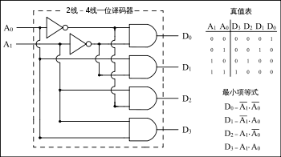
</center>

广义的译码器是指将二进制编码输入转换为任意的编码输出，且这个转换关系可以不满足单射。我们反思一下，其实一个逻辑表达式或者说一张真值表，就是一个输入到输出的编码对应关系，输入天然满足二进制编码，如果我们将输出定义为一种新的编码，那么任何有限长度的输入输出映射对应的电路都可以称之为**编码器**。

```
输入输出关系 <=> 逻辑表达式 <=> 真值表 <=> 编码器
                    /\
                    ||
                    \/
                 组合电路
```

### 复合多路选择器

多路选择器可以根据 selector 从多个单 bit 输入中选择单 bit 的输出，那如果我们需要从多组输入中根据 selector 选出单组输出呢？可以使用复合多路选择器。

??? abstract "多个一位多路选择器组合"
    复合多路选择器在硬件实现上是用多个一位多路选择器组合而成

    ```Verilog
    module Mux4T1_4(
        input [3:0] I0,
        input [3:0] I1,
        input [3:0] I2,
        input [3:0] I3,
        input [1:0] S,
        output [3:0] O
    );

        Mux4T1_1({I3[0], I2[0], I1[0], I0[0]}, S, O[0]);
        Mux4T1_1({I3[1], I2[1], I1[1], I0[1]}, S, O[1]);
        Mux4T1_1({I3[2], I2[2], I1[2], I0[2]}, S, O[2]);
        Mux4T1_1({I3[3], I2[3], I1[3], I0[3]}, S, O[3]);

    endmodule
    ```

    `{}` 是 `[i]` 的反操作，`{ W0, W1, W2, ..., Wn }` 将线路数组 W0, W1, ..., Wn 组拼接成一个增广的线路数组：

    - `LEN({ W0, W1, W2, ..., Wn }) = Sum(LEN(W0), LEN(W1), ..., LEN(Wn))`
    - `{ W0, W1, W2, ..., Wn }` 的线路从高到低的输入和 W0, W1, ..., Wn 内部从高到低的输出保持一致

??? abstract "与或形式"
    也可以用最朴素的逻辑门的形式得到符合多路选择器电路，不过这个电路未免过于复杂，我们可以用一些 Verilog 语法进行简化。
    ```Verilog
    module Mux4T1_4(
        input [3:0] I0,
        input [3:0] I1,
        input [3:0] I2,
        input [3:0] I3,
        input [1:0] S,
        output reg [3:0] O
    );

        assign O[0] = (~S[0]&~S[1])&I0[0] | (S[0]&~S[1])&I1[0] | (~S[0]&S[1])&I2[0] | (S[0]&S[1])&I3[0];
        assign O[1] = (~S[0]&~S[1])&I0[1] | (S[0]&~S[1])&I1[1] | (~S[0]&S[1])&I2[1] | (S[0]&S[1])&I3[1];
        assign O[2] = (~S[0]&~S[1])&I0[2] | (S[0]&~S[1])&I1[2] | (~S[0]&S[1])&I2[2] | (S[0]&S[1])&I3[2];
        assign O[3] = (~S[0]&~S[1])&I0[3] | (S[0]&~S[1])&I1[3] | (~S[0]&S[1])&I2[3] | (S[0]&S[1])&I3[3];

    endmodule
    ```

    * 向量操作
        两个向量的每个 bit 依次做与、或、异或、取反操作，得到向量输出。
    ```Verilog
    wire [3:0] a;
    wire [3:0] b;
    wire [3:0] c [3:0];
    assign c[0] = a & b;
    assign c[1] = a | b;
    assign c[2] = a ^ b;
    assign c[3] = ~a;
    ```

    * 扩展操作
        `{}`内的线路会被扩展 N 份，常用于符号扩展、0 扩展、一个输出扩展为向量输出等场景
    ```Verilog
    wire a;
    wire [3:0] b;
    assign b = {4{a}};
    ```

    * 归约操作
        将一个向量的所有 bit 或、与、异或起来。
    ```Verilog
    wire [3:0] a [2:0];
    wire b [2:0];
    assign b[0] = |a[0];
    assign b[1] = &a[1];
    assign b[2] = ^a[2];
    ```

    于是上述代码可以化简为：
    ```Verilog
    module Mux4T1_4(
        input [3:0] I0,
        input [3:0] I1,
        input [3:0] I2,
        input [3:0] I3,
        input [1:0] S,
        output reg [3:0] O
    );

        wire [3:0] sel;
        assign sel[0] = ~S[0]&~S[1];
        assign sel[1] = S[0]&~S[1];
        assign sel[2] = ~S[0]&S[1];
        assign sel[3] = S[0]&S[1];
        assign O = {4{sel[0]}}&I0 | {4{sel[1]}}&I1 | {4{sel[2]}}&I2 | {4{sel[3]}}&I3;
        // assign O = {LEN{cond0}}&data[0] | {LEN{cond1}}&data[1] | ... | {LEN{condN}}&data[N]

    endmodule
    ```

??? abstract "使用 ?: 语法"
    实际上 Verilog 提供了更简洁的复合多路选择器的语法：

    ```Verilog
    module Mux4T1_4(
        input [3:0] I0,
        input [3:0] I1,
        input [3:0] I2,
        input [3:0] I3,
        input [1:0] S,
        output [3:0] O
    );

        assign O=S[1] ? (S[0] ? I3 : I2) : (S[0] ? I1 : I0);

    endmodule
    ```

    `exp0 ? exp1 : exp2` 直接对应一个复合多路选择器，exp0 是一位的选择子，则复合多路选择器的输出 exp1 的输入，反之输出 exp2 的输入。

??? abstract "使用 index 索引语法"

    ```Verilog
    module Mux4T1_4(
        input [3:0] I0,
        input [3:0] I1,
        input [3:0] I2,
        input [3:0] I3,
        input [1:0] S,
        output [3:0] O
    );

        wire [3:0] I [3:0];
        assign I[0] = I0;
        assign I[1] = I1;
        assign I[2] = I2;
        assign I[3] = I3;

        assign O = I[S];

    endmodule
    ```

    核心在于将离散的线路数组整合为可以被索引的二维数组。

??? abstract "使用 if-else 语法"
    ```Verilog
    module Mux4T1_4(
        input [3:0] I0,
        input [3:0] I1,
        input [3:0] I2,
        input [3:0] I3,
        input [1:0] S,
        output reg [3:0] O
    );

        always @(*) begin
            if (S[1]) begin
                if (S[0]) O = I3;
                else O = I2;
            end else begin
                if (S[0]) O = I1;
                else O = I0;
            end      
        end 

    endmodule
    ```

??? abstract "使用 case 语法"
    ```Verilog
    module Mux4T1_4(
        input [3:0] I0,
        input [3:0] I1,
        input [3:0] I2,
        input [3:0] I3,
        input [1:0] S,
        output reg [3:0] O
    );

        always @(*) begin
            case (S)
                2'b00 : O = I0;
                2'b01 : O = I1;
                2'b10 : O = I2;
                2'b11 : O = I3;
            endcase
        end 

    endmodule
    ```

??? abstract "与或式 vs 高级语法式"
    与或式的表达能力相较于高级语法更强，如果我们的需求是满足 `cond0=1` 输出 `data0`，满足 `cond1=1` 输出 `data1`...，且 `cond0、cond1...condN` 满足 one-hot，则可以使用与或式直接编程，但是高级语法往往需要将 `cond0、cond1...condN` 编码为二进制选择子。
    <center>
    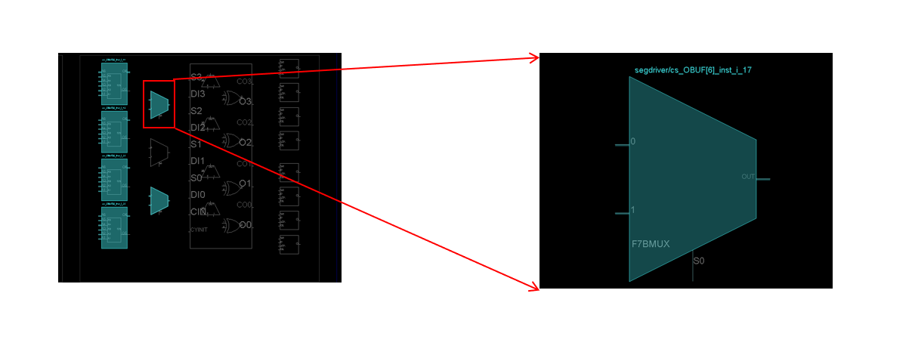
    </center>

    但是高级语法的选择电路可以用 FPGA 的选择电路直接构建，综合效率更高，运行效果更好；而与或式则没有这个优点，且可读性更差。


??? abstract "复合多路选择器实现译码器"
    对于 N 位输入，M 位输出的真值表可以用宽度为 M 的 2<sup>N</sup> 多路选择器来实现。当输入为 0，1，2 ... 2<sup>N</sup>-1 时，复合多路选择器输出真值表对应的输出即可。以 one-hot 码译码器为例：

    <center>
    <table style="text-align:center">
        <thead>
            <tr> <th colspan="2">Input</th> <th colspan="4">Output</th> </tr>
            <tr> <td>I0</td> <td>I1</td> <td>O0</td> <td>O1</td> <td>O2</td> <td>O3</td> </tr>
        </thead>
        <tbody>
            <tr> <td>0</td> <td>0</td> <td>1</td> <td>0</td> <td>0</td> <td>0</td> </tr>
            <tr> <td>1</td> <td>0</td> <td>0</td> <td>1</td> <td>0</td> <td>0</td> </tr>
            <tr> <td>0</td> <td>1</td> <td>0</td> <td>0</td> <td>1</td> <td>0</td> </tr>
            <tr> <td>1</td> <td>1</td> <td>0</td> <td>0</td> <td>0</td> <td>1</td> </tr>
        </tbody>
    </table>
    </center>

    可以用复合多路选择器实现：

    ```Verilog
    module one-hot(
        input [1:0] S,
        output [3:0] O
    );

        wire [3:0] I [3:0];
        assign I[0]=4'b0001;
        assign I[1]=4'b0010;
        assign I[2]=4'b0100;
        assign I[3]=4'b1000;

        assign O=I[S];

    endmodule
    ```

再加上 LUT 和多路选择器等价，复合 LUT 和复合多路选择器等价，所以有如下的等价关系：

```
输入输出关系 <=> 逻辑表达式 <=> 真值表 <=> 编码器
                    /\        /\
                    ||        ||
                    \/        \/
                 组合电路  多路选择器 <=> LUT
```

### 七段数码管

数码管的一种是半导体发光器件，数码管可分为七段数码管和八段数码管，区别在于八段数码管比七段数码管多一个用于显示小数点的发光二极管单元 DP(decimal point)，其基本单元是发光二极管。

七段数码管分为**共阳极**及**共阴极**，共阳极的七段数码管的正极（或阳极）为八个发光二极管的共有正极，其他接点为独立发光二极管的负极（或阴极），使用者只需把正极接电，不同的负极接地就能控制七段数码管显示不同的数字。共阴极的七段数码管与共阳极的只是接驳方法相反而已。

**NOTE:** [Nexys A7](https://digilent.com/reference/programmable-logic/nexys-a7/start) 开发板的七段数码管为**共阳极**数码管，当输入信号为 0 时，对应数码管亮；输入信号为 1 时，对应数码管灭。

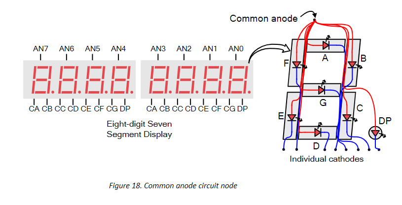

七段数码管的显示译码的对应关系如下，根据复合多路选择器实现译码器的关系不难得到译码电路。

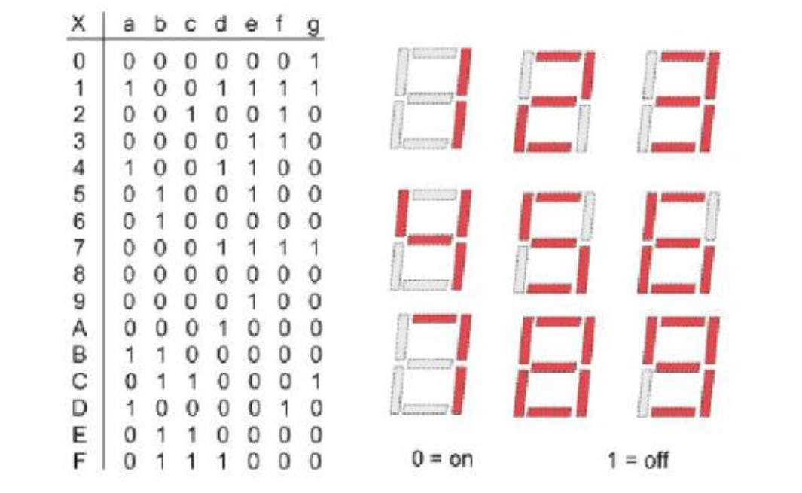

### 动态时分复用

Nexys-A7 开发板有八个七段数码管，所有七段数码管共用 CA、CB ... DP 的输出。此外每个七段数码管有自己专用的 AN 信号线作为使能信号，当 AN=1 时，七段数码管无论 CA、CB ... DP 输入为多少，七段数码管不亮；当 AN=0 时七段数码管才根据 CA、CB ... DP 的输入亮灭。

<center>
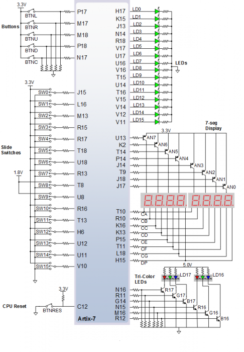
</center>

现在我们希望八个七段数码管分别显示 32'h12345678 这八个数据，我们应该怎么做才能让接收同样 CA、CB ... DP 输入的数码管输出不同的信号呢？

我们将一个时间周期平均分为八分，在第一分时间内我们将 4'h1 的译码结果输出到七段数码管，然后将第一个七段数码管的 AN 启动，其余七段数码管的 AN 关闭，这样第一个七段数码管会显示数字 1，其余数码管不亮。

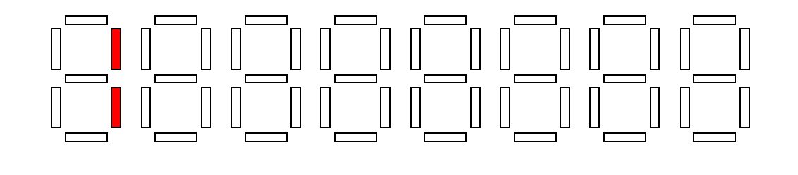

第二个时间片输出 4'h2 的译码结果，仅使能第二个七段数码管，这样只有第二个七段数码管显示数字 2，其余数码管不亮。

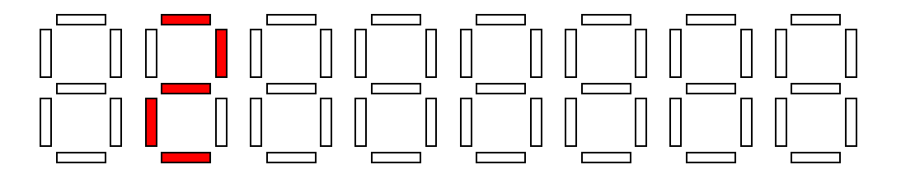

依次类推，如此轮回。最后每个数码管都会有八分之一的时间显示自己对应的数据，然后因为视觉残留，最后人眼会感觉八个数码管同时亮起，且分别显示对应的数据。

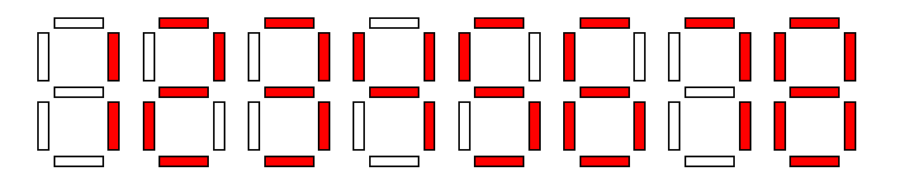


## 实验步骤

!!! Warning "注意事项"

    为了使同学们理解 Verilog 是描述电路的语言，我们认为过早的使用行为描述方式会导致同学们以高级语言编程的方式理解 Verilog 代码，偏离学习硬件电路设计的初衷，在本次实验中，请严格用**结构描述和数据描述法**复现电路，**不能使用行为描述法**。以此训练大家根据电路设计 Verilog、熟悉硬件描述语言本质的能力。

### 实验前准备

与 Lab 1-1 相同，启动安装在你电脑中的 Ubuntu 24.04 环境（WSL 或虚拟机），cd 到 sys1-sp{{ year }} 文件夹执行：

```shell
git pull
cd repo/sys-project
git pull
```

这个命令将仓库更新到最新状态。

在进行接下来的实验之前，请仔细阅读背景知识中[译码器](#decoder)相关的内容，并自学 Verilog 代码的语法。

另外为了方便同学们进行 Verilog 代码的编写及调试，我们建议下载 [VSCode](https://code.visualstudio.com/) 并安装 **Verilog 插件**作为编辑器进行代码编写，当然你也可以使用你自己喜欢的 IDE。

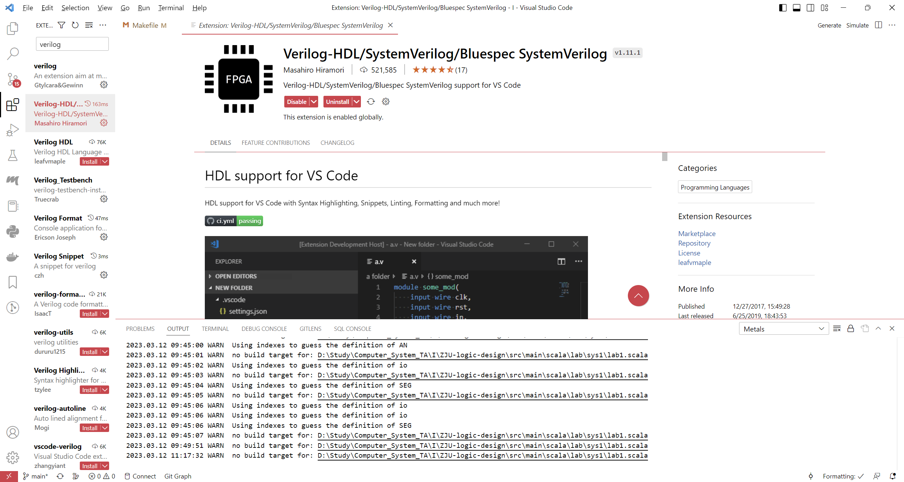

### 设计七段数码管译码器

请使用结构化描述或者数据流描述方式完善代码仓库中的 `src/lab1-2/submit/SegDecoder.v` 文件

!!! warning "**请不要修改 module 定义的输入输出**，以免自动化编译脚本失效"

`SegDecoder` 模块的电路如下：

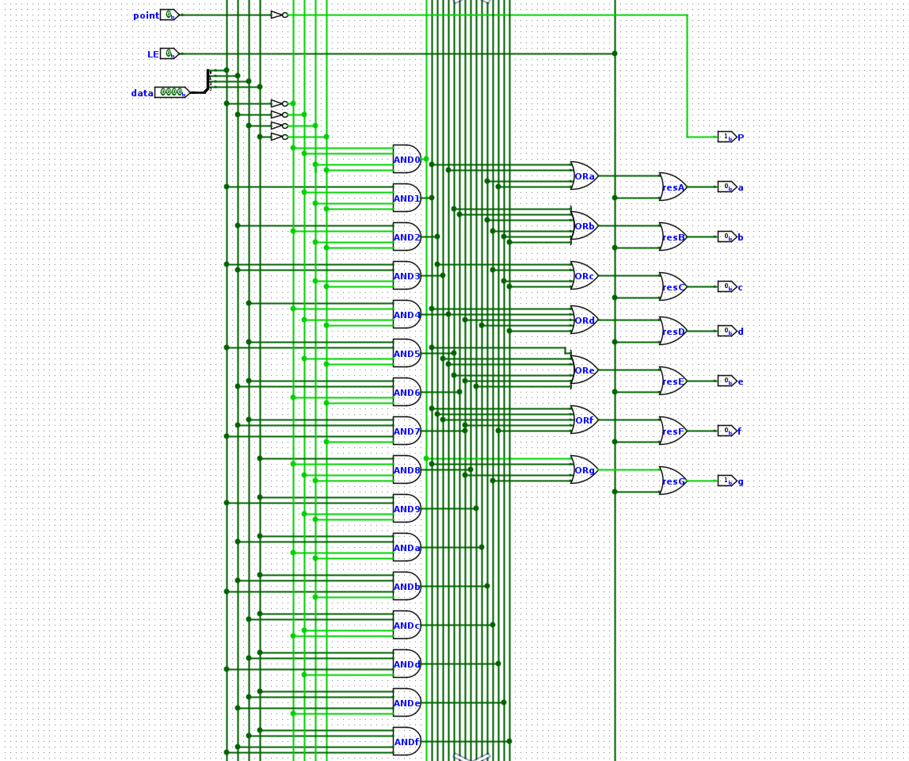

```Verilog
module SegDecoder (
    input wire [3:0] data,  //要显示的十六进制数
    input wire point,       //是否显示小数点，1 显示小数点
    input wire LE,          //是否使能，0 使能

    output wire a,          
    output wire b,
    output wire c,
    output wire d,
    output wire e,
    output wire f,
    output wire g,
    output wire p           //小数点对应的数码管
);
```

编写完成后，运行 `make verilate` 进行仿真验证查看波形。

### 实现 32 位复合四选一多路选择器

学习实验原理部分的复合多路选择器部分，选择某一种语法实现四选一多路选择器模块 `src/lab1-2/submit/Mux4T1_32.v`，尝试比较各种语法的优劣。

### 综合下板验证

下板的代码由 `src/lab1-2/submit` 和 `repo/sys-project/lab1-2/syn` 两部分模块组成，整体的电路图如下：

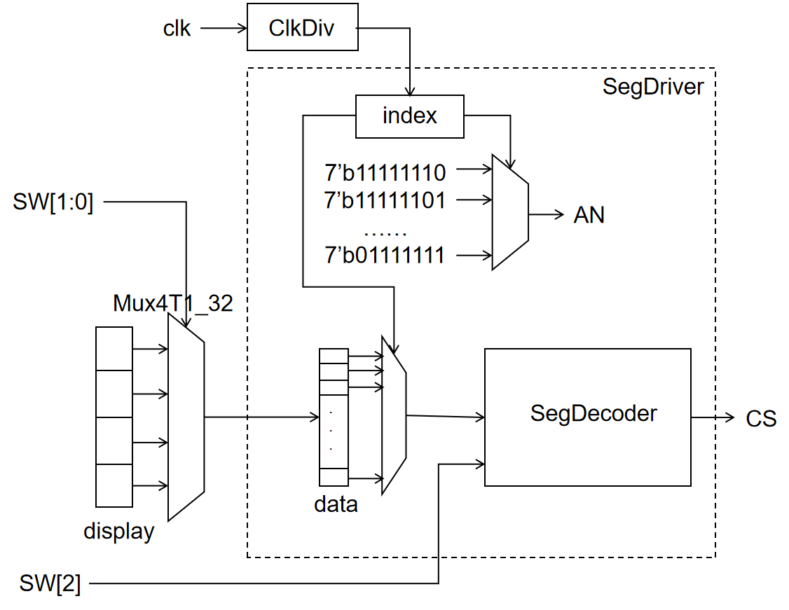

`display` 是待显示的值，被定义在 `src/lab1-2/include` 中：前半部分 `0123456789abcdef` 用于验证译码模块的正确性；后半部分的 `x` 请替换成自己的学号。

```Verilog
`define DISPLAY 128'h01234567_89abcdef_000000xx_xxxxxxxx
```

\`define 等价于 C 的 #define，但是 Verilog 的宏变量在使用的时候需要在前面加 \` 才可以，例如 \`DISPLAY。

- 开关 sw[1:0] 为最右侧两个开关，结合 32 位四选一多路选择器从 display 中选择要显示的 32 位数据输入 SegDriver 模块
- 开关 sw[2] 控制七段数码管的亮灭，当 sw[2]=1 的时候七段数码管不工作
- clk_div 模块和 index 寄存器配合工作，index 寄存器的值在 012...7 之间循环，然后每个时间片输出对应的 AN 使能信号和 data 要输出的 4 位数据，这四位数据由 SegDecoder 译码，最后显示到七段数码管上（即动态刷新时分复用）

完成 `src/lab1-2/submit` 的两个模块之后运行，编译得到比特流，下板验证：

```bash
    make bitstream
```

## 实验报告 <font color=Red>50%</font>

请在实验报告中详细描述每一步的过程并配有适当的截图和解释，对于仿真设计和上板验证的结果也应当有适当的解释和照片 <font color=Red>Total 30%</font>

> 细分：
> 
> - 译码管设计 <font color=Red>10%</font>
> - 复合多路选择器及语法分析比较 <font color=Red>10%</font>
> - 综合实现数码管 <font color=Red>10%</font>

阅读 `repo/sys-project/lab1-2/sim/testbench.v` 的测试样例，尝试将 `for` 语句展开为初始化序列，然后写出你对 `for` 语句的理解 <font color=Red>10%</font>

对于各种多路选择器的写法进行比较，请写出你最喜欢的多路选择器语法，并给出理由 <font color=Red>10%</font>

有兴趣的同学请自行阅读 `repo/sys-project/lab1-2/syn` 的代码细节，分享你的心得体会。

## 代码提交

### 验收检查点 <font color=Red>55%</font>

- 仿真波形展示 <font color=Red>15%</font>
- 代码解释或设计思路 <font color=Red>20%</font>
- 下板验证（七段数码管能显示自己的学号）<font color=Red>20%</font>

### 提交文件

`src/lab1-2/` 中编写的 submit 的代码。