# reg 与时序电路

## 寄存器

Verilog 可以用`reg`定义寄存器：

```Verilog

reg a; // 定义一个寄存器 a
reg [7:0] b; // 定义寄存器组 b[0]-b[7]
reg [7:0] b [11:0]; // 定义寄存器二维数组
reg [7:0] b [11:0]...[11:0]; // 定义寄存器高维数组
// 数组长度、排列顺序、索引等和 wire 语法一致

```

## 触发器

Verilog 的触发器可以简单地认为是 D 触发器。最简单的触发器 Verilog 语言如下，时钟边沿沿触发，载入 data 输入的值。这些寄存器一般会使用 FPGA 内置的 Flip Flop 实现。

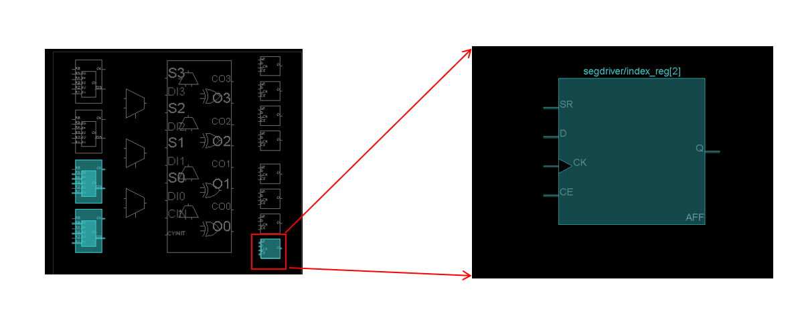

我们可以看到 Flip Flop 稀疏均匀地分布在 FPGA 的 slice 上，因此这种寄存器被称为 distributed register，简称 dram，即分布式寄存器。

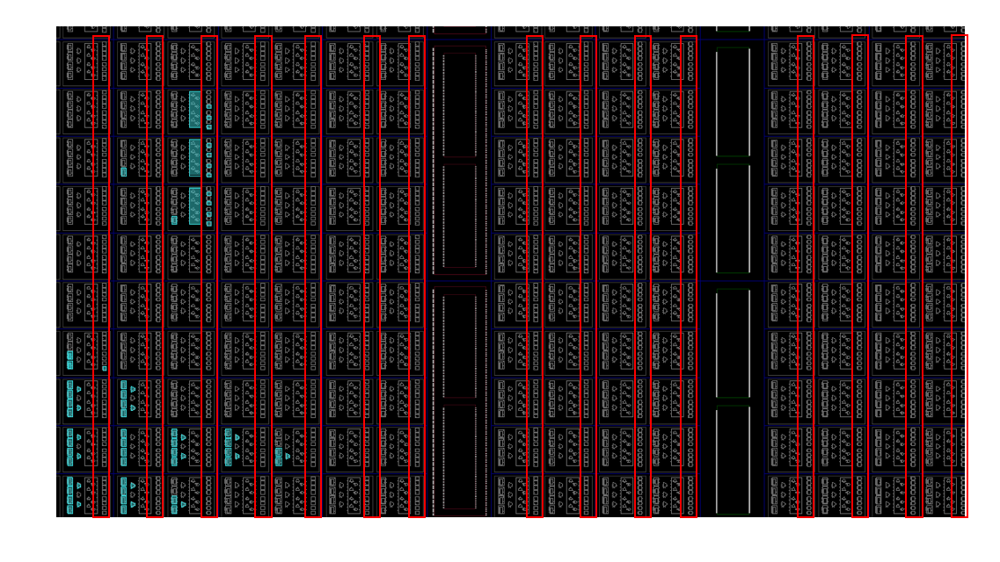

```Verilog
wire data;
reg a;
reg b;
always@(posedge clk)begin
// always at positive edge of clk
// 总是在 clk 信号的上升沿触发以下功能块
    a <= data;
    // 寄存器 a 载入线路 data 的数据
end

always@(negedge clk)begin
// always at negative edge of clk
// 总是在 clk 信号的下降沿触发以下功能块
    b <= a;
    // 寄存器 b 载入线路 a 的数据
end
```

我们可以动态的感受一下上述电路的波形变化，一开始的时候寄存器 a、b 假设值是 0，data 和 clk 引脚接受的输入如下：

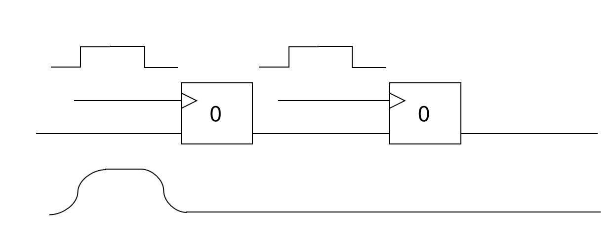

随着时间的推移，电线上的波形开始向后传播，但是因为寄存器本身的特殊性，当 clk 输入波形没有到达方波边沿的时候寄存器内部的值不会发生改变，所以 data 中的高电平电波传递到 a 寄存器之后被阶段，后续的传播依旧保持 a 寄存器本身的低电平信号。

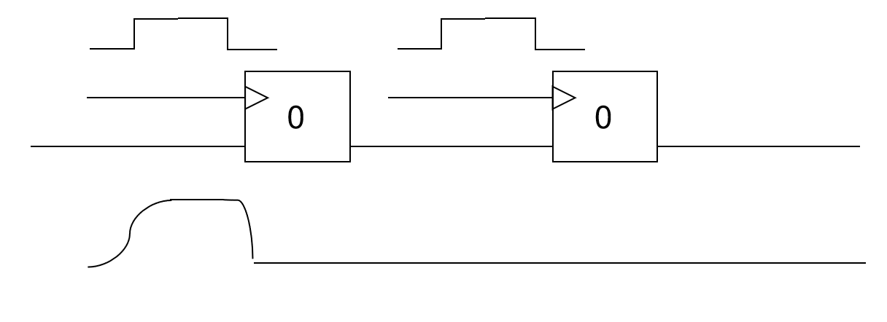

随着波形的传播，寄存器 a 的 clk 波形从低电平变为了高电平，遇到了一个上升沿。因为寄存器 a 是上升沿触发的，所以寄存器内部存储的电平开始载入为 data 输入的高电平，此时寄存器 a 内部的电平处于低电平向高电平转换的中间状态。

寄存器 b 则因为是下降沿触发，所以不修改内部存储的电平，后续的输出也保持不变。

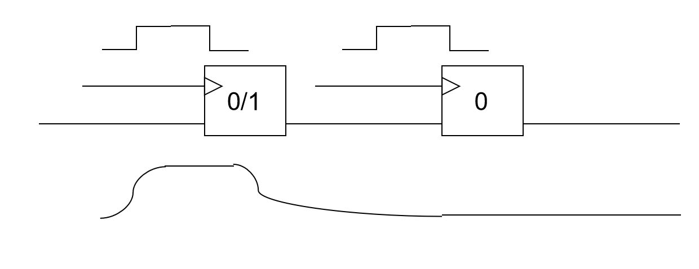

一段时间后寄存器 a 内部的电平稳定为高电平，这个时间非常短暂，基本在 clk 上升沿前后时间完成，这个期间 data 得输入电平要保持稳定，不然寄存器 a 的值将会不确定。上升沿到来前的电平稳定时间称为 **slack time**，上升沿到来后的电平稳定时间称为 **hold time**。电平只有在 slack time + hold time 的范围内都保持稳定才能确保寄存器内部电平变化正确。 

之后，寄存器 a 和寄存器 b 中间的线路中开始传播寄存器 a 的高电平。

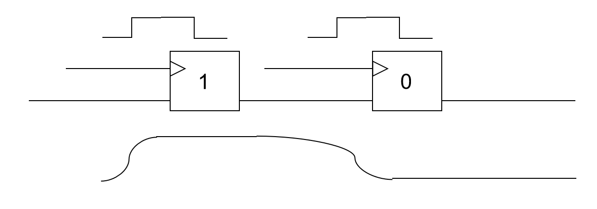

寄存器 a 和 b 之间的线路随着寄存器 a 高电平的传播已经都是高电平了，但是因为寄存器 b 下降沿触发，所以寄存器内部的电平和后续电平都保持低电平不变。在下降沿到来之前寄存器 b 的 data 输入已经是稳定的高电平了，这样可以确保满足 **slack time**。

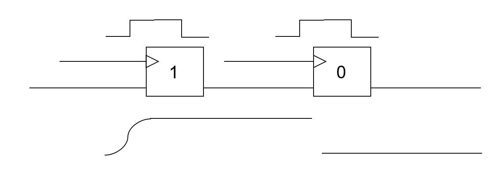

下降沿之后寄存器 b 载入高电平，之后输入的高电平也会持续一段时间以满足 **hold time** 的需求，确保寄存器 b 内部电平顺利转换为高电平。

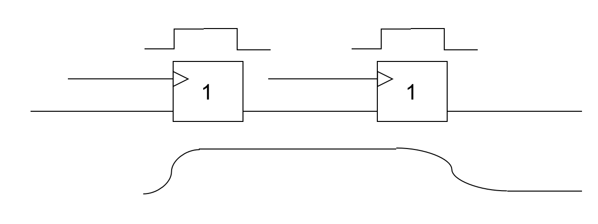

如果我们说线路是河流，电流是河水，电平是河流的水位，那么寄存器就好比是水坝。在触发边沿没有出现的时候寄存器将输入输出的电平隔开，使得输入的电平不会影响输出的电平；一旦边沿被触发，寄存器就像水坝开闸了一样，上游的河水涌入下游使得下游的水位和上游一致，也即寄存器载入输入的电平，使得输出的电平等于输入的电平；一旦边沿结束，寄存器就像水坝关闭了一样，输入的电平就不会影响输出的电平了。

## 时序约束

但是有时候会遇到这种问题：如果寄存器 a 和寄存器 b 之间的线路特别长、经过的门电路特别多，这就会导致寄存器 a 的电平变化之后，传播到寄存器 b 得输入会需要很长时间，比如下图的情况。

我们可以看到寄存器 a 的值变为 1，但是寄存器 a 和 b 之间的线路中寄存器 a 的高电平只传播了大半的线路，这导致下降沿到来的时候寄存器 b 的 data 端口输入的值在 0-1 之间，没有稳定，那么寄存器 b 内部电平就可能无法顺利变为高电平，导致电路运行的结果和设计相违背。

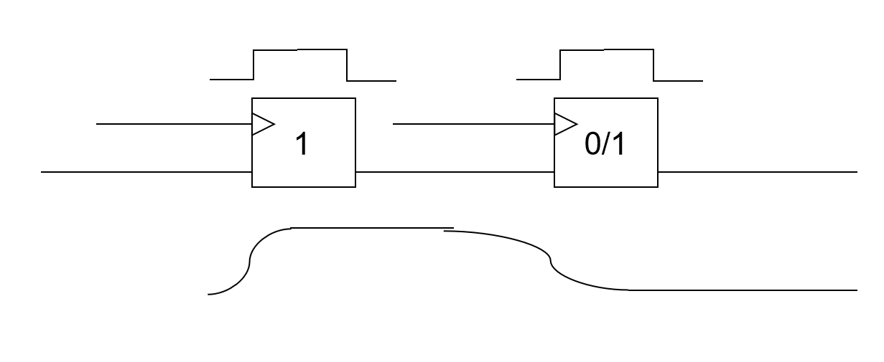

我们可以根据电路的材料、电线的长度、中间的门电路特性等入手估算出寄存器 a 的输出到寄存器 b 的输入之间电平传播需要的时间。然后因为寄存器 a 是上升沿触发，b 是下降沿触发，所以从寄存器 a 数据变化到寄存器 b 载入新的电平的时间窗口仅半个时钟周期，这就要求电平传播时间小于半个周期。如果违例就会导致电路运行结果和设计结果不一致，导致时序错误。

常用的解决方法：

1. 布线优化：线路布线的时候将寄存器 a 和寄存器 b 的位置放置的足够近，减少之间电路的长度，从而降低时延，满足时序约束。Vivado 的 implementation 会尽可能的进行布线优化。
2. 逻辑优化：简化寄存器 a 和寄存器 b 之间的门电路逻辑，使得线路的时延减少。Vivado 的 implementation 会尽可能的进行逻辑优化。
3. 降低频率：将时钟频率降低，使得触发沿之间的时间间隔增大，但是整体电路的工作效率会变差
4. 统一时钟沿：寄存器 a 用上升沿触发，寄存器 b 用下降沿触发，其时间窗口只有半个周期，但是如果统一用上升沿或者下降沿就会有一个周期，时间间隔增大。虽然局部的工作效率会有所降低，但是整体的工作效率基本不受影响，所以请大家如无必要，统一时钟沿设计电路。
5. 其他：...

## 使能寄存器

有些寄存器会有一个使能引脚 CE，只有当 CE=1 的时候寄存器才会载入输入 data 的值。

```Verilog
always@(posedge clk)begin
// always at positive edge of clk
// 总是在 clk 信号的上升沿触发以下功能块
    if(wen)begin
    // 当 wen=1 的时候
        a <= data;
        // 寄存器 a 载入数据 data 的值
    end
    // 不然保持原来的值不变
end
```

我们之前将`always@(*)`的时候，if 是需要搭配 else 使用的，不然会导致环路错误，但是这里不需要，因为`always@(*)`综合得到的电路是用 wire 搭建的，它只是借用了 reg 的 always 块语法而已。但是`always@(posedge clk)`得到的电路使用真实的寄存器搭建的，是不会形成环路问题的。

这一区别再次说明了电路特性在 Verilog 语言中的重要性，不了解电路是很难学好 Verilog 的。。

## 寄存器初始化

许多时候我们需要寄存器有一个初始值（之后介绍的有限状态机 FSM 就需要寄存器有初始值），因此可以用以下语法实现。

### 异步初始化

```Verilog
reg a;
//高电平异步复位寄存器
always@(posedge clk or posedge rst)begin
// always at positive edge of clk
// or at posedge edge of rst 
    if(rst)begin
    // 如果 rst=1
        a <= INTIAL_VALUE;
        // a 载入初始化的值
    end else if(wen)begin
        a <= data;
        // 如果 rst=0，执行正常的逻辑电路操作
    end
end

reg a;
//低电平异步复位寄存器
always@(posedge clk or negedge rstn)begin
// always at positive edge of clk
// or at negitive edge of rstn 
    if(~rstn)begin
    // 如果 rstn=0
        a <= INTIAL_VALUE;
        // a 载入初始化的值
    end else if(wen)begin
        a <= data;
        // 如果 rstn=1，执行正常的逻辑电路操作
    end
end
```

这段代码对应的寄存器是异步复位寄存器，这类寄存器除了有时钟输入 clk、使能输入 CE、数据输入 data 之外，还会有一个额外的输入引脚 rst/rstn。这个引脚如果输入 0 则寄存器会被复位，则该寄存器是低电平异步复位，复位引脚标注为 rstn；这个引脚如果输入 1 则寄存器会被复位，则该寄存器是高电平异步复位，复位引脚标注为 rst。

第一种写法就是在描述高电平异步复位寄存器的行为，第二种写法则是在描述低电平异步复位寄存器的行为。

此外根据复位的时候内部电平被复位为 0 还是 1，异步复位寄存器又被分为两大类，所以两两组合，实际上有四类异步复位寄存器。FPGA 内置的 Flip Flop 是异步高电平复位的带使能信号的上升沿触发器：

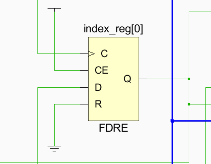

### 同步初始化

```Verilog
reg a;
//高电平同步复位寄存器
always@(posedge clk)begin
// always at positive edge of clk
    if(rst)begin
    // 如果 rst=1
        a <= INTIAL_VALUE;
        // a 载入初始化的值
    end else if(wen)begin
        a <= data;
        // 如果 rst=0，执行正常的逻辑电路操作
    end
end

reg a;
//低电平同步复位寄存器
always@(posedge clk)begin
// always at positive edge of clk
    if(~rstn)begin
    // 如果 rstn=0
        a <= INTIAL_VALUE;
        // a 载入初始化的值
    end else if(wen)begin
        a <= data;
        // 如果 rstn=1，执行正常的逻辑电路操作
    end
end
```

同步电路没有显式的异步复位引脚，它的输入 data 前有一个多路选择器，然后用 rst/~rstn 作为选择子选择载入 INITIAL_VALUE 的结果还是 data 的结果。而 ~rstn|wen 则会被作为寄存器 CE 的输入。

所以不同于异步复位只要 rst=1/rstn=0，寄存器就可以复位得到初始化值；同步复位只有在时钟边沿到来的时候才会复位得到初始化的值。

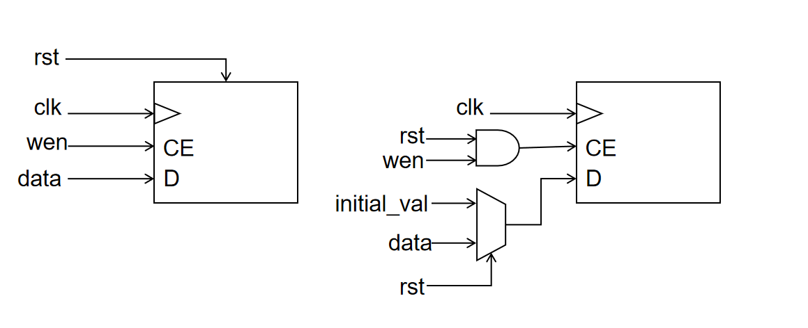

### FPGA 初始化

FPGA 的复位信号 rstn 由 FPGA 芯片的 C12 引脚引入。当 Vivado 将 bitstream 下载到 FPGA 板之后，rstn 信号会先保持一段时间的 0，使得所有的寄存器可以被充分初始化，然后 rstn 信号变为 1 且一直保持不变，这样所有的寄存器就从初始化阶段进入工作阶段，开始载入数据。

FPGA 进入工作阶段后，我们也可以按开发板的 reset 按钮，让 rstn 再次输入 0，重新复位所有寄存器的值。

```Verilog
    set_property -dict {PACKAGE_PIN C12 IOSTANDARD LVCMOS33} [get_ports rstn]
```

因为 FPGA 板的 rstn 在初始化阶段是低电平，所以该信号只能直接用于复位低电平复位寄存器。对于高电平复位的寄存器可以将 rstn 取反，然后用 rst 作为复位信号。
```Verilog
wire rst;
assign rst = ~rstn;
```

### 触发信号

```Verilog
always@(posedge clk) // 上升沿触发

always@(negedge clk) // 下降沿触发

always@(posedge clk or negedge rstn) // 上升沿触发和下降沿复位

always@(posedge clk or posedge rstn) // 上升沿触发和上升沿复位
```
实际上 reg 的触发边沿和复位电平是由寄存器本身的电气特性决定的，比如 FPGA 的 FF 一般是上升沿触发和高电平复位。但是我们可以通过给 clk 和 rstn 经过非门在连接到 reg 的方式实现所谓的下降沿触发和低电平复位（将非门和 reg 看成一个整体的话）。

#### 问题一：多时钟触发
```Verilog
always@(posedge clk1 or posedge clk2) // 上升沿触发
```
从语义上看这个 always 块既在 clk1 上升沿触发，又在 clk2 上升沿触发。当我们仿真的时候，可以实现这个逻辑功能，但是因为 reg 只有一个时钟输入端口，所以综合的时候实际上并不能做到 clk1、clk2 同时作为时钟触发。

#### 问题二：多边沿触发
```Verilog
always@(clock) // 上升沿也触发、下降沿也触发，即时钟电平翻转就触发
always@(a or b or c) // a、b、c 电平反转就触发
```
从语义上看只要 clock、a、b、c 数据变化就会引起 always 块触发。仿真可以接受这样的逻辑设计，但是因为不存在即上升沿触发又下降沿触发，所以实际上并不能综合得到这样的时序电路。

```Verilog
reg d;
always@(a or b or c)begin
    if(a) d <= c;
    else d <= b;
end
```
虽然不能得到时序电路，但是可以综合得到组合电路。d 的结果依赖于 a、b、c，一但 a、b、c 的输入发生了变化，则 d 随着变化，这是符合组合电路的逻辑语义的。最后会得到 b、c 作为数据，a 作为选择子的二选一多路选择器。

!!! 注意 if-else、case-default 搭配使用，不然也会有 latch warning。
!!! 仅在 always 触发的信号是 always 块内部输出以来的所有输入时，这个写法才有意义。

```Verilog
reg d;
always@(*)begin
    if(a) d <= c;
    else d <= b;
end
```
任何信号变化就触发 always 块，这就是我们之前介绍的 always@(*) 写法的组合电路，它无论如何都是在更改电平的状态。

#### 问题三：多 always 块触发
```Verilog
always@(posedge clk)begin
    d <= a;
end
always@(negedge clk)begin
    d <= b;
end
```

上升沿的时候 d 载入 a 的值，下降沿的时候 d 载入 b 的值。仿真允许 reg 在不同的 always 块被不同的时钟沿触发，但是在综合的时候一个 reg 不能被两个时钟沿触发。

```Verilog
always@(posedge clk)begin
    if(c) d <= a;
end
always@(posedge clk)begin
    if(~c) d <= b;
end
```

这个逻辑是连仿真也无法通过的，因为在同一时间 d 被两个过程同时仲裁，即使我们知道这两个过程并不冲突，但是也不可以被编译通过。类似于 wire 不能被多个驱动同时输入，reg 也不能在两个 always 块内被赋值，这都会引起 multi-driven 错误。

#### 问题四：异步触发

```Verilog
reg [1:0] d;
wire problem;
reg cond1;
reg cond2;
assign problem = cond1 & cond2;

always@(posedge problem)begin
    d <= d + 2'b1;
end
```

##### 数据竞争

当 cond1 和 cond2 同时为 1，problem 变为 1 的时候触发 always 块。这在仿真的时候不容易发现问题，但是请考虑下面这个情形：

```Verilog
initial begin
    cond1=1'b0;cond2=1'b1;
    #5;
    cond1=1'b1;cond2=1'b0;
end
```

在仿真的时候会看到 problem 永远等于 0，always 块不会触发。但是真实的电路综合之后会因为时延造成问题。当 cond1 从 0 变为 1 的时候高电平需要一段时间在可以到的 problem = cond1 & cond2 的与门；cond2 从 1 变为 0，低电平也需要一段时间到达与门。如果 cond1 的高电平在 cond2 的低电平之前先到达，则会短暂的出现与门的输入都是高电平，最后 problem 短暂出现高电平，进而 always 块被触发，寄存器被复制。

##### 转换为同步电路

归根结底是因为不同路径的电平传播速度有快慢，电平在传播期间电路本身处于不稳定状态，有很多中间态是逻辑分析无法覆盖的。因此我们很多时候采用和应用逻辑无关的 clk 方波信号进行触发，确保上升沿来临的时候电路的电平已经全部传播完毕并且保持稳定：

```Verilog
reg [1:0] d;
wire problem;
reg cond1;
reg cond2;
assign problem = cond1 & cond2;

always@(posedge clk)begin
    if(problem) d <= d + 2'b1;
end
```

如果只希望 problem 的上升沿使得 d 寄存器组加 1，则可以先试用 PosSample 上升沿采样电路对 problem 进行采样。参见常用模块-边沿采样。

### logic

SystemVerilog 提供的新变量类型。logic 类型的变量既可以用在 `assign、always@(*)` 等组合电路，也可以用在 `always@(posedge clk)` 等时序电路：如果用在 `assign、always@(*)` 等组合电路设计中，它的行为就是和 wire 类型保持一致的，最后会被综合得到 wire；如果用在 `always@(posedge clk)` 等时序电路设计中，它的行为就是和 reg 类型保持一致的，最后会被综合得到 reg 类型。

所以大家在编程的时候可以用 logic 全面替代 wire/reg 变量，然后让 SystemVerilog 自己根据场景确定 logic 的实际类型，方便编程者将更多的精力放在逻辑设计本身，而进一步忽略电路组件的细节。
```SystemVerilog
logic [1:0] d;
logic problem;
logic cond1;
logic cond2;
assign problem = cond1 & cond2; // problem 自动识别为 wire
always@(posedge clk)begin   
    if(problem) d <= d + 2'b1;  // d 自动识别为 d
end
```

其实对于仿真本身而言，wire/reg 都只是一个 C 语言变量而已，所以全部取代为 logic 完全没有问题。wire 和 reg 的区别仅仅在综合成电路、具有电气特性之后才有意义。

### 扩展 always

always 块本身是为 reg 设计的，但是因为其对于行为描述较好的支持，因此也被借用给了组合电路设计。这使得 always 块语法既可以用于生成时序电路，也可以生成组合电路、latch 电路，而具体生成那种电路纯粹取决了不可靠的编程者的描述细节；该语法要求编程者编程时极其小心，以防止 always 生成的电路类型和设计的电路类型不一致。为此 SystemVerilog 扩展了 always 语法，为时序电路、组合电路、锁存器电路分别提供了 always_ff、always_comb、always_latch 三个关键字。

#### always_comb

你还在为 always@(*) 语法的看起来在做 reg 编程实际上在做 wire 编程苦恼吗？always_comb 关键字就解决了这个问题，它说明一下的行为描述就是直接被生成组合电路的，内部被赋值的 logic 都会被综合为 wire，然后会对 if-else 缺失、case-default 缺失等问题进行检查。大家可以用`logic+always_comb`语法全面替代`reg+always@(*)`语法，这样在享受 always 便利的行为描述语法的同时，也可以享受编译器的电路问题检查。
```SystemVerilog
// 修改前
reg d;
always@(*)begin
    if(a) d <= c;
    else d <= b;
end

// 修改后
logic d;
always_comb begin
    if(a) d <= c;
    else d <= b;
end

// 修改前
reg d;
always@(*)begin
    if(a) d <= c; // 可能得到锁存器 latch 电路
end

// 修改后
logic d;
always_comb begin
    if(a) d <= c; // 没有 else 分支，给出报错
end
```

#### always_ff

always_ff 语法说明这个 always 块是专门用于生成 ff 电路，内部被赋值的 logic 都会被综合为 reg。语法上只需要将 always 替换为 always_ff 即可。

```SystemVerilog
always_ff@(posedge clk)begin
    if(problem) d <= d + 2'b1;
end
```

#### always_latch

always_latch 语法说明这个 always 块是专门用于生成 latch 电路的，这是很不常用、很危险的电路，大家如无必要不要尝试使用。原来的 always@(*) 如果 if-else、case-default 完整就是得到组合电路，有所缺失就是得到 latch 电路；always_latch 则是会严格检查语法，确保存在 if-else、case-default 缺失。

```SystemVerilog
// 修改前
reg d;
always@(*)begin
    if(a) d <= c;
end

// 修改后
logic d;
always_latch begin
    if(a) d <= c;
end
```

## 常用模块介绍

介绍几个常用的电路模块：

### 分频器

```Verilog
module ClkDiv( // repo/sys-project/lab3-1/syn/ClkDiv.v
    input clk,
    input rstn,
    output reg [31:0] clk_div
);

    always@(posedge clk)begin
        if(~rstn)clk_div<=32'b0;
        else clk_div<=clk_div+32'b1;
    end

endmodule
```

可以看到分频器就是对一个 32 位的 clk_div 做累加，仿真可以看到对应的波形如下：

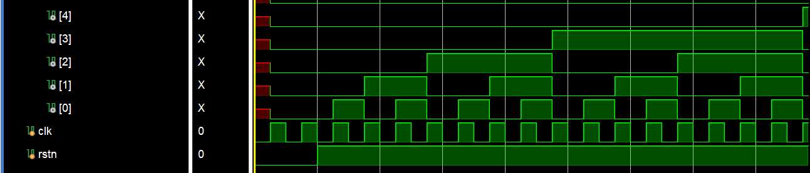

`clk_div[0]` 每个时钟周期翻转一次，所以它的时钟频率是 clk 的一半；`clk_div[1]` 每两个时钟周期翻转一次，时钟频率是 clk 的四分之一；`clk_div[2]` 到 `clk_div[31]` 依次减半。

于是我们可以用分频器得到不同频率的时钟。我们 lab1-2 的七段数码管动态刷新所使用的时钟要求频率比较低，因此使用 `clk_div[10]` 以满足时钟频率的要求。

### 按键去抖器

我们希望按钮按下为高电平，弹起为低电平。但是按钮本身具有一定的弹性，当我们按下按钮的时候它会进行一段时间的抖动，时而高电平、时而低电平，如果我们仍然假定高电平是按钮按下、低电平是按钮弹起，那么在电路的视角里按钮就被连续按了很多下。因此需要一个电路逻辑将按钮抖动产生的毛刺过滤掉，即去抖电路：

```Verilog
module Debouncer ( // repo/sys-project/lab3-1/syn/Debouncer.v
    input  wire  clk,//100Mhz 2^10
    input  wire  btn,
    output wire  btn_dbnc
);

    reg [7:0] shift = 0;

    always @ (posedge clk) begin
        shift <= {shift[6:0], btn};
    end

    assign btn_dbnc = &shift;
endmodule
```

可以看到如果连续 8 个周期的时钟输入是高电平，则输出高电平；这里的时钟使用 100 KHz，时钟周期为 10 us，也就是连续 80us 都是高电平，则认为按钮输入高电平，这样就可以将按钮按下和松开时抖动产生的毛刺过滤掉。

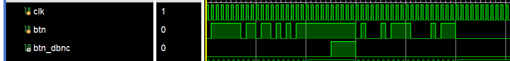

### 边沿采样

```Verilog
module PosSample ( // repo/sys-project/lab3-1/syn/Debouncer.v
    input clk,
    input data,
    output sample
);

    reg old_data;
    always@(posedge clk)begin
        old_data <= data;
    end

    assign sample = ~old_data & data;

endmodule
```

如果上一个周期采样的是低电平而这个周期采样的是高电平，则发现了一个上升沿，输出高电平。如果之后一直是持续高电平或者低电平则不响应，输出低电平。同理还可以实现下降沿采样和翻转采样。

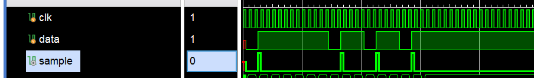
