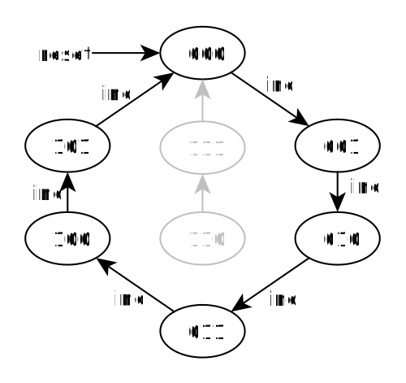
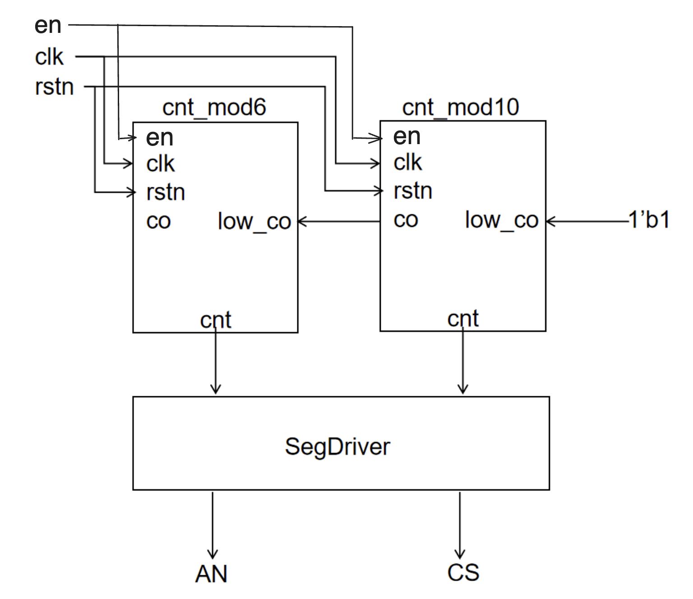
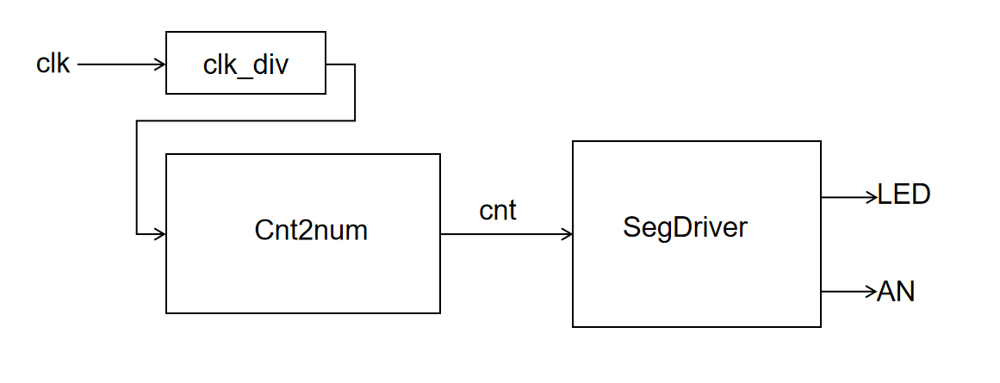

# 实验3-2: 计数器/定时器设计与应用

> 本实验主体内容参考施青松、董亚波等老师编著的《数字逻辑电路设计与实践》一书进行设计。

## 实验目的

- 学习使用Verilog语言进行复杂电路设计的方法
- 进一步掌握组合电路、时序电路设计

## 实验环境

- 操作系统：Windows 10+ 22H2，Ubuntu 22.04+
- VHDL：Verilog，SystemVerilog

## 背景知识

### 计数器

计数器是一种基本的数字电路组件，它可以对一个信号进行计数和累加，输出一个数字表示计数器计数的次数。计数器广泛应用于各种数字系统中，如时钟发生器、分频器、频率计、计时器等。

计数器可以按照不同的工作模式进行分类，最常见的是二进制计数器和 BCD 计数器。二进制计数器是将计数器的输出表示为二进制数的形式，而 BCD 计数器是将计数器的输出表示为 BCD 码的形式。

计数器的工作原理是基于时钟信号的上升沿或下降沿触发计数器计数的功能。例如，当一个上升沿触发器被连接到计数器的时钟输入端时，每当时钟信号上升沿到来时，计数器就会增加 1。当计数器的计数达到最大值时，它会自动复位为 0，重新开始计数。因此，计数器可以用于产生周期性的脉冲信号，以及用于实现分频器和其他数字电路。

广义的计数器并非日常生活中的加减计数，而是对状态进行有序遍历的时序电路。这种计数器也被称为模N计数器，其功能是反复遍历 N 个固定状态的计数器，相当于在 M 个状态中选择 N 个来遍历，故称为**模 N 计数器**。

下图是一个模 6 计数器的状态图和 Verilog 实现：

<!-- https://www.circuit-diagram.org/editor/ -->


```verilog
module counter_mod6(clk, reset, out);
    input wire clk;
    input wire reset;
    output wire [2:0] out;

    reg [2:0] cnt;

    always @(posedge clk) begin
        if (reset) begin
            cnt <= 0;
        end
        else case(out)
            3'b000: cnt <= 3'b001;
            3'b001: cnt <= 3'b010;
            3'b010: cnt <= 3'b011;
            3'b011: cnt <= 3'b100;
            3'b100: cnt <= 3'b101;
            3'b101: cnt <= 3'b000;
            default: cnt <= cnt + 1;
        endcase
    end

    assign out = cnt;
endmodule
```

这里使用状态机的方式进行的电路描述，但是状态机的本质其实也是函数映射关系，我们可以看到这个函数映射关系，其实可以用一个简单的加法函数来实现：

```Verilog
always @(posedge clk) begin
    if (reset) begin
        cnt <= 0;
    end else if(cnt == 3'd5)begin
        cnt <= 0;
    end else begin
        cnt <= cnt + 3'd1;
    end
end
```

这里的 `cnt == 3'd5` 也可以写作 `cnt >= 3'd5`，在逻辑上是没有问题的，但是 `==` 会被综合为简单的同或电路，而 `>=` 则会被综合为复杂的大于等于比较器电路，会导致电路开销变得比较大（当我们想使用一个算子来提高编程效率，请时刻注意它对应的电路开销）。

### BCD 码计数器

如果我们要实现一个 60 位的秒钟计数器，我们可以按照“计数器”一节的代码加以实现。但是因为计数器的值是按照二进制存储的，所以如果我们希望将七段数码管等显示设备按照十进制显示计数器的值，则需要一套复杂的乘除法电路来进行二进制编码和十进制编码的转换。但如果计数器内部是按照 BCD 码进行数据存储就可以避免这个问题。

BCD 码使用 4 位二进制表示十进制的 0-9，下表为其中一种 BCD 码格式。对于数字 34，在二进制原码编码下二进制值为 00100010，而在 BCD 码编码下为 00110100（3：0011，4：0100）。可以看到后者可以直接发送给七段数码管进行输出。

<center>

| 十进制数 | BCD 码 | 十进制数 | BCD 码 |
|:-------:|:------:|:-------:|:------:|
|    0    | 0000   |    1    | 0001   |
|    2    | 0010   |    3    | 0011   |
|    4    | 0100   |    5    | 0101   |
|    6    | 0110   |    7    | 0111   |
|    8    | 1000   |    9    | 1001   |

</center>

我们可以将一个 mod 10 的二进制计数器和一个 mod 6 的二进制计数器组合得到 60 BCD 码计数器。




* co：co=1 表示计数器进位，用于通知外部设备进位事件的发生
* low_co：高位计数器用于接收低位计数器的进位信息，如果 low_co = 1，高位计数器应该递增（上图最低位计数器的 co 输入为 60 BCD 计数器的 low_co 输入，因为 60 BCD 计数器已是最顶层，这里让其恒等于 1）
* en: 表示计数器使能，en=1 时，计数器进行工作

## 实验步骤

### 实现计数器模块

补全 `src/lab3-2/submit/Cnt.sv` 的代码，实现模数计数器。

```SystemVerilog
module Cnt #(
    parameter BASE = 10,    
    // 模数值，当 cnt == BASE-1 的时间发生进位，cnt 归零
    parameter INITIAL = 0
    // 初始化值，作为 cnt 初始化时的值
) (
    input en,
    // 计数器使能信号
    input clk,
    input rstn,
    input low_co,
    // 表示低位计数器进位，cnt 递增
    input high_rst,
    // 上层模块的不同复位信号，cnt 归零
    output co,
    // 表示该计数器要发生进位
    output reg [3:0] cnt
    // 计数器的值
);

    // fill the code

endmodule
```

### 实现 24 BCD 码计数器

补全 `src/lab3-2/submit/Cnt2num.sv` 的代码，实现 24 BCD 码计数器。我们可以考虑用一个 mod 2 的计数器和一个 mod 10 的计数器组建 Cnt2num，但是当它们的结果是 23 的时候，下一次递增不会发生归零。因此我们提前为 Cnt 模块提供了 high_rst 引脚，当 Cnt2num 模块计数为 23 的时候就可以利用 high_rst 引脚将两个 Cnt 内部的计数归零。

```SystemVerilog
module Cnt2num #(
    // 用两个 Cnt 配合实现 Cnt2num
    parameter BASE = 24,
    // 模数值，当 cnt == BASE-1 的时间发生进位，cnt 归零
    parameter INITIAL = 16
    // 初始化值，作为 cnt 初始化时的值
)(
    input en,
    // 计数器使能信号
    input clk,
    input rstn,
    input low_co,
    // 表示低位计数器进位，cnt 递增
    input high_rst,
    // 上层模块的不同复位信号，cnt 归零
    output co,
    // 表示该计数器要发生进位
    output [7:0] cnt
    // 计数器的值
);

    localparam HIGH_BASE = 10;
    localparam LOW_BASE  = 10;
    // 高位 Cnt 和低位 Cnt 都可以是模 10 的计数器
    localparam HIGH_INIT = INITIAL/10;
    localparam LOW_INIT  = INITIAL%10;
    // 高位 Cnt 和低位 Cnt 各自的初始值
    localparam HIGH_CO   = (BASE-1)/10;
    localparam LOW_CO    = (BASE-1)%10;
    // 高位寄存器和低位寄存器检查是否发生进位时候用的参考值

    // fill the code
endmodule
```

!!! tip "Hint：`en` 与 `low_co`"
    - `en=1` 与 `low_co=1` 表面上看都表示计数器工作。实际上，相比 `low_co`, `en` 起到了全局作用。
    - 关于 24cnt 的设计逻辑可以参考 60 BCD 的设计图：
        - `en` 用于控制所有计数器是否工作（包括计数以及上层计数器对下层计数器的强制复位）
        - `low_co` 端口则相当于上层对下层的最低位计数器，以及低位对相邻高位计数器的使能信号

### 仿真

执行 `make verilate` 进行仿真，具体代码参考 `repo/sys-project/lab3-2/sim`。

这里我们使用 cnt_init 和 cnt_judge 两个 DPI-C 函数进行差分测试。cnt_init 的逻辑对应于 Cnt2num 的初始化操作，cnt_judge 的逻辑对应于 Cnt2num 递增的操作。如果执行正确最后会输出 `success!!!`，反之会输出 `fail!!!`。

### 下板验证

执行 `make bitstream` 进行仿真，具体代码参考 `repo/sys-project/lab3-2/syn`。

顶层模块电路如下：


<u>执行正确效果：第一个开关开启开始计数且可以看到七段数码管显示的数据在 0-23 之间循环递增；当拨下时计数暂停。</u>

## 实验报告 <font color=Red>30%</font>

1. 请在实验报告中详细描述每一步的过程并配有适当的截图和解释，对于仿真设计和上板验证的结果也应当有适当的解释和照片 <font color=Red>Total: 20%</font>

> 细分：
> 
> - 仿真通过，输出`success!!!` <font color=Red>10%</font>
> - 综合实现计数器 <font color=Red>10%</font>

2. 简述如何使用 Cnt2num 实现 1234 的 BCD 码计数器，并思考 Cnt2num 预留 co、low_co、high_rst 引脚的意义 <font color=Red>10%</font>


## 代码提交

### 验收检查点 <font color=Red>40%</font>

- 仿真波形展示 <font color=Red>10%</font>
- 代码解释或设计思路 <font color=Red>15%</font>
- 下板验证 <font color=Red>15%</font>

### 提交文件

`src/lab3-2/` 中编写的 submit 和 include 的代码（include 按需填写）


