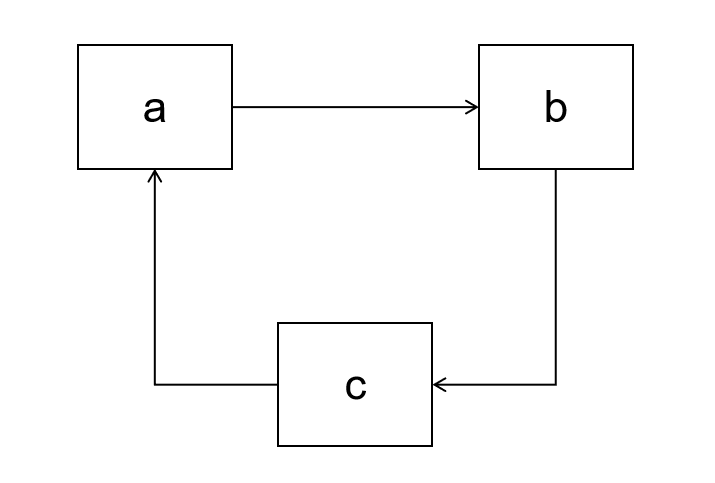
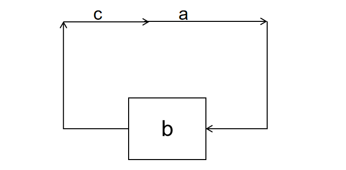
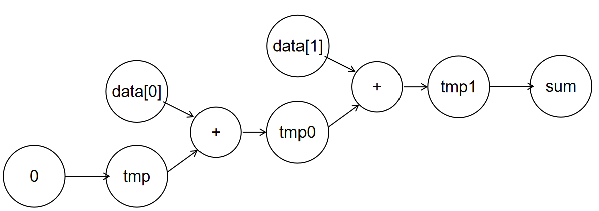
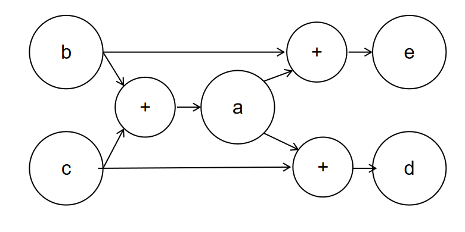
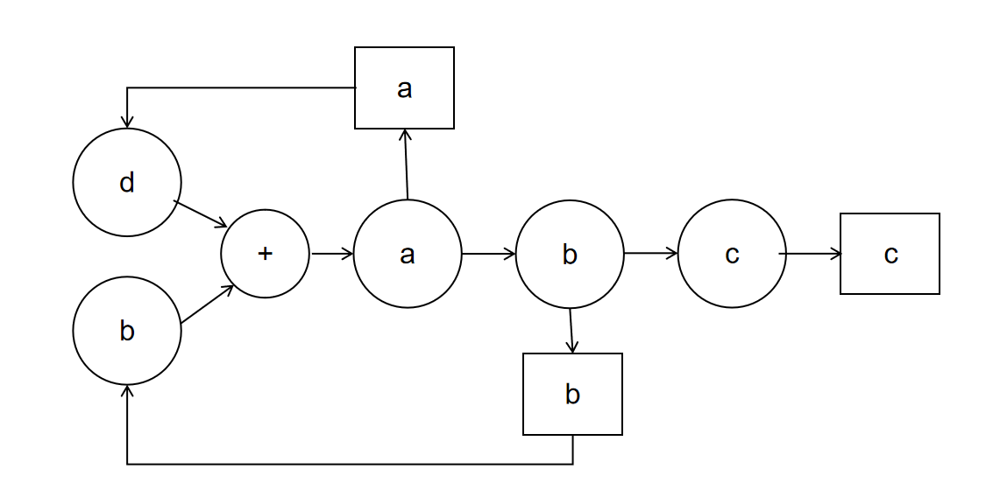

# 阻塞赋值和非阻塞赋值

不同于 wire 变量只能被 = 赋值，reg 变量在 always 块中其实可以被 = 和 <= 两个运算符赋值，使用 = 赋值的方式被称为**阻塞赋值**，使用 <= 的赋值方式被称之为**非阻塞赋值**。我们在之前的实验中使用的 always 赋值语句都是非阻塞赋值语句，阻塞赋值是一种使用灵活、功能强大的语法，但是也很容易出错，因此我们在这一节详细介绍一下阻塞赋值，以及使用阻塞赋值需要注意的细节。**个人建议，尽量不使用阻塞赋值。**

```Verilog
always@(posedge clk)begin
    a = b; // 阻塞赋值 
end

always@(posedge clk)begin
    a <= b; // 非阻塞赋值
end
```

## 一个例子

为了理解阻塞赋值和非阻塞赋值的差异，我们给出如下的例子：
```Verilog
reg a;
reg b;
reg c;
always@(posedge clk)begin
    c <= b;
    a <= c;
    b <= a;
end
always@(posedge clk)begin
    c = b;
    a = c;
    b = a;
end
```
非阻塞赋值语句的 `<=` 左侧是会被赋值的寄存器，右侧是各个寄存器和线路的输出构造的组合电路。同一个 always 块内的所有赋值语句是被同时执行的，相互之间没有依赖关系，我们针对每一个被赋值的寄存器分别实现对应的电路。所以上述代码的功能就是寄存器 a、b、c 在下个时钟周期分别载入寄存器 c、a、b 的值。电路图如下：


如果是 `=` 的语句，赋值语句左侧的 reg 变量并不一定会被建模为寄存器，而是如下图。这三句赋值语句是有先后关系的，首先变量 c 获得变量 b 的值，然后变量 a 获得变量 c 的值也就是原来 b 的值，最后 b 后的变量 a 的值也就是最开始变量 b 的值，形成环路。最后只有这个环路的最终结果 b 会被建模为寄存器，其他的 a、c 则会被建模为 wire。


## 阻塞赋值的电路

### 重命名

不同于非阻塞语句一个寄存器只能被赋值一次，阻塞语句的寄存器可以被多次赋值。例如：

```Verilog
reg tmp;
wire [1:0] data;
always@(posedge clk)begin
    tmp = 1'b0;
    tmp = tmp + data[0];
    tmp = tmp + data[1];
    sum = tmp;
end
```

虽然看起来 tmp 寄存器被赋值了很多次，但是每个被赋值的 tmp 是不同的变量，他们只是暂时共用了 tmp 这个名字，我们可以将被先后赋值的 tmp 重命名为 tmp、tmp0、tmp1，则可以得到如下的 Verilog 语句。实际上变量的名字不是那么重要，它代表的数据发生了变化，它就是一个新的数据：

```Verilog
reg tmp;
wire [1:0] data;
always@(posedge clk)begin
    tmp = 1'b0;
    tmp0 = tmp + data[0];
    tmp1 = tmp0 + data[1];
    sum = tmp1;
end
```

于是对应的电路图如下：


重命名的方法可以参考：

* 当一个变量被赋值，且在之前已经被赋值过或者充到源操作数之后，该变量分配一个新的名字
* 后续使用这个变量做源操作数的时候，用该变量最新被分配的名字做源操作数

### 无环图

always 块内部的阻塞赋值关系可以非常复杂，但无论多么复杂都是可以表示为一个数据流图的，数据流图是有向无环图，那些最终那些出度为 0 的节点才会被最终生成寄存器，而那些中间赋值的变量值会被生成 wire。例如：

```Verilog
always@(posedge clk)begin
    a = b + c;
    d = a + c;
    e = a + b;
end
```

对应的控制流图如下：


所以最后生成电路的时候，e 和 f 会生成寄存器，但是 a 只会得到线路 wire

### 中间变量的 reg

一下若干种情况中间变量会变为寄存器，即这个中间变量的源操作数的值和自己有关，它的电路成环，如：

```Verilog
wire d;
reg a,b,c;

assign d = a;

always@(posedge clk)begin
    a = b + d;
    b = a;
    c = b;
end
```

对应的电路图如下：


因为线路 a 依赖于中间变量 a 的值，所以 a 不能被综合为 wire 不然会产生环路，因此这里 a 的线路结果会被保存进入寄存器 a，换句话说变量 a 确实会被综合为寄存器，但是变量 b 得到的不是寄存器 a 的输出，而是和 a 一样的输入。

b 也一样，b 如果被综合为 wire 也会有环路问题，所以 b 被综合为寄存器，变量 c 载入的值是寄存器 b 得输入而不是输出。

## 阻塞赋值的优点

### 设计简单

阻塞赋值的执行方式和 C 语言的执行方式高度类似，如果有一段 C 代码，可以将它几乎不加修改的用阻塞赋值的方式实现，例如下面这段代码：

```C
b = b + a;
if(b < 0){
    b = b - a;
}
```

就可以直接用如下阻塞语句实现

```Verilog
always@(posedge clk)begin
    b = b + a;
    if(b < 0)begin
        b = b - a;
    end
end
```
### 实现灵活
对于复杂的中间过程的计算可以用定义大量中间变量进行暂存，甚至可以搭配 for、if 等高级语法使用，非常灵活方便，有很好的可读性。例如下面这段代码：

```Verilog
always@(posedge clk)begin
    if(multiplier[0])begin
        result = result + multiplicant;
    end
    result = result >> 1;
end
```

如果使用阻塞赋值的方式实现的话，要么将多条表达式用嵌套的形式改为一条表达式，但是这种表达式可读性比较差，中间过程语义不明，且容易写错。

```Verilog
always@(posedge clk)begin
    result <= (multiplier[0]?result + multiplicant:result) >> 1;
end
```

或者可以将复杂的组合电路运算拿到 always 块外面用 assign 语法加以分布实现。这样在可读性上虽然好了很多，但是一个完整的逻辑会被拆分为两块代码，还是有一定的间离。

```Verilog
wire [31:0] add_one;
wire [31:0] shift;
assign add_one = multiplier[0]?result + multiplicant:result;
assign shift = add_one >> 1;

always@(posedge clk)begin
    result = shift;
end
```

## 阻塞赋值的缺点

### 忽略电路实现
因为阻塞赋值可以实现从 C 语言到 Verilog 的快速转换，所以容易出现对代码不加修改的直接照抄。不同于 C 语言每行代码较为廉价，多一条 C 语句只会导致 CPU 多执行几个周期，对于 Verilog 而言多一条语句可能就会多一个大型电路。例如上面我们照搬的例子，可以看到需要一套加法器和一条减法器。

```Verilog
always@(posedge clk)begin
    b = b + a;
    if(b < 0)begin
        b = b - a;
    end
end
```

但我们只要稍作修改就可以只用一个加法器，而节约下一个减法器。语法简洁了之后，编程者容易忽略底层的硬件开销和电路实现，从而导致浪费，就像 Java 的开销远大于 C 一样。

```Verilog
assign result = b + a;
always@(posedge clk)begin
    if(result >= 0)begin
        b = result;
    end
end
```

上面的例子只会导致电路的浪费，但是下面的例子会导致电路结构发生巨大的变化。我们以乘法器为例，在 lab3-3 的教程中我们提到将每次迭代当作一个状态，然后将这个状态迭代 32 次。但是部分同学会照抄伪代码得到如下的 Verilog：

```Verilog
always@(posedge clk)begin
    for(i=0;i<32;i++)begin
        if(multiplier[0])begin
            product = product + multiplicant;
        end
        multiplier = multiplier >> 1;
        multiplicant = multiplicant << 1;
    end
end
```

该电路（当然还需要做调整才可以真的执行）确实可以实现乘法器的功能，但是实际上 for 循环会把电路展开为 32 份，也就是每次迭代执的加法器、选择器、移位器会被重复 32 次。最后我们不是一组电路 32 次迭代得到最终结果，而是 32 组电路串联然后一个周期得到最终结果。

```Verilog
always@(posedge clk)begin
    if(multiplier[0])begin
        product = product + multiplicant;
    end
    multiplier = multiplier >> 1;
    multiplicant = multiplicant << 1;

    ... // 重复 32 次

    if(multiplier[0])begin
        product = product + multiplicant;
    end
    multiplier = multiplier >> 1;
    multiplicant = multiplicant << 1;
end
```

### 行为未定义

中间变量被外部调用的情况不确定。例如下面这个例子。因为 b 所在的数据成环路，所以 b 会成为一个寄存器，但是寄存器的值有输出的值、有输入的值，它们都叫做 b。那么对于 a 和 e 而言他们输入的数据 b 是寄存器的输出还是输入呢？这个是不确定的，有的模拟器认为是输入、有的认为是输出，所以在 always 块外部使用中间变量会导致大量的不确定问题。

```Verilog
assign a = b; 
always@(posedge clk)begin
    b = a + 1;
    c = b + 1;
end
always@(posedge clk)begin
    e = b;
end
```

## 如何正确使用阻塞赋值

### 构造组合电路

因为阻塞赋值会将中间变量根据情况建模为 wire 和 reg，导致很多复杂的分析和不确定的考量。但是我们可以在 `always@(*)` 电路当中使用阻塞赋值，因为 `always@(*)` 本身就是用来生成组合电路的，所有变量都是 wire，所以可以规避这个问题。

常见的选择是 `always@(*)` 搭配 `=` 构建组合电路，`always@(posedge clk)` 搭配 `<=` 构建时序电路。

因为我们已经介绍了 always_ff 的写法，所以可以 always_ff 搭配 = 进行编程。

### 构造仿真激励
我们可以看到阻塞赋值的语法是按照指令顺序从前往后进行赋值的，我们在 `initial` 块对仿真输入做激励的时候就是用的阻塞赋值的语法。实际上 `initial` 也可以和 `always` 一样使用 for 语句和 if 语句，来实现复杂的激励功能。

### 不使用中间变量
对于中间变量在被 always 块外部程序调用的时候是使用寄存器得输入、还是寄存器的输出、还是 wire 的值本身是难以界定的，甚至本身就是 undefine 的，所以应该规避中间变量的使用。我们在电路设计的时候应该事先确定我们需要构造 always 块的所有 reg，然后 reg 之间的输入输出依赖只和这些 reg 有关，然后在实现某个 reg 的 always 块的时候处于方便起见，加入一些 reg 存储中间结果，而决不在 always 块外部使用。

### 使用 logic
阻塞赋值的变量类型为 reg，但是建模的时候既可能是 reg、也可能是 wire，会造成歧义。这个时候不如用 logic 变量来消弭这种语法上带来的歧义。
