# 实验3-3: 乘法器

## 实验目的

- 继续学习时序电路设计的方法
- 设计实现乘法器

## 实验环境

- 操作系统：Windows 10+ 22H2，Ubuntu 22.04+
- VHDL：Verilog，SystemVerilog

## 背景知识

### 乘法器(Multiplier)

#### 乘法器的基本概念

被乘数 x 为 1000，乘数 y 为 1001，下面的乘法过程是手工运算的一个步骤，而计算机在做乘法时就是模拟手工运算的执行过程。 

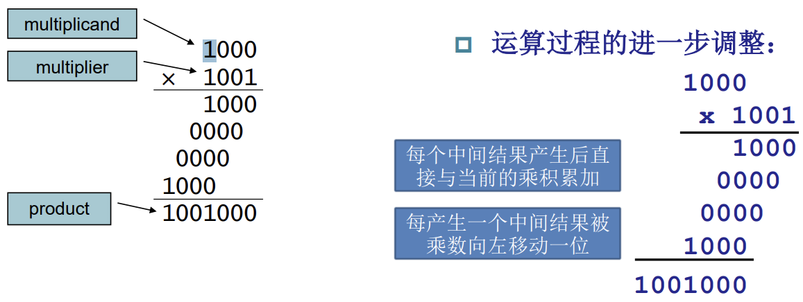

#### 乘法器的硬件实现

因为是两个 4 位数相乘，所以结果应该是四个数加和得到的。

* 先判断 y 的最低位是 0 还是 1
* 如果是 1，则需要把 x 加到部分积上，若为 0，则保持原值
* x 左移一位，之后再让 y 右移一位
* 若 y 为 0，则循环结束，否则继续此循环过程

电路图和流程图如下。

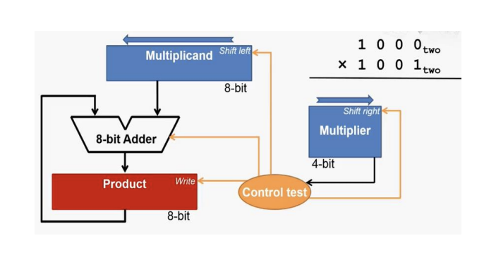

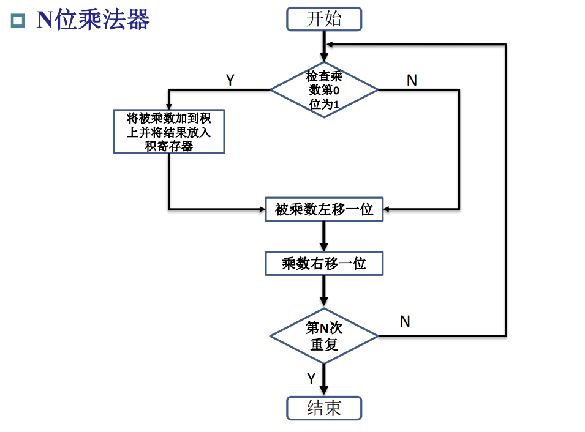

#### 乘法器的优化实现

为了节省不必要的硬件消耗，乘法器可以做如下的优化：

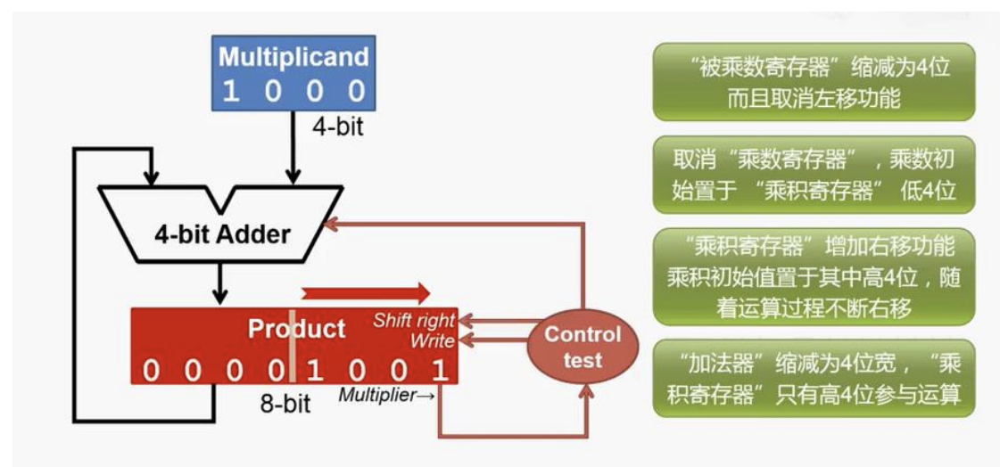

这样节省了乘数寄存器、被乘数寄存器的位宽，被乘数寄存器也不需要设计为移位寄存器。

64 位乘法器的流程图如下：

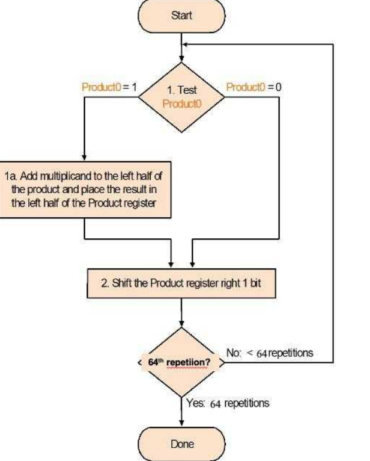

### 逻辑设计到电路设计范式

在设计电路的时候，我们首先获得的是一个任务，然后我们根据任务需要设计一个算法，那么我们要怎么将这个算法转换为我们的电路，有什么通用的方法吗？我们可以以上面乘法器算法为例做一个简要介绍。

#### 得到逻辑算法设计

我们也可以用一些伪代码来描述上面的乘法算法：

```C
high_product = 0;
low_product = multiplier;
// 初始化阶段，product 的高 64 位载入 0
// product 的低 64 位载入乘数

for(i=0;i<64;i++){
    // 计算阶段，需要经历 64 次迭代
    if(low_product & 1){
        high_product_tmp = high_product + multiplicand;
    }else{
        high_product_tmp = high_product;
    }
    // 参考列竖式的计算方式，每次迭代都做一次加法，不要忘记加法的进位
    {high_product, low_product} = {high_product_tmp, low_product} >> 1;
    // 加法的结果右移，等价于被乘数左移，起到进位的作用
    // 乘数的右移既是为了给加法的右移提供空间
    // 空余多得到的 1 bit 可以存放加法的进位
    // 下次迭代要参考的乘数的 0/1 bit 可以在 low_product 的最低位
}

return {high_product, low_product};
// 结束阶段，返回最终结果
```

#### 状态机设计

在算法中我们可以总结出若干个状态，这里是三个状态：初始化、迭代、结束。

所以，我们的乘法器的有限状态机也可以由三个状态进行控制：

* 初始状态(idle)：当模块被使能时（因此需要额外的 start 信号作为 request），将被乘数、乘数载入对应的寄存器，进入工作状态开始执行迭代

* 工作状态(work)：执行加法、根据乘数的 bit 值选择是用加法结果还是载入原值、计算结果移位后载入寄存器、计数器迭代，迭代到次数了进入结束状态

* 结束状态(final)：输出最终结果，并通知调用方接收结果（因此需要额外的 finish 信号作为 reply）

我们可以设计如下的有限状态机：

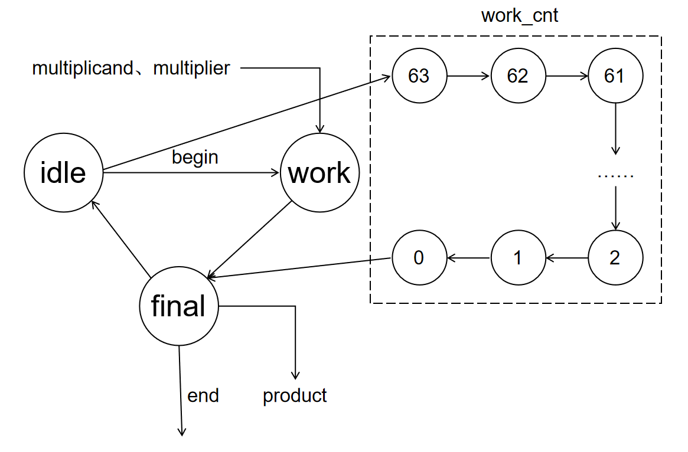

#### 各阶段电路设计

现在我们为每个寄存器的每个阶段设计对应的电路

=== "初始化阶段"

    之后我们来看初始化每个寄存器需要的计算电路：

    * multiplicand 寄存器载入输入的被乘数
    * product 寄存器载入 multiplier 和 0

    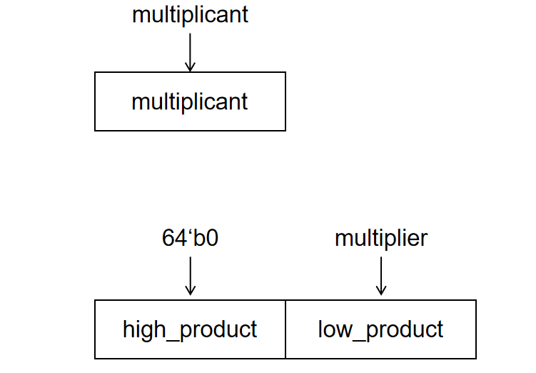

=== "工作阶段"

    * multiplicand 保持不变
    * product 载入加法运算、选择运算、移位运算的结果

    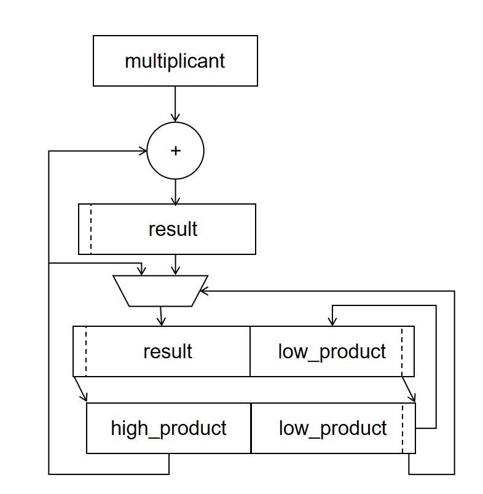

=== "结束阶段"

    * multiplicand 保持不变
    * product 保持不变

#### 状态机控制寄存器

可以看到每个状态下，每个寄存器需要的计算电路和载入的结果都略有不同，所以这里的每一套计算电路我们都是需要实现的，然后根据状态机的状态将对应的计算电路的计算结果用选择器选择出来，载入给对应的寄存器。

所以寄存器和状态机的协同电路如下：

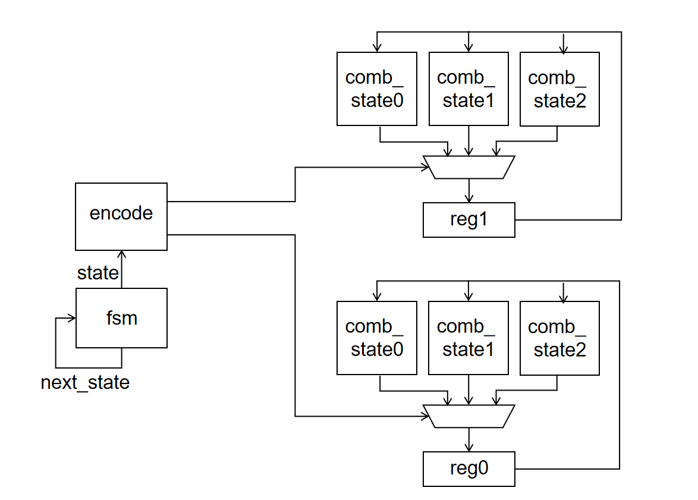

#### 总结

我们可以简单总结这个形式化设计的过程：

1. 将任务转换为算法，写出对应的伪代码
2. 根据伪代码总结出多个执行阶段和变量参数（一些控制流和数据流分析的方法）
3. 根据执行阶段的流程图总结出有限状态机的状态和状态转移
4. 根据数据流总结出需要的寄存器
5. 为每个寄存器设计每个阶段下的算术运算、选择运算对应的组合电路
6. 有限状态机的状态通过译码，为每个寄存器多个状态下的不同组合电路的结果输入提供选择子、为每个寄存器提供使能信号

### start-finish 握手信号

考虑以下场景，我们的处理器有时需要使用乘法器进行乘法操作。因此处理器需要信号通知乘法器单元接收运算内容、开始乘法运算，当乘法器单元执行结束之后，乘法器需要信号通知处理器计算完毕、接收运算结果。所以可以定义简单的 start-finish 握手协议：

* 调用模块(caller)向被调用模块(callee)发送只要被执行的数据和至少持续一个周期的 start 信号，当 start = 1 的时候发送的数据有效；callee 发现 start = 1 必须立刻接受 caller 的数据，因为 start 复位后数据有效性不能保证
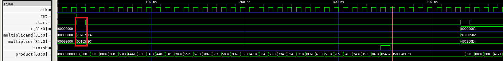

* callee 执行结束后向 caller 发送执行结果和至少持续一个周期的 finish 信号，当 finish = 1 的时候发送的数据有效；被 caller 发现 finish = 1 必须立刻接受 callee 的数据，因为 finish 复位后数据有效性不能保证
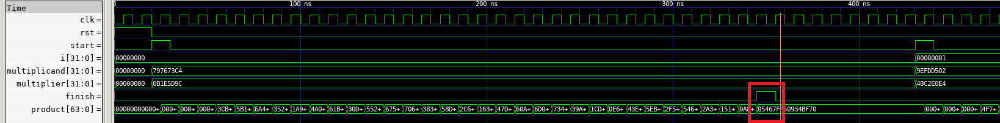

* 当一个 start 请求被发送而 finish 请求没有反馈之前，不能发送下一个 start 请求，callee 不保证是否响应；caller 只有收到 callee 的 finish 信号之后，才可以发送下一个 start 信号
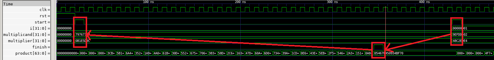

* 当一个 start 请求没被发送，caller 不能发送 finish

其中 caller 发送给 callee 的数据和 start 信号作为 caller 发送给 callee 的请求信号(request)；callee 发送给 caller 的 finish 信号作为 callee 响应 caller 的回应信号(resp)。


multiplier 乘法器的调用遵循该协议。

## 实验步骤

### 实验前准备

与之前的 lab 相同，启动安装在你电脑中的 Ubuntu 22.04 环境（WSL 或虚拟机）。cd 到 sys1-sp{{ year }} 文件夹并执行

```shell
git pull origin master
cd repo/sys-project
git pull origin other
```

### 设计参数配置的无符号乘法器

仔细阅读指导，编写 `src/lab3-3/submit/multiplier` 文件夹下的文件，按照**3.2.3优化乘法器实现**的方法设计无符号乘法器。

!!! warning "注意"
    如果想要获得 LEN 位的 0 或者 1，不能使用 `LEN'b0` 或者 `LEN'b1`，而要使用 `{LEN{1'b0}}` 和 `{LEN{1'b1}}`。


```SystemVerilog
module Multiplier #(
    parameter LEN = 32
    // 乘数、被乘数的长度参数
) (
    input clk,
    input rst,
    // 使用 rst，rst = 1 复位
    input [LEN-1:0] multiplicand,
    input [LEN-1:0] multiplier,
    input start,
    
    output [LEN*2-1:0] product,
    output finish
);

    localparam PRODUCT_LEN = LEN*2;
    // 表示乘积的位宽
    logic [LEN-1:0] multiplicand_reg;
    logic [PRODUCT_LEN-1:0] product_reg;

    localparam CNT_LEN = $clog2(LEN);
    // 表示迭代计数器的位宽
    localparam CNT_NUM = LEN - 1;
    // 迭代需要的立即数，大家按需使用
    logic [CNT_LEN-1:0] work_cnt;

    typedef enum [1:0] {IDLE, WORK, FINAL} fsm_state;
    // 有限状态机
    fsm_state fsm_state_reg;
    

    // fill the code
    
endmodule
```

### 仿真

#### 仿真样例生成
在 `sim/testbench.v` 的仿真激励中生成不少于 16 组随机样例，并且 start 信号的激励要满足 start-finish 协议。

```Verilog
integer i;
initial begin
    clk=0;
    rst=1;
    #20;
    rst=0;
    // fill the code
    $display("success!!!");
    $finish;
end
```

#### DPI-C 实践

本次乘法器的从差分测试继续使用 DPI-C 函数接口提供验证功能。请在 `sim/judge.v` 中补全 mul_judge 函数的 DPI-C 接口声明，在`sim/judge.cpp` 中实现乘法判断功能。

```Verilog
// DPI-C
import "DPI-C" function int mul_judge (
    input int unsigned multiplicand, 
    input int unsigned multiplier,
    input longint unsigned product
);

module Judge (
    input clk,
    input rstn,
    input [31:0] multiplicand,
    input [31:0] multiplier,
    input start,
    input [63:0] product,
    input finish,
    output reg error
);
```

```C
extern "C" unsigned int mul_judge (
    unsigned int multiplicand, 
    unsigned int multiplier,
    unsigned long long int product
){
    
    // fill the code

    if(!right){ // right 是仿真结果和执行结果是否一致
        printf("*********error***********\n");
        printf("simulation multiplicand = %08x, multiplier = %08x, product = %016llx\n", multiplicand, multiplier, simulate_result);// simulate_result 是仿真得到的 product 结果
        printf("hardware   multiplicand = %08x, multiplier = %08x, product = %016llx\n", multiplicand, multiplier, product);
    }else{
        printf("simulation multiplicand = %08x, multiplier = %08x, product = %016llx\n", multiplicand, multiplier, simulate_result);
    }

    return right; // 如果一致返回 1，反之返回 0
}
```

最后执行 `make verilate`，如果仿真通过最后会输出 `success!!!`，反之就是 `fail!!!` 和报错信息。

### 综合下板

我们的测试数据由`sys-project/lab3-3/syn/DataGenerator.v`的 DataGenerator 模块提供。测试数据存储在`sys-project/lab3-3/syn/initial.hex`，我们在`lab3-3/include/initial_file.vh`文件中将 FILE_PATH 变量设置为 initial.hex 的绝对路径，然后 DataGenerator 就会用其中的值初始化 data 寄存器组。其中 initial_file 一共存储了四组测试数据，也即四组 multiplicant 和 multiplier。

当 next_state = 1 的时候，输出下一组测试样例的 multiplicant、multiplier，并且将 start 拉高一个周期，之后乘法器会根据 DataGenerator 的输出进行乘法计算。

```Verilog
module DataGenerator(
    input clk,
    input rstn,
    input next_test,
    output reg start,
    output [31:0] multiplicand,
    output [31:0] multiplier
);
    `include"initial_file.vh"
    reg [31:0] data [7:0];
    initial begin
        $readmemh(FILE_PATH, data);
    end

    reg [1:0] index;
    always@(posedge clk or negedge rstn)begin
        if(~rstn) index <= 2'b11;
        else if(next_test) index <= index+2'b01;
    end

    always@(posedge clk or negedge rstn)begin
        if(~rstn) start <= 1'b0;
        else if(next_test) start <= 1'b1;
        else start <= 1'b0;
    end

    assign multiplicand = data[{index,1'b0}];
    assign multiplier = data[{index,1'b1}];

endmodule
```

顶层模块如下：

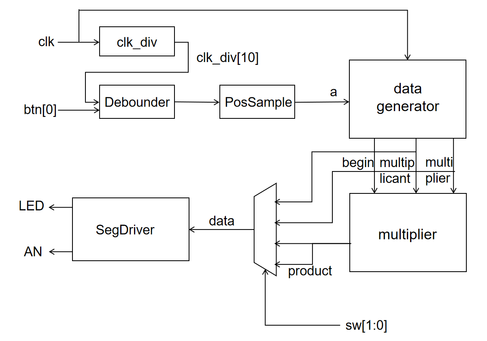

通过按按钮 btn[0] 让 datatgenerator 输出下一组测试样例，然后乘法器计算得到结果 product，之后根据开关 sw[1:0] 选择 multiplicant、multiplier 和 product 的值发送给七段数码管显示。

其中 sw 对输出数据的选择关系如下：

<center>

| sw值 | 选择的输出     |
|:----:|:-------------:|
| 00   | multiplicant  |
| 01   | multiplier    |
| 10   | product[31:0] |
| 11   | product[63:32]|

</center>

执行`make bitstream`下板验证即可

## 实验报告 <font color=Red>40%</font>

1. 请在实验报告中详细描述每一步的过程并配有适当的截图和解释，对于仿真设计和上板验证的结果也应当有适当的解释和照片 <font color=Red>Total: 20%</font>

> 细分：
> 
> - 仿真通过，输出`success!!!` <font color=Red>10%</font>
> - 综合实现乘法器 <font color=Red>10%</font>

2. 解释仿真测试样例和下板的顶层结构为什么满足 start-finish 握手协议。尝试给出 start-finish 握手协议存在的缺点和改进的方法。 <font color=Red>10%</font>

3. 请仿照乘法器的设计方法和我们**手动计算除法**的方式，设计**32bit无符号整数除法器**，你只需要给出设计思路即可。流程图和伪代码是推荐的描述形式。 <font color=Red>10%</font>

作为参考的接口定义如下：

```verilog
module Divider_32(
        input    clk,
        input    rst,

        input    start,
        input    [31:0] dividend, 
        input    [31:0] divisor,

        output    finish,
        output    [31:0] quotient,
        output    [31:0] remainder
        ); 

endmodule
```

4. (bonus) 尝试改进目前的有限状态机，使得一次乘法操作或者连续乘法操作消耗的时钟周期数可以减少。 <font color=Red>
+15%</font>

## 代码提交

### 验收检查点 <font color=Red>40%</font>

- 仿真波形展示 <font color=Red>10%</font>
- 代码解释或设计思路 <font color=Red>15%</font>
- 下板验证 <font color=Red>15%</font>

### 提交文件

`src/lab3-3/` 中编写的 submit、sim 和 include 的代码