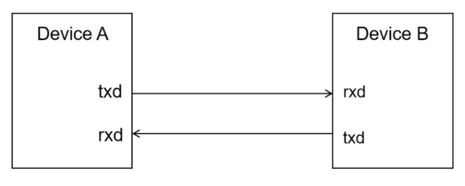
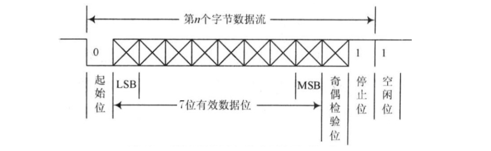
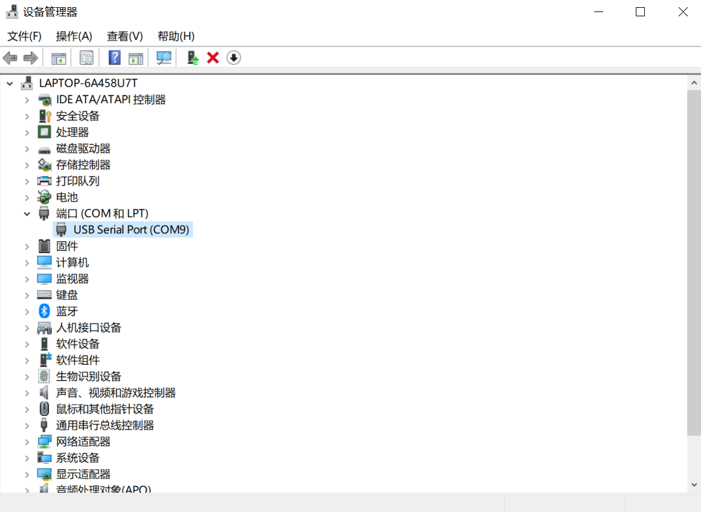
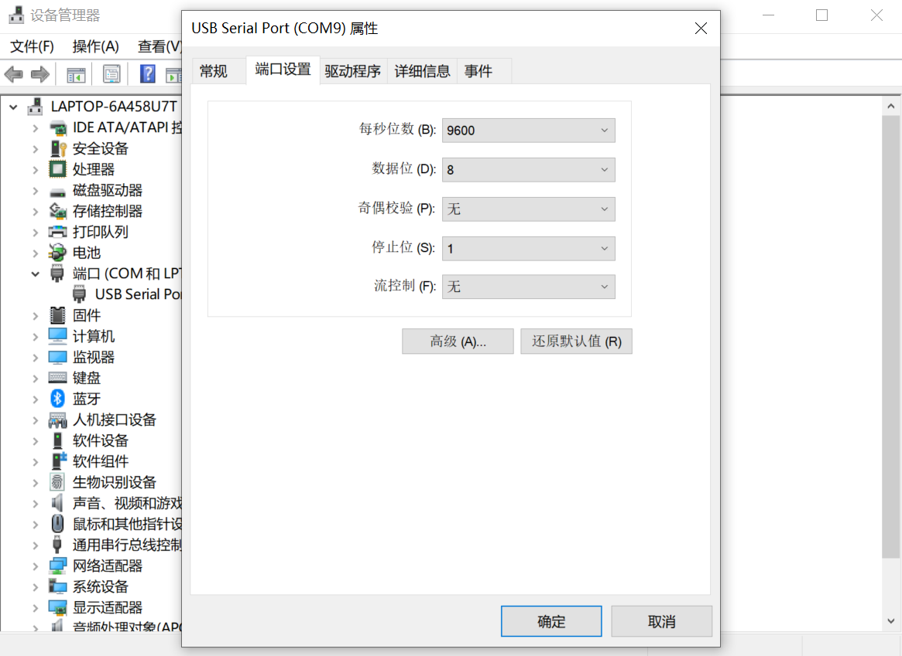
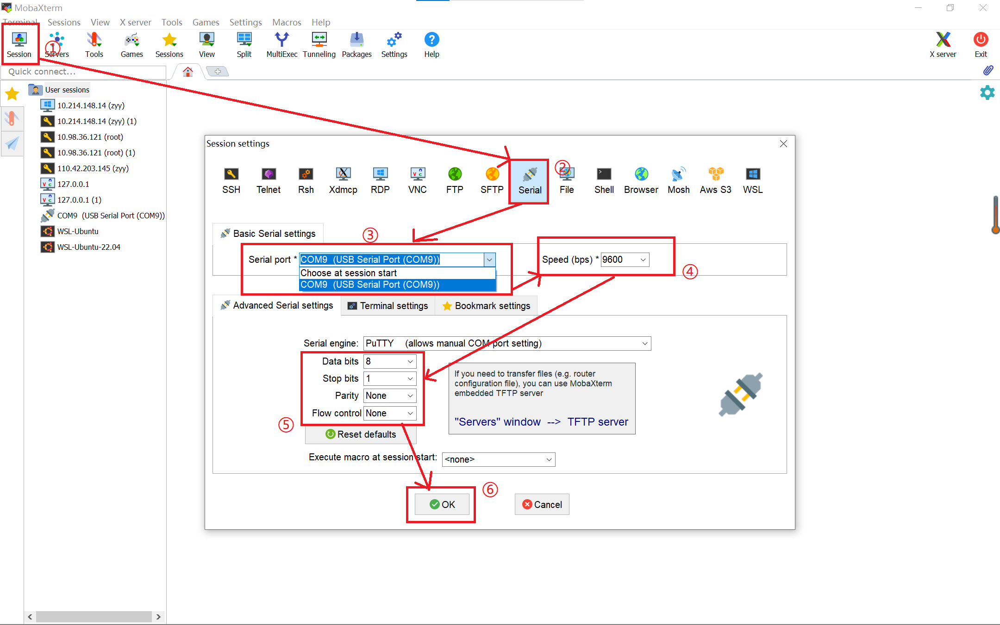
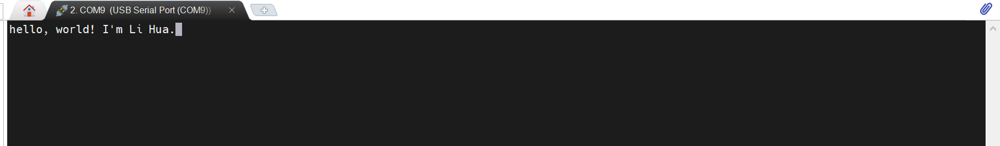
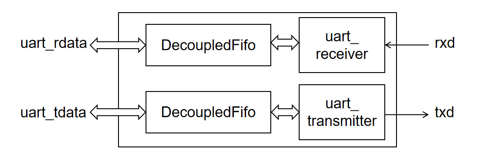
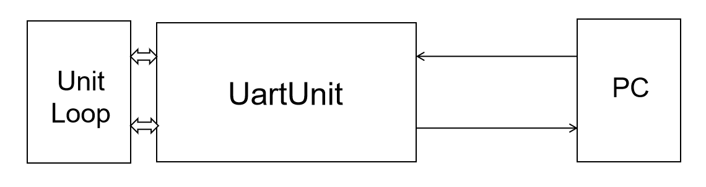

# 实验4-2: 串口使用（bonus）

## 实验目的

- 学习使用 SystemVerilog 的 interface 等高级语法
- 学习串口的原理和使用
- 学习 FIFO 的原理和使用

## 实验环境

- 操作系统：Windows 10+ 22H2，Ubuntu 22.04+
- VHDL：Verilog，SystemVerilog

## 背景知识

### uart 串口传输协议

uart(universal asynchronous receiver/transmitter) 通用异步收发串口是一种低速、全双工、串行、异步数据传输设备。最简单的串口由两个引脚组成：

* txd：向外部设备发送数据
* rxd：接受收外部设备发送的数据

uart 串口数据线由两根线组成：一根连接 A 设备的 txd 和 B 设备的 rxd，负责将 A 的数据发送给 B；一根连接 A 设备的 rxd 和 B 设备的 txd，负责将 B 设备的数据发送给 A。从而实现设备 A 和设备 B 之间的双向交互。

<center>
{ width="500" }
</center>

uart 交互的双方并不依赖时钟进行同步，所以是异步传输的，它们共同遵守 uart 异步传输协议来确保传输的正确性。波特率（Baud Rate）用于描述串口传输的速率，例如波特率是 9600，则每秒传输 9600 个 bit 的数据，或者说每个被传输的数据会在数据线上维持 1/9600 s，常见的波特率有 9600、115200 等。

uart 每次传输一个字节的数据，他会根据协议将数据打包为一个位序列，然后通过数据线发送出去，每个位保持 1/baud s。数据线在不发送数据时保持高电平，当发送端需要发送数据时，首先发送一个单位时间的低电平，表示发送开始；然后将待发送数据从低到高依次发送到数据线上，每个位保持一个单位时间；最后发送一个单位时间的高电平表示发送结束。然后数据线回归高电平，直到下一次数据发送。

接收端恰恰相反，它时刻检查数据线上的电平，当遇到低电平时发现有数据传输，然后每隔一个单位时间做一次采样，依次将 8 个 bit 的传输数据采样拼接，得到完整的传输数据。

<center>
{ width="550" }
</center>

uart 数据传输格式如下：

* 起始位：1 bit
* 数据位：8 bit
* 奇偶校验位：0/1 bit（可选）
* 终止位：1/1.5/2 bit（可选）

### 串口使用

假设我们的 FPGA 板已经有了串口单元，那么我们要怎么使用上位机和 FPGA 板通过串口进行交互呢？

首先我们需要进行物理连线。因为 nexys-a7 开发板的 uart 口和 jtag 口共用一个端口、uart 传输线和 jtag 传输线共用一根数据线，所以我们将下板用的数据线连接 FPGA 和上位机的同时，已经完成了 uart 的数据线连接完毕。现在打开开发板电源，就可以在 windows 操作系统的设备管理器看到这个 `USB Serial Port` 设备。

<center>
{ width="570" }
</center>

双击这个 `USB Serial Port` 可以查看串口的配置属性，可以看到默认情况下串口波特率为 9600，数据位 8 位，没有奇偶校验位，停止位 1 位，没有流控制。如果需要其他配置可以在这里修改。

<center>
{ width="570" }
</center>

之后我们下载安装串口调试软件 [Mobaxterm](https://mobaxterm.mobatek.net/)。双击打开后，进行串口交互界面的配置:

* 点击 session 建立新的会话
* 点击 Serial 设置串口会话
* 选择 Serial Port 为开发板的端口
* 设置 Speed 为之前查到的默认值 9600
* 修改 Serial 其他配置和查到的默认值保持一致
    - Data Bit: 8
    - Stop Bit: 1
    - Pairty: None
    - Flow Control: None
* 点击 Ok 创建会话



之后如果串口发送数据，就可以在这个界面看到字符输出；点击会话界面敲击键盘，就可以向 FPGA 发送数据。如果上位机发送了数据，开发板的 TX 灯会闪烁，如果上位机接收到 FPGA 发送的数据，开发板的 RX 灯会闪烁。



## 实验步骤

### 实验前准备

与之前的 lab 相同，启动安装在你电脑中的 Ubuntu 22.04 环境（ WSL 或虚拟机），随后通过 `cd` 移动到 `sys1-sp{{ year }}` 目录下，执行下面的命令：
```shell
git pull origin master
cd repo/sys-project
git pull origin other
```

### 模块接口简介

串口相关的模块很多，我们对内部细节不一一介绍了，只对端口、配置参数和使用做一个简单介绍：

#### UartPack

`UartPack` 包(`sys-project/lab4-2/include/uart_struct.vh`)定义了 uart 相关的数据类型和参数，其中 `uart_t` 是收发数据的数据类型，`UART_DATA_WIDTH` 是收发数据的宽度。

```SystemVerilog
package UartPack;

    parameter UART_DATA_WIDTH = 8;
    typedef logic [UART_DATA_WIDTH-1:0] uart_t;
    parameter UART_STRUCT_WIDTH = UART_DATA_WIDTH;

endpackage
```

#### async_transmitter 和 async_receiver

`async_transmitter` 是裸露的串口发送装置，负责将 8 位的输入数据根据 uart 数据传输协议和波特率，打包从串口的 txd 端口发送给接收设备。数据配置：8 位数据位、2 位停止位、没有奇偶校验位。

```Verilog
module async_transmitter#(
    parameter ClkFrequency = 25000000,
    // 驱动 transmitter 是时钟频率，单位 Hz
    // 例如 100MHz，参数就是 100000000
    parameter Baud = 115200
    // 串口的波特率
)(
	input wire clk,
    // 串口驱动的时钟
	input wire TxD_start,
    // 当 TxD_start=1 的时候串口将开始发送 TxD_Data 的值
	input wire [7:0] TxD_data,
    // 串口发送到数据线上的数据
	output wire TxD,
    // 连接到开发板的 txd 端口
	output wire TxD_busy
    // 当 TxD_busy=1 的时候，transmitter 正在传输数据，不响应 TxD_start 请求。因此当 TxD_busy=1 的时候最好不要将 TxD_start 设置为 1。
);
```

`async_receiver` 是裸露的串口接收设备，根据 uart 数据传输协议，接收对方发送设备发送到 rxd 的 bit 流，整合得到 8 位数据。数据配置：8 位数据位、1 位停止位、没有奇偶校验位。

```Verilog
module async_receiver #(
    parameter ClkFrequency = 25000000,
    // 驱动 receiver 是时钟频率
    parameter Baud = 115200
    // 串口的波特率
)(
	input wire clk,
	input wire RxD,
    // 接受来自串口 rxd 端口的输入
	output reg RxD_data_ready,
    // RxD_data_ready = 1 的时候说明串口内部接受得到数据，请求外部设备读取接收到的数据
	input wire RxD_clear,
    // RxD_clear = 1 的时候，串口认为外部设备已经读取了自己内部的数据，将清空内部缓存的数据
	output reg [7:0] RxD_data
    // 串口接收设备整理得到的 8 位数据，当且仅当 RxD_data_ready = 1 的时候，RxD_data 有效，且只保证有效一个时钟周期，从下个周期开始可能被传口信发送的数据覆盖
);
```

#### uart_transmitter 和 uart_receiver

`uart_transmitter` 对 `async_transmitter` 进行了包裹，将原来 `TxD_start` 数据传输、`TxD_busy` 设备繁忙数据传输控制信号转换为 valid-ready 的数据传输协议形式。

`uart_receiver` 对 `async_receiver` 进行了包裹，将原来 `RxD_data_ready` 数据就绪、`RxD_clear` 数据清空数据传输控制信号转换为 valid-ready 的数据传输协议形式。

这样便于上层模块用统一的 valid-ready 协议进行模块调用。 

```SystemVerilog
module uart_transmitter#(
    parameter ClkFrequency = 100000000,
    // 驱动 receiver 是时钟频率
    parameter Baud = 9600
    // 串口的波特率
)(
	input wire clk,
    input wire rstn,
	Decoupled_ift.Slave uart_data,
    // valid-ready 协议进行待发送的 data 的传输
	output wire txd,
    // txd 端口输出的数据
    input wire 
    // cts 用于流控制，这里暂时没有使用
);

module uart_receiver#(
    parameter ClkFrequency = 100000000,
    parameter Baud = 9600
)(
	input wire clk,
    input wire rstn,
	Decoupled_ift.Master uart_data,
    // valid-ready 协议进行接收到的 data 的传输
	input wire rxd,
    // rxd 端口输入的数据
    output wire rts
    // rts 用于流控制，这里暂时没有使用
);
```

这里的 `Decoupled_ift` 是我们定义的接口 `interface`，用于规范模块之间的数据传输。SystemVerilog 的 `interface` 语法参见[附录部分](./lab4-1-appendix.md/#interface)。

#### SyncFifo 和 AsyncFifo

因为串口的数据收发和 FPGA 内部数据的收发速度有一定的差异，因此需要有一个队列（fifo）起到数据缓冲的作用。比如 FPGA 一次性发送了 8 个字节的数据请求，而串口只来得及发送一个，那么剩下的 7 个会被暂存到 fifo 中，等待串口空闲后慢慢读取。

SyncFifo 同步队列。负责暂存上游模块产生的数据，并为下游模块提供待处理的数据。这里上游模块和下游使用同一个时钟，没有跨时钟域。

```SystemVerilog
module SyncFifo # (
    parameter DATA_WIDTH = 64,
    // 队列每项数据的宽度
    parameter FIFO_DEPTH = 8
    // 队列最大存储的数据的个数，或者说队列的深度
) (
    input logic clk,
    // 上游、下游的驱动时钟
    input logic rstn,

    input logic ren,
    // 下游的读请求
    output logic [DATA_WIDTH-1:0] out_data,
    // 发送给下游的数据，只要 ren&~empty 直接获得数据
    output logic empty,
    // 表示队列是否为空，如果为空，下游无法获得数据

    input logic wen,
    // 上游的写请求
    input logic [DATA_WIDTH-1:0] in_data,
    // 上游写入的数据，只要 wen&~full 直接写入数据
    output logic full
    // 表示队列是否满，如果为满，上游无法写入数据
);
```

AsyncFifo 异步队列和同步队列的区别在于上游和下游使用不同的时钟，且需要额外进行跨时钟域的保护。

```SystemVerilog
module AsyncFifo # (
    parameter DATA_WIDTH = 64,
    parameter FIFO_DEPTH = 8
) (
    input logic rstn,

    input logic rclk,
    // 下游驱动时钟
    input logic ren,
    output logic [DATA_WIDTH-1:0] out_data,
    output logic empty,

    input logic wclk,
    // 上游驱动时钟
    input logic wen,
    input logic [DATA_WIDTH-1:0] in_data,
    output logic full
);
```

#### Fifo 和 DecoupledFifo

Fifo 在 `SyncFifo` 和 `AsyncFifo` 的基础上加入了 `FIFO_KIND` 参数，如果参数值为 “`sync`”，则内部使用 `SyncFifo` 模块实现，如果参数值是 “`async`”，则内部使用 `AsyncFifo` 模块实现。

```SystemVerilog
module Fifo #(
    parameter DATA_WIDTH = 64,
    parameter FIFO_DEPTH = 8,
    parameter FIFO_KIND  = "sync"
    // "sync" 为同步队列，"async" 为异步队列
) (
    input logic rstn,

    input logic rclk,
    // 同步队列的 rclk 和 wclk 应保持一致
    input logic ren,
    output logic [DATA_WIDTH-1:0] out_data,
    output logic empty,

    input logic wclk,
    input logic wen,
    input logic [DATA_WIDTH-1:0] in_data,
    output logic full
);
```

`DecoupledFifo` 模块对 Fifo 模块的接口进行封装，将 `in_data` 和 `out_data` 的数据传输控制型号转换为统一的 valid-ready 模式，便于统一调用。

```SystemVerilog
module DecoupledFifo #(
    parameter FIFO_DEPTH = 8,
    parameter FIFO_KIND  = "sync"
)(
    input logic rstn,

    input logic out_clk,
    // 同步队列的 in_clk 和 out_clk 应保持一致
    Decoupled_ift.Master out_data,
    // 下游模块和 fifo 的握手

    input logic in_clk,
    Decoupled_ift.Slave in_data
    // 上游模块和 fifo 的握手
);
```

#### UartUnit

正式使用的串口单元，其内部的模块构造如下：

<center>
{ width="500" }
</center>

txd 输入的数据被 `uart_trasmitter` 接收后存入 fifo，等待被其他模块读取；模块发送的数据先存入 fifo，然后发送给 `uart_receiver` 模块发送到 rxd 端口。fifo 和 uart 驱动模块之间用 valid-ready `协议传输数据，uartunit` 和外部模块之间也用 valid-ready 协议传输数据。

### 回环测试

为了检测 `UartUnit` 收发功能是否都正确，最简单的方式是上位机向 `UartUnit` 发送一个数据，`UartUnit` 接收到数据之后再发送给上位机，如果发送的数据和接收到的数据一致，则说明数据收发都没有问题。

请补全 `src/lab4-2/submit/UartLoop.sv` 模块，该模块负责接收 `UartUnit` 的数据，然后再让 `UartUnit` 发送该数据，从而和上位机配合实现完整的回环测试。`UartLoop` 和 `UartUnit` 配合得到最终的回环测试模块 LoopTest(`sys-project/lab4-2/general/LoopTest.sv`)

<center>
{ width="500" }
</center>

`UartLoop` 模块的接口如下。`rdata` 用于接收来自 `uart_rdata` 的上位机数据，然后 `rdata` 将数据发送给 `tdata`，`tdata` 将数据发送给 `uart_tdata` 即可。相互之间使用 valid-ready 协议。

debug 的四个数据是用于调试的可选项。`debug_rdata`、`debug_tdata` 用于将 `tdata` 和 `rdata` 的值输送到七段数码管显示，如果回环测试的时候发现 `tdata`、`rdata` 的值和上位机发送或者接收的数据不一致，可以起到调试的作用。`debug_data`、`debug_send` 分别连接到开关和按钮，当按钮按下的时候，`debug_send = 1`，则 `tdata` 载入 `debug_data` 的值，然后发送给 `uartunit`。这样即使接收装置存在问题，发送装置仍然可以进行测试。这四个数据都是备选项，可以不实现（但是建议实现，可以帮助硬件调试）。

```SystemVerilog
`include"uart_struct.vh"
module UartLoop(
    input clk,
    input rstn,
    Decoupled_ift.Slave uart_rdata,
    Decoupled_ift.Master uart_tdata,

    input UartPack::uart_t debug_data,
    input logic debug_send,
    output UartPack::uart_t debug_rdata,
    output UartPack::uart_t debug_tdata
);
    import UartPack::*;

    uart_t rdata;
    logic rdata_valid;

    uart_t tdata;
    logic tdata_valid;

    // fill the code

    assign debug_rdata = rdata;
    assign debug_tdata = tdata;

endmodule
```

### 仿真测试

`sys-project/lab4-2/sim/Judge.sv` 实现了一个 Verilog 实现的上位机，会以和 `UartUnit` 相一致的波特率将字符发送给 `LoopTest`，然后接收来自 `LoopTest` 的字符。`Judge` 每发送一个字符会输出 `transmit data xx`，每接收一个数据会输出 `receive data xx`，如果比对 transmit 的数据和 receive 数据不一致怎会报错输出 `fail!!!`，如果在规定时间内没有比对错误，会输出 `success!!!`。不过请注意，如果你的 `UartLoop` 存在错误，无法正确的发送数据，Judge 因为接受不到数据并不会报错，这个时候需要检查 log 输出，查看 `Judge` 输出和接收是不是相一致，而不是只有输出，没有接收。

运行 `make verilate` 即可进行测试，如果测试成功应该会有类似如下的输出（数据的值不一定一致）：
```
receive data c4
receive data 9c
receive data 02
transmit data c4
receive data e4
transmit data 9c
receive data 78
transmit data 02
receive data bc
transmit data e4
receive data b6
transmit data 78
receive data e4
transmit data bc
receive data b7
transmit data b6
receive data 53
transmit data e4
success!!!
```

### 综合下板

运行 `make bitstream` 生成 bit 流，然后下板验证。用 “串口使用” 一节的描述将开发板和上位机连接、打开 mobaxterm、设置串口会话，然后在串口会话窗口键入字符，等待开发班接收和重新发出字符，如果窗口显示的字符和键入的字符相一致，则说明回环测试正确，反之则有错误。例如我这里输入 `good morning, everyone`，会话就会显示这个字符串：


开关和按钮的作用如下：

<center>

| io    | function   |
|:-----:|:----------:|
|btn[0] | debug_send |
|sw[2:9]| debug_data |
|sw[0:1]| display_sel|

</center>

<center>

| sw[0:1] | function                                 |
|:-----:|:----------:|
| 00      | txd,rxd,rdata,tdata UartLoop 内部的信息   |
| 01      | rxd=0 的周期数，对板子接收到上位机数据的量化 |
| 10      | txd=0 的周期数，对板子发送数据的量化        |
| 11      | 0                                        |

</center>

## 实验报告 <font color=Red>100</font>

1. 请在实验报告中详细描述每一步的过程并配有适当的截图和解释，对于仿真设计和上板验证的结果也应当有适当的解释和照片 <font color=Red></font>

> 细分：
> 
> - 仿真通过，输出 `success!!!` <font color=Red>20</font>
> - 下板测试，可以通过回环测试，要求会话窗口输出自己的学号 <font color=Red>20</font>

2. 阅读代码和理论，设计 async_transmitter 的有限状态机，并描述 async_transmitter 的大致工作流程 <font color=Red>40</font>

3. uart 数据线不可避免存在毛刺和电平扰动，思考 async_receiver 可以用什么办法来规避接受数据的毛刺 <font color=Red>20</font>

## 代码提交

### 验收检查点 <font color=Red></font>

- 仿真展示 <font color=Red></font>
- 代码解释或设计思路 <font color=Red></font>
- 下板验证 <font color=Red></font>
- 解释 async_transmitter 的有限状态机 <font color=Red></font>

### 提交文件

`src/lab4-2/` 中编写的 submit 和 include 的代码