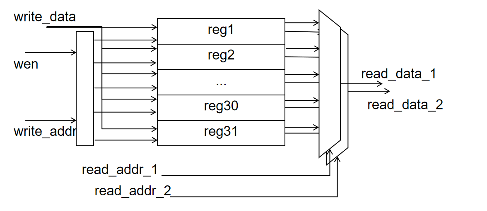
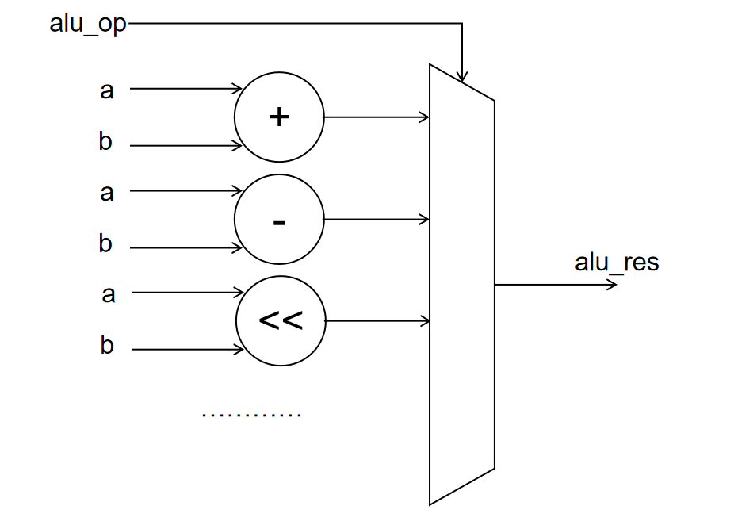
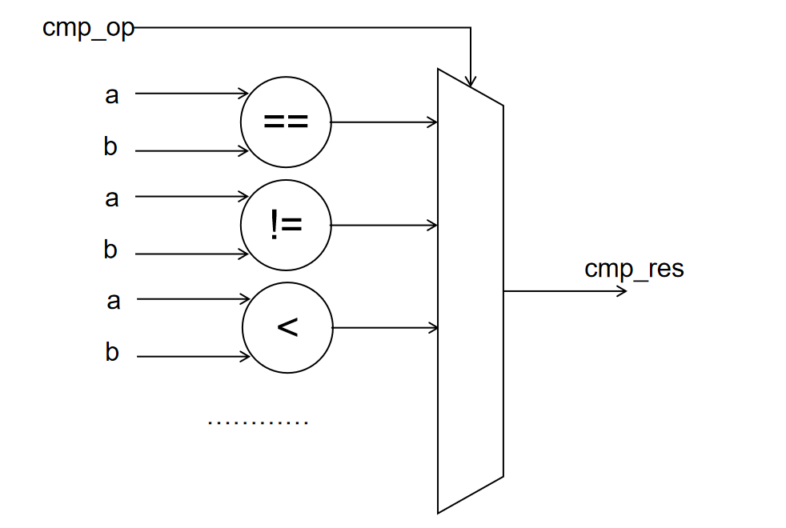

# project: 单周期 CPU 数据通路设计

## 实验目的

- 了解 CPU 设计的基本原理
- 设计 CPU 数据通路
- 为之后搭起单周期 CPU 打下基础

## 实验环境

- 操作系统：Windows 10+ 22H2，Ubuntu 22.04+
- VHDL：Verilog，SystemVerilog

## 背景知识

### 单周期 CPU

单周期 CPU 主要特征是在一个周期内完成一条指令，也就意味着其 CPI (cycle per instruction) 是 1。
考虑到不同的指令都需要在一个周期内完成，因而单周期 CPU 时钟频率是以执行最慢的那条指令作为基准，这也是单周期 CPU 最大的缺陷之一。
我们可以把单周期 CPU 分成数据通路和控制单元两个模块，本次实验将完成数据通路模块。

### 数据通路设计

为了之后能和流水线 CPU 进行衔接，我们把单周期 CPU 数据通路划分成 5 个阶段（stage）:

- Instruction Fetch (IF)
- Instruction Decode (ID)
- EXecution (EX)
- MEMory access (MEM)
- register Write Back (WB)

这 5 个 stage 所做的操作解释：

=== "获取指令阶段 (IF)"
    - 从 Instruction Memory 中获取 32 位指令
    - 更新当前的 PC (Program Counter)
=== "指令译码阶段 (ID)"
    - 拿到指令之后，我们需要知道指令能提供各种信息包括 Opcode, Rs1, Rs2, Rd, Imm 等等，所以需要对指令进行译码，提取信息，得到寄存器号，立即数和一系列控制信号。
    - 译码完成后，我们可以通过拿到的 Rs1, Rs2 读取相应的寄存器值
=== "执行阶段 (EX)"
    - 执行一些运算操作，包括+，-，\*，/，逻辑运算或左移、右移等等
    - 跳转地址的计算也可以在这个阶段执行
=== "访存阶段 (MEM)"
    - 从 Data Memory 中拿到数据
=== "写回阶段 (WB)"
    - 把计算后获得的数据或者从 Data Memory 读的数据写回到寄存器中

### 数据通路图


#### 模块设计要点

- 示意图中的处理器为哈佛架构，内存分为 Instruction Memory 和 Data Memory。为了兼容输入样例，我们需要实现冯诺依曼架构。简便起见，我们将两块内存合并为一个双口内存，其中 0 号端口为提供给 IF 取指阶段的只读端口，1 号端口为提供给 MEM 阶段的读写端口，并且支持字节掩码
- Add 模块就是简单的加法，注意其和 ALU 的区别
- Registers 是 32 个 64 位寄存器
- 因为 RISC-V 的 Imm 在指令中的位置不是固定的，所以需要针对不同指令生成相应的 Imm，当然 Imm Gen 模块也可以放到之后要实现的控制单元模块中或者说指令解码器中
- ALU 模块根据要实现的指令实现具体的操作，注意要充分利用 Verilog 提供的操作符，例如 +, -, <<, >>> 等

#### 数字电路设计要点

数字电路根据其特点大概可以分成*组合电路*和*时序电路*两大类，其概念和特性已经在课上讲述，在这里不多阐述。在单周期 CPU 设计中，这两种电路设计归纳如下：

- 在实验中， Instruction Memory 是组合电路，Data Memory 是时序电路（仅限于本实验，实际中并非如此）
- Registers、PC 模块使用时序电路
- ALU、Add 模块使用组合电路
- Imm Gen、Mux 模块使用组合电路


## 实验步骤

### 实验前准备

启动安装在你电脑中的 Ubuntu 22.04 环境（WSL 或虚拟机），随后通过 `cd` 移动到 `sys1-sp{{ year }}` 目录下，执行下面的命令：

```shell
git pull origin master
cd repo/sys-project
git checkout main
```

该实验的 sys-project 代码在 main 分支下。

### 文件结构

本实验的文件数目较多，为了方便同学们进行文件管理，我们设置了如下的文件结构：

```
.
├── repo
│   └── sys-project
│       ├── general
│       ├── include
│       ├── ip
│       ├── sim
│       ├── syn
│       ├── tcl
│       └── testcode
│           └── testcase
└── src
    └── project
        ├── include
        ├── Makefile
        └── submit
```

#### 硬件部分

* `sys-project/general`：提供给同学们的既用于仿真、也用于综合的代码
* `sys-project/include`：提供的一些头文件
* `sys-project/ip`：用于差分测试的 spike 静态链接库和头文件，和 sim 文件配合进行差分测试
* `sys-project/sim`：仅用于仿真的 v、sv、cpp 代码
* `sys-project/syn`：仅用于综合的 v、xcd、sv 代码
* `sys-project/tcl`：Vivado 用于综合的脚本
* `src/project/submit`: 需要你完成的 CPU 代码

!!! Tip "对于非 X86 架构机器"
    当前 ip 文件夹提供的静态链接库是 x86 架构的，如果部分同学不是 x86 的机器，请在 repo 文件夹运行 `make ip_gen` 自行编译静态链接库

#### 软件部分

* `sys-project/testcode`: 包含了各类可能的指令测试序列，具体使用详见 [project-2](https://zju-sys.pages.zjusct.io/sys1/sys1-sp{{year}}/project-2/#_11)

#### 工作区管理

- src/project 是用于编译综合的工作区，project 的各个子文件夹作用如下：
    * include: 用于存放用户自己编写的头文件
    * submit: 用于实现用户自己的硬件部分代码，包括编写自定义模块和补全我们提供的模块
    * Makefile: 编译综合的脚本

!!! tip "代码编写须知"
    src/project 是实际需要编写你自己的代码、编译运行、提交的工作区。而 repo/sys-project 是实验框架，**不需要也不可以修改**。

### CPU 相关参数

在本实验中，我们在 `sys-project/include/core_struct.vh` 中提供了你在设计单周期 CPU 过程中会使用到的大部分参数（包括可能的运算和各类型指令字段的不同值），并进行了 `package` 封装。下文提及的大多数数据类型都在该文件中进行了声明。此外其中的声明的各类 `enum` 变量可以作为你设计 ALU 等运算单元时需要覆盖运算类型的参考。

!!! Tip
    关于相关语法，可以参考 [Lab4 附录](https://zju-sys.pages.zjusct.io/sys1/sys1-sp{{year}}/lab4-1-appendix/)。

### Memory 设计

在本实验中，`sys-project/general/DRAM.v` 实现了一个简单的内存模型:

```SystemVerilog
module DRAM #(
    parameter FILE_PATH = "",   // 初始化内存的文件路径
    parameter DATA_WIDTH = 64,  // 数据的宽度
    parameter CAPACITY = 4096   // 内存存储的数据量
) (
    input  clk,
    input  wen,   // 写使能，当 wen=1 时写内存
    input  [$clog2(CAPACITY/(DATA_WIDTH/8))-1:0] waddr, //  写操作的内存地址
    input  [DATA_WIDTH-1:0] wdata,                      //  写操作写入的数据
    input  [DATA_WIDTH/8-1:0] wmask,                    //  写操作的字节掩码
    // MEM 阶段写操作
    
    input  [$clog2(CAPACITY/(DATA_WIDTH/8))-1:0] raddr0,//  第一个读口的读操作内存地址
    output [DATA_WIDTH-1:0] rdata0,                     //  第一个读口返回的数据
    // IF 阶段读操作

    input  [$clog2(CAPACITY/(DATA_WIDTH/8))-1:0] raddr1,//  第二个读口的读操作内存地址
    output [DATA_WIDTH-1:0] rdata1                      //  第二个读口返回的数据
    // MEM 阶段读操作
);

    localparam BYTE_NUM = DATA_WIDTH / 8;
    localparam DEPTH = CAPACITY / BYTE_NUM;
    integer i;
    reg [DATA_WIDTH-1:0] mem [0:DEPTH-1];   
    // distribute memory，用寄存器模拟的内存区域
    // 读写效率高，但是资源开销大
    
    initial begin
        $readmemh(FILE_PATH, mem);
        //  用 hex 文件初始化内存值
    end

    always @(posedge clk) begin
        if (wen) begin  // 写操作
            for(i = 0; i < BYTE_NUM; i = i+1) begin
                if(wmask[i]) begin  
                // 写掩码按位使能，64 位的数据有 8 位掩码，掩码为 1，对应的字节写入
                    mem[waddr][i*8 +: 8] <= wdata[i*8 +: 8];
                end
            end
        end
    end

    assign rdata0 = mem[raddr0];
    assign rdata1 = mem[raddr1];
    // 读操作
endmodule
```

### Memory 接口

本实验使用的内存模型很简单，这样导致 CPU 和 Memory 的交互操作非常简单，且可以在一个周期执行多次内存操作。但是实际上的内存操作是很复杂的，需要复杂的时序控制和多周期的执行时间。在之后系统 II、系统 III 的实验中，我们会逐步构建更接近真实内存模型的内存，为了保证 CPU 与内存交互在贯通课程中的一致性，我们在本次实验中提供了一个相对较为复杂且完备的 Memory 接口，虽然在本实验中无法体现它的效果，但是在之后系统 II、系统 III 的实验中，大家会慢慢感受到它的优秀之处，这里做一个简要介绍。

Memory 接口由四个数据通道组成：

* 读请求通道：该通道线路相互配合，将 Core 的读请求发送给 Memory
    - r_request_bits：类型 RrequestBit，为读请求的数据包
        - raddr：类型 addr_t，为需要读的内存地址
    - r_request_valid：类型 ctrl_t，Core 和 Memory 关于 r_request_bits 的握手信号
    - r_request_ready：类型 ctrl_t，Core 和 Memory 关于 r_request_bits 的握手信号
* 读响应通道：该通道线路相互配合，将 Memory 读到的结果返还给 Memory
    - r_reply_bits：类型 RreplyBit，为读响应的数据包
        - rdata：类型 data_t，为读到的内存数据
        - rresp：类型为 resp_t，为内存访问过程中的报错信息
    - r_reply_valid：类型 ctrl_t，Core 和 Memory 关于 r_reply_bits 的握手信号
    - r_reply_ready：类型 ctrl_t，Core 和 Memory 关于 r_reply_bits 的握手信号
* 写请求通道：该通道线路相互配合，将 Core 的写请求发送给 Memory
    - w_request_bits：类型 WrequestBit，为写请求的数据包
        - waddr：类型 addr_t，为需要写的内存地址
        - wmask：类型为 mask_t，为写操作的字节掩码
        - wdata：类型为 data_t，为写入的数据
    - w_request_valid：类型 ctrl_t，Core 和 Memory 关于 w_request_bits 的握手信号
    - w_request_ready：类型 ctrl_t，Core 和 Memory 关于 w_request_bits 的握手信号
* 写响应通道：该通道线路相互配合，将 Memory 写的结果返还给 Memory
    - w_reply_bits：类型 WreplyBit，为写响应的数据包
        - bresp：类型为 resp_t，为内存访问过程中的报错信息
    - w_reply_valid：类型 ctrl_t，Core 和 Memory 关于 w_reply_bits 的握手信号
    - w_reply_ready：类型 ctrl_t，Core 和 Memory 关于 w_reply_bits 的握手信号

当进行读操作的时候，首先通过读通道的握手，Master 将读请求的内容发送给 Slave，然后等待 Slave 通过读响应通道的握手，将读操作的结果反馈给 Master；写操作同理，Master 通过写请求通道握手发送请求内容，然后等待写响应握手得到 Slave 写的结果。

不过本次实验因为是单周期 CPU，一个周期内一定可以得到读写结果，所以 valid-ready 握手一直成立，大家只要将需要读写的通道常开即可。对于复杂的内存访问操作会遇到各种待处理的内存错误，所以接口会返回 rresp、bresp，这些在之后的系统 II 和系统 III 中大家也会慢慢遇到，这里可以先不考虑。本次实验只要求大家学习使用 interface 的基本语法即可。

我们的 Core 和 DRAM 之间用 mem_ift 相连接。为此我们将 DRAM 的输入输出接口包装为 mem_ift 的接口模式，得到 Mem_ift_DRAM 模块。

### 功能模块设计

我们会按照 CPU 的五个运行阶段来介绍我们设计的 CPU 数据通路中的各个功能部件。

!!! Tip 
    文档以下部分给出的代码来自 `src/project/submit` ，这些代码基于 [3-3](https://zju-sys.pages.zjusct.io/sys1/sys1-sp{{year}}/project-1/#_5) 给出的数据通路。

    当然这些代码仅供同学参考，我们鼓励你根据数据通路自行设计模块或是更进一步自己设计数据通路

#### IF 阶段

=== "Instruction Selection"
    由于我们设计的是 64 位 CPU，因此 imem 读回的数据为是 64 位，但 RISC-V 规定的指令长度只有 32 位，因此需要根据 PC 来进一步判断需要执行的是高 32 位指令还是低 32 位指令，后续再通过控制单元进行指令译码。

=== "PC"
    我们使用 PC 来从 imem 中取指令，而 PC 也需要随着指令流动进行更新。在正常情况下 PC 只需要不断 +4，但是在 B 型指令跳转条件满足以及 J 型指令来临时，PC 需要根据后续阶段的计算结果进行更新。
    !!! Note
        需要注意我们的 Instruction Memory 是 byte-addressing 的，因此例如顺序执行指令时，取下一条指令时需要将 PC + 4 而不是 PC + 32。

#### ID 阶段

=== "控制单元 Controller"
    控制单元负责解码指令中的各字段，具体设计会在[控制单元设计](https://zju-sys.pages.zjusct.io/sys1/sys1-sp{{year}}/project-2)进行详细说明。

=== "寄存器堆 Register File"

    !!! Tip "关于 Regfile 的涉及阶段"
        需要注意 Regfile 并不单纯只与 ID 阶段有关，在 WB 阶段我们会将计算得到的更新后的值写回寄存器堆，从而实现寄存器值的维护。

    在寄存器堆 Register File 中我们会维护 32 个 64 位寄存器来供 CPU 使用，在 ID 阶段中我们会使用解码得到的 rs1, rs2 寄存器号来从寄存器堆中获取寄存器值：

    ```systemverilog
    `include "core_struct.vh"
    module RegFile (
    input clk,
    input rst,
    input we, // Signal decoded from inst
    input CorePack::reg_ind_t  read_addr_1,
    input CorePack::reg_ind_t  read_addr_2,
    input CorePack::reg_ind_t  write_addr,
    input  CorePack::data_t write_data,
    output CorePack::data_t read_data_1,
    output CorePack::data_t read_data_2
    );
    import CorePack::*;

    integer i;
    data_t register [1:31]; // x1 - x31, x0 keeps zero

    // fill your code

    endmodule
    ```

    可以参考如下电路图：

    

    大家也可以参考 DRAM 的写法来编写 Regfile，顺便思考 regfile 和 dram 有什么内在联系。请注意 zero 寄存器 x0 恒等于 0。


#### EXE 阶段

在 EXE 阶段我们需要根据指令译码结果进行计算，其涉及的计算类型可以参考 `sys-project/include/core_struct.vh` 中相关 `enum` 的声明。

对于这两个部件，最简单的实现就是多路选择器，但多路选择器的电路开销总是最大的，大家可以思考如何对电路进行优化，用更少的电器元件得到同样的电路。
=== "ALU"

    ALU 会根据运算类型对数据进行算术和逻辑运算，需要注意 a 和 b 并不一定来自寄存器堆，你需要根据指令类型自行判断：

    ```systemverilog
    `include "core_struct.vh"
    module ALU (
        input  CorePack::data_t a,
        input  CorePack::data_t b,
        input  CorePack::alu_op_enum  alu_op, // Signal decoded from inst
        output CorePack::data_t res
    );

    import CorePack::*;

    // fill your code

    endmodule
    ```

    大家可以参考如下电路图：

    

=== "Cmp"

    Cmp 会通过逻辑和算术运算来判断 B 型指令是否满足跳转条件，与 ALU 不同，Cmp 的操作数总是来自寄存器堆（参考 B 型指令的指令结构）：

    ```systemverilog
    `include"core_struct.vh"
    module Cmp (
        input CorePack::data_t a,
        input CorePack::data_t b,
        input CorePack::cmp_op_enum cmp_op,
        output cmp_res
    );

        import CorePack::*;

        // fill your code
        
    endmodule
    ```

    大家可以参考如下电路图：

    

#### MEM 阶段

MEM 阶段我们需要对计算得到的数据进行加工，并与 dmem 交互完成内存数据的读写工作。

=== "Data Package"

    在我们实现的 CPU 中，所有写回内存的数据都是 64 位的，但是 RISC-V 中 S 型指令有多种数据类型，本次实验中我们需要支持的类型包括 `sb` (8-bit), `sh` (16-bit), `sw` (32-bit), `sd` (64-bit)，显然我们需要写回的数据并不一定能完全占据 64 位空间，因此我们需要根据数据位宽和写回地址来进行移位准备写回的数据。

    ??? Note "例"

        假设此时有一条 `sb` 指令，经过计算我们得到需要写回的数据为 8'h20，而需要写回的地址为 64'h25 (byte-addressing) ，即我们要将该数据写回 64'h0000_0000_0000_0025 这一地址所在字节。而我们写回的数据总是 8 字节对齐的，因此写回数据将处于 [64'h20, 64'h27] 这个 64 位区域内，此时我们就可以根据写回地址 64'h25 计算得到我们要写回的数据处于该 64 位区域的第 6 个字节。这意味着我们需要把我们要写回的数据移到该区域的第 6 字节处，即写回数据为 64'h00_00_**20**_00_00_00_00_00

    ```systemverilog
    `include "core_struct.vh"

    module DataPkg(
        input CorePack::mem_op_enum mem_op,
        input CorePack::data_t reg_data,
        input CorePack::addr_t dmem_waddr,
        output CorePack::data_t dmem_wdata
    );

    import CorePack::*;

    // Data package
    // fill your code

    endmodule
    ```

=== "Data Mask Generation"

    在进行 Data Package 后，我们传回的数据中可能包含大量无意义仅用于占位的 0 ，而我们不希望这些数据被内存错误地写入，因此我们需要使用掩码 (Mask) 来告知内存哪些位是有意义的，只有掩码中为 1 的**字节**才会被载入内存。

    ??? Note "例"
        在 Data Package 所使用的例子中，我们随同数据写入的掩码就应当是 8'h00**1**00000。表示只有从 64'h25 开始的 1-byte 数据是有意义的

    ```systemverilog
    `include "core_struct.vh"

    module MaskGen(
        input CorePack::mem_op_enum mem_op,
        input CorePack::addr_t dmem_waddr,
        output CorePack::mask_t dmem_wmask
    );

    import CorePack::*;

    // Mask generation
    // fill your code

    endmodule
    ```

=== "Data Truncation"

    与写内存类似，在 Load 指令读内存时，我们也只需要读到的 64 位数据中的一部分，因此需要根据读内存的地址来从中进行截取。此外需要注意由于我们的寄存器是 64 位的，因此仍然需要对截取的数据进行一定加工，你需要注意有无符号数符号扩展和零扩展的差异。

    ```systemverilog
    `include "core_struct.vh"

    module DataTrunc (
        input CorePack::data_t dmem_rdata,
        input CorePack::mem_op_enum mem_op,
        input CorePack::addr_t dmem_raddr,
        output CorePack::data_t read_data
    );

    import CorePack::*;

    // Data trunction
    // fill your code

    endmodule
    ```
#### WB 阶段

在该阶段你需要将根据指令选择数据写回寄存器堆（如果有必要）。

### 数据通路 Core

在你的控制通路中集成上面实现的这些功能模块，声明为 Core 模块。Core 模块有两个 mem_ift 的内存接口和 DRAM 连接，其中 imem_ift 仅使用读请求和读响应通道，向 DRAM 请求指令；dmem_ift 使用四个通道分别进行 DRAM 的读写操作。

该模块的顶层引脚如下，cosim_core_info 结构复杂连接 core 内部的数据信息，这些信息会被用于差分测试和硬件调试，请务必仔细连接。

```verilog
`include "core_struct.vh"
module Core (
    input clk,
    input rst,

    Mem_ift.Master imem_ift,
    Mem_ift.Master dmem_ift,

    output CorePack::CoreInfo cosim_core_info
);
    import CorePack::*;
    
    // fill your code

    assign cosim_core_info.pc        = pc;
    assign cosim_core_info.inst      = {32'b0,inst};   
    assign cosim_core_info.rs1_id    = {59'b0, rs1};
    assign cosim_core_info.rs1_data  = read_data_1;
    assign cosim_core_info.rs2_id    = {59'b0, rs2};
    assign cosim_core_info.rs2_data  = read_data_2;
    assign cosim_core_info.alu       = alu_res;
    assign cosim_core_info.mem_addr  = dmem_ift.r_request_bits.raddr;
    assign cosim_core_info.mem_we    = {63'b0, dmem_ift.w_request_valid};
    assign cosim_core_info.mem_wdata = dmem_ift.w_request_bits.wdata;
    assign cosim_core_info.mem_rdata = dmem_ift.r_reply_bits.rdata;
    assign cosim_core_info.rd_we     = {63'b0, we_reg};
    assign cosim_core_info.rd_id     = {59'b0, rd}; 
    assign cosim_core_info.rd_data   = wb_val;
    assign cosim_core_info.br_taken  = {63'b0, br_taken};
    assign cosim_core_info.npc       = next_pc;

endmodule
```

注意上述 `cosim_core_info` 信号中要求必须要引出的有：pc、inst、rd_we、rd_id、rd_data。

在完成了数据通路后，我们的 CPU 已经拥有了所有必要的功能部件，接下来我们将在下一部分介绍控制单元的设计来向这些功能部件提供控制信号从而使指令能够真正地流动起来。