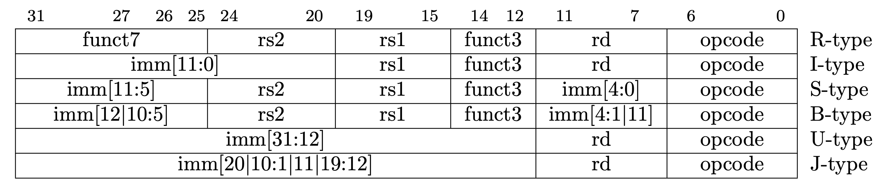
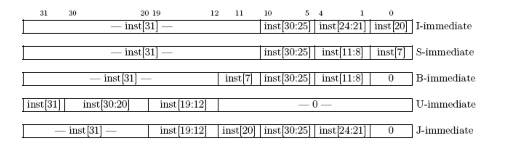

# project: 单周期 CPU 设计

## 实验目的

- 了解 CPU 设计的基本原理
- 设计 CPU 控制单元模块
- 结合上次实验中的数据通路模块，搭建单周期 CPU

## 实验环境

- 操作系统：Windows 10+ 22H2，Ubuntu 22.04+
- VHDL：Verilog，SystemVerilog

## 背景知识

### 概述

单周期 CPU 设计可以分成数据通路和控制单元两个模块。本节我们将讲解控制单元模块的编写。

!!! Warning "特别注意"
    控制单元的设计需要你深入了解 RISC-V ISA 的具体细节，包括指令类型、指令结构、各种指令的操作数和具体功能等。这部分中文资料质量良莠不齐，如果遇到 ISA 相关的疑问，请务必先阅读 [The RISC-V Instruction Set Manual Volume I: Unprivileged Architecture](https://github.com/riscv/riscv-isa-manual/releases/download/riscv-isa-release-7b6911f-2025-04-25/riscv-unprivileged.pdf)。

    RV64I 的指令大多与 RV32I 一致，可以参考指令集手册的 Chapter 2；但部分指令，如 SLLI，SRLI，LUI，AUIPC，SLL，SRL，LW，SW 语意和 RV32I 有些许区别，请参考 Chapter 4

### 控制单元

控制单元，也称译码器，它的作用是解码指令，发出信号，告诉 Datapath 应该执行什么操作。

RV64I 指令集包括 R、I、S、B、U、J 6 个类型的指令格式，如下图所示。
指令的类型基本是由 Opcode，Funct7(如果存在的话)和 Funct3(如果存在的话)决定的。
通过这 3 个字段判断得到了指令的类型之后，就可以为控制信号赋值，控制 Datapath 中的数据流。



??? "例"
    例如，opcode = 6'0000011，且 funct3 = 3'b010，说明是 LW 指令，pc 应更新为 PC+4 ，alu_src_b 信号线应该控制 Imm 作为 ALU B 口的输入，alu_op 应该为加法信号 (做地址的加法计算读内存地址)，mem_to_reg 应该控制把从 dmem 读的数据写回 Register File 中，reg_write 信号线应该允许数据写回 Register File。

控制信号是用来控制数据流在 Datapath 的流动，下述表格列出了参考的控制单元信号设计，大家也可以自行设计控制信号。

控制通路模块的输出是一系列控制信号，定义如下：

| 类型               | 名称          | 宽度 | 含义           |
| -------------------| ------------- | ---- | -------------- |
| logic              | we_reg        | 1    | 寄存器写使能   |
| logic              | we_mem        | 1    | 内存写使能     |
| logic              | re_mem        | 1    | 内存读使能     |
| logic              | npc_sel       | 1    | NEXT PC 选择   |
| imm_op_enum        | immgen_op     | 3    | 立即数选择     |
| alu_op_enum        | alu_op        | 4    | 运算操作码     |
| cmp_op_enum        | cmp_op        | 3    | 分支计算操作码 |
| alu_asel_op_enum   | alu_asel      | 2    | ALU A 端口选择 |
| alu_bsel_op_enum   | alu_bsel      | 2    | ALU B 端口选择 |
| wb_sel_op_enum     | wb_sel        | 2    | 写回数据选择   |
| mem_op_enum        | mem_op        | 3    | 访存操作码     |

各个信号的详细定义如下：

#### we_reg、we_mem、re_mem、npc_sel

| 取值 |  含义   |
| :--: | :----: |
| 1'b0 | 不允许读/写/PC跳转   |
| 1'b1 | 允许读/写/PC跳转    |

#### immgen_op[2:0]

为了便于编程，这些控制信号在 `sys-project/include/core_struct.vh` 的 CorePack 包中定义了对应的枚举类型和枚举常量。该信号在 CorePack 中定义为 imm_op_enum 枚举类型

|  取值  |        含义        |
| :----: | :----------------: |
| IMM0   |       生成 0       |
| I_IMM  | 生成 I TYPE 立即数 |
| S_IMM  | 生成 S TYPE 立即数 |
| B_IMM  | 生成 B TYPE 立即数 |
| U_IMM  | 生成 U TYPE 立即数 |
| UJ_IMM | 生成 J TYPE 立即数 |

具体立即数的格式可以参考下图：



#### alu_op[3:0]

CorePack 中定义为 alu_op_enum

|  取值   | 含义 |  取值   | 含义 |
| :-----: | :--: | :-----: | :--: |
| ALU_ADD | ADD  | ALU_SRL | SRL  |
| ALU_SUB | SUB  | ALU_SRA | SRA  |
| ALU_AND | AND  | ALU_ADDW| ADDW |
| ALU_OR  |  OR  | ALU_SUBW| SUBW |
| ALU_XOR | XOR  | ALU_SLLW| SLLW |
| ALU_SLT | SLT  | ALU_SRLW| SRLW |
| ALU_SLTU| SLTU | ALU_SRAW| SRAW |
| ALU_SLL | SLL  |

#### cmp_op[2:0]

在 CorePack 定义为 cmp_op_enum

|  取值  |       含义       |
| :----: | :--------------: |
| CMP_NO | 不是 Branch 操作 |
| CMP_EQ |        EQ        |
| CMP_NE |        NE        |
| CMP_LT |        LT        |
| CMP_GE |        GE        |
| CMP_LTU|       LTU        |
| CMP_GEU|       GEU        |

#### alu_asel[1:0]

CorePack 中定义为 alu_asel_op_enum

| 取值      |    含义     |
| :------: | :---------: |
| ASEL0    | 选择 0 输入 |
| ASEL_REG |  选择 RS1   |
| ASEL_PC  |   选择 PC   |

#### alu_bsel[1:0]

CorePack 中定义为 alu_bsel_op_enum

| 取值      |   含义    |
| :------: | :-------: |
| BSEL0    | 选择 0 输入 |
| BSEL_REG |  选择 RS2   |
| BSEL_IMM |  选择 imm   |

#### wb_sel[1:0]

CorePack 中定义为 wb_sel_op_enum

| 取值        |         含义          |
| :--------: | :-------------------: |
| WB_SEL0    |      选择写回 0        |
| WB_SEL_ALU | 选择写回 ALU 计算结果   |
| WB_SEL_MEM | 选择写回内存读回内容    |
| WB_SEL_PC  |     选择写回 pc+4      |

#### mem_op[2:0]

CorePack 中定义为 mem_op_enum

|  取值  |        含义        |
| :----: | :----------------: |
| MEM_NO |       不访存       |
| MEM_D  |    Double Word     |
| MEM_W  |        Word        |
| MEM_H  |     Half Word      |
| MEM_B  |        Byte        |
| MEM_UW |   Unsigned Word    |
| MEM_UH | Unsigned Half Word |
| MEM_UB |   Unsigned Byte    |

!!! Tip "注意"
    为了方便同学们调试，上面的信号设计了很多为 0 时无意义的状态，在最终的处理器中同学们可以尝试把空的状态优化掉。

#### 其他

CorePack 还有常用的 opcode, funct3, funct7 的数值定义，请大家妥善利用。

## 实验步骤

### 控制单元设计

下面给出 Control 模块的代码接口:

!!! Tip 关于 ControllerPack
    我们在 `sys-project/include/core_struct.vh` 中提供了整合了所有控制信号的结构 `ControllerSignals` 并存放于 `ControllerPack` 中，你可以按照下方代码注释的方式启用 `ControllerSignals` 来代替原有的所有控制信号，从而减少你例化模块时接线的工作量。
```systemverilog
`include "core_struct.vh"
module controller (
    input CorePack::inst_t inst,
    output we_reg,
    output we_mem,
    output re_mem,
    output npc_sel,
    output CorePack::imm_op_enum immgen_op,
    output CorePack::alu_op_enum alu_op,
    output CorePack::cmp_op_enum cmp_op,
    output CorePack::alu_asel_op_enum alu_asel,
    output CorePack::alu_bsel_op_enum alu_bsel,
    output CorePack::wb_sel_op_enum wb_sel,
    output CorePack::mem_op_enum mem_op
    // output ControllerPack::ControllerSignals ctrl_signals
);

    import CorePack::*;
    // import ControllerPack::*;
    
    // fill your code

endmodule

```

这里的译码过程非常繁琐，所以我们推荐使用**二段译码的方式**进行译码。

### 二段译码

对于 controller 这个译码单元，我们有如下的输入输出关系（简单起见只有 reg_wen、mem_wen、mem_ren、is_imm 四个信号输出）：

|  opcode         | reg_wen | mem_wen | mem_ren | is_imm |
| :-------:       | :-----: | :-----: | :-----: | :-----:|
|  0000011(load)  |    0    |   0    |     1   |    1   |
|  0110011(R)     |    1    |   0    |     0   |    0   |
|  0010011(I)     |    1    |   0    |     0   |    1   |
|  0100011(store) |    0    |   1    |     0   |    1   |
|  ....           |    ..   |   ..   |   ..    |   ..   |

根据译码器的编程范式，我们可以做如下的编程：
```systemverilog
always_comb begin
    case(opcode)
        7'b0000011:
        begin
            reg_wen=1'b0;
            mem_wen=1'b0;
            mem_ren=1'b1;
            is_imm=1'b1;
        end
        7'b0110011:
        begin
            reg_wen=1'b1;
            mem_wen=1'b0;
            mem_ren=1'b0;
            is_imm=1'b0;
        end
        7'b0010011:
        begin
            reg_wen=1'b1;
            mem_wen=1'b0;
            mem_ren=1'b0;
            is_imm=1'b1;
        end
        7'b0100011:
        begin
            reg_wen=1'b0;
            mem_wen=1'b1;
            mem_ren=1'b0;
            is_imm=1'b1;
        end
        default:
        begin
            reg_wen=1'b0;
            mem_wen=1'b0;
            mem_ren=1'b0;
            is_imm=1'b0;
        end
    endcase
end
```
这样写非常符合设计直觉，但是它存在大量的问题：

1. 这样需要对每一类指令的每一个输出都做一次赋值，对于 M 种指令、N个输出的情况需要赋值 M x N 次。编程的代码越多越容易出现代码赋值的立即数写错等问题，检查校验起来效率会很低。

2. 在 always_comb 语法中这个问题不存在，但是在 always@(*) 语法中，容易出现输出寄存器漏赋值、default 分支漏写等问题，造成出现 latch 的时序错误。

3. 每当需要增加一条新的指令就要写 N 行的代码，每当新增一个输出就要新增 M 行代码。写错、漏写的风险都会很高。

因此我们提出了如下的写法：
```systemverilog
wire inst_load=opcode==7'b0000011;
wire inst_reg=opcode==7'b0110011;
wire inst_imm=opcode==7'b0010011;
wire inst_store=opcode==7'b0100011;

wire reg_wen=inst_load|inst_reg|inst_imm;
wire mem_wen=inst_store;
wire mem_ren=inst_load;
wire is_imm=inst_load|inst_store|inst_imm;
```
第一部分根据 opcode 得到指令的种类，这个过程是第一次译码，复杂度是 M。
第二部分根据 opcode 和译码表中输出为 1 的条目，将输出为 1 的指令种类或起来即可，复杂度与表格中 1 的数量一样，不妨记为 K。鉴于译码表中 1 的条目是非常稀疏的，特别是当很多的输出信号是针对某些指令专门设立的，所有 K << M x N。

所以这种写法相对于第一种有如下的好处：

1. 编程的复杂度 M + K，远远小于 M x N

2. 不会出现 always@(*) 生成 latch 的问题

3. 多加一条指令需要修改的行数和输出中的 1 个数一致，一般远小于 N；多加一个输出需要修改的行数和该输出为 1 的指令的个数一致，一般远小于 M

由此可见，对于稀疏的译码函数，使用二段译码比直接使用一段译码可以有更少的编程难度和维护难度。

### 仿真测试

本实验中 DRAM 根据 FILE_PATH 参数的文件地址进行初始化，我们在`sys-project/testcode/testcase`下提供了一些测试文件，用于加载到 RAM 中，测试你的 CPU 是否能合理得执行指令。其中`.hex`后缀的为实际加载到 RAM 中的文件，你需要在修改`project/include/initial_mem.vh`头文件的`FILE_PATH`参数为你本地的**绝对路径**。

#### 仿真测试文件说明

本次实验为大家提供了仿真测试的代码，即 `sys-project/testcode/testcase` 文件夹下。
在顶层目录 `src/project` 执行 `make TESTCASE=XXX`，其中 `XXX` 为测试样例名（rtype, itype, btype, utype, jtype, stype, remain, sample）。

具体的测试文件内容类型如下：

* testcase: 初始化 0-0x1000 的内存，进行简单的功能测试
  - sample：简单测试样例，用于熟悉实验结构
  - rtype：测试 R 型指令
  - itype：测试 I 型指令
  - stype：测试 S 型指令
  - btype：测试 B 型指令
  - utype：测试 U 型指令
  - jyupe：测试 J 型指令
  - remain：测试其他类型的指令
  - full：测试所有类型的指令

编译方式如下，不过多数时候不需要手动执行 Makefile 进行编译：

* 运行 `make -C testcase TESTCASE=xxx`，编译其中指定的测试样例
    - 例如 `TESTCASE=sample`，编译 sample 文件夹的测试样例，得到 sample.hex
    - 如果需要得到综合下板的测试样例，则运行 `make -C testcase board TESTCASE=xxx`，这样执行完毕可以顺利死循环在 pass 指令处


#### Makefile 脚本功能

* make verilate：进行不下板仿真，运行在 repo/sys-project/testcode 中执行 `make sim` 后得到的测试代码
* make board_sim：进行下板仿真，运行在 .../testcode 中执行 `make board` 后得到的测试代码
* make wave：gtkwave 查看波形
* make bitstream：生成 bit 流
* make vivado：打开 Vivado

希望这些脚本的改动可以方便大家编译安装工具、进行仿真测试、进行综合下板，不过更希望大家可以仔细阅读这些脚本，从中学习到更多的知识。如果大家有更好的管理方法来提高脚本的质量，也欢迎和助教们联系。


!!! Warning "注意"
    测试环境 Verilator 版本为 v5.002，测试操作系统为 Ubuntu22.04，其 gcc 版本为 Ubuntu 11.3.0-1ubuntu1~22.04，libc 版本为 GLIBC 2.35-0ubuntu3.1。如果出现环境兼容问题在询问时请附上以上工具的具体版本信息。

通常情况下，你看到的直接结果如下：

```bash
./Testbench
warning: tohost symbols not in ELF; can't communicate with target
[*] `Commit & Judge' General Co-simulation Framework
                powered by Spike 1.1.1-dev
- core 1, isa: rv64i MSU vlen:128,elen:64
- memory configuration: 0x0@0x1000
- elf file list: testcase.elf
- tohost address: 0x0
- fuzz information: [Handler] 0 page (0x0 0x0)
                    [Payload] 0 page (0x0 0x0)

core   0: 0x0000000000000000 (0x07b00093) li      ra, 123
core   0: 3 0x0000000000000000 (0x07b00093) x1  0x000000000000007b
core   0: 0x0000000000000004 (0x06f08113) addi    sp, ra, 111
core   0: 3 0x0000000000000004 (0x06f08113) x2  0x00000000000000ea
core   0: 0x0000000000000008 (0x06f10193) addi    gp, sp, 111
core   0: 3 0x0000000000000008 (0x06f10193) x3  0x0000000000000159
...
core   0: 0x000000000000009c (0xff4a9ee3) bne     s5, s4, pc - 4
core   0: 3 0x000000000000009c (0xff4a9ee3)
core   0: 0x00000000000000a0 (0x00000000) c.unimp
core   0: exception trap_illegal_instruction, epc 0x00000000000000a0
core   0:           tval 0x0000000000000000
core   0: 0x0000000000000000 (0x0000007b) unknown
...
[CJ]           0 Commit Failed
[0] %Error: cosim.v:56: Assertion failed in TOP.Testbench.difftest
%Error: /mnt/c/Users/Phantom/Downloads/release/chipblock-stu/sim/cosim.v:56: Verilog $stop
Aborting...
Aborted
make: *** [Makefile:19: verilator] Error 134
```

你会看到 Spike 打印的执行过程，当执行到最后一条指令(0x9c)之后，下一次取指令得到了 0x00000000，这在 RISC-V 中是一条非法指令，因此 Spike 会报错 illegal_instruction。
但是你的处理器不支持异常处理会继续当成正常指令执行下去，所以检测到了一个不一致的行为。

我们的测试框架会使用的上面的 `cosim_*` 信号，在每条指令执行结束后将你的处理器的状态与 Spike 中的状态进行比较，因此能够帮助你更及时的定位到错误。
有关测试框架的详细介绍请参考[链接](https://www.usenix.org/conference/usenixsecurity23/presentation/xujinyan)。

### 上板验证

首先执行 `make board_sim TESTCASE=full`，可以将 full.S 的测试程序编译为用于下板的 testcase.hex，即 build/verilate/testcase.hex，该程序执行正确会死循环在 9a8 地址，如果执行错误会死循环在 9a4 地址。

修改 `project/include/initial_mem.hex` 的 FILE_PATH 为 testcase.hex 的绝对路径，然后执行 `make bitstream` 即可得到最终的 bitstream。

硬件调试方法：

1. 你可以使用数码管来监控数据通路中的数值。

    switch[3:0] 用来控制数码管显示的调试信息，switch[4] 选择查看 64 为数据的高位还是低位，这些信息就是 SCPU 模块引出的 `cosim_core_info` 信号：

    |  开关   | 监视数据  |  开关   |  监视数据  |
    | :-----: | :------: | :-----: | :-------: |
    | 4'b0000 |    pc    | 4'b1000 |  mem_we   |
    | 4'b0001 |   inst   | 4'b1001 | mem_wdata |
    | 4'b0010 |  rs1_id  | 4'b1010 | mem_rdata |
    | 4'b0011 |   rs1    | 4'b1011 |   rd_we   |
    | 4'b0100 |  rs2_id  | 4'b1100 |   rd_id   |
    | 4'b0101 |   rs2    | 4'b1101 |    rd     |
    | 4'b0110 |   alu    | 4'b1110 | br_taken  |
    | 4'b0111 | mem_addr | 4'b1111 |    npc    |

2. 当 switch[15] 拨上时，CPU 进入调试模式，此时可以通过按中央按钮（button[0]）来单步执行指令（建议在下板之前就提前设置好开关，Program Device 后再设置来不及）。按下 reset 按钮可以重新初始化执行程序，但是因为内存是无法被 reset 的，这导致 reset 之后内存的数据发生变化，之后的执行会出错，进而死循环在 9a4，这是正常情况；此时只能重新下载程序再次测试。


## 实验报告 <font color=Red>100%</font>

1. 请在实验报告中详细描述每一步的过程并配有适当的截图和解释，对于仿真设计和上板验证的结果也应当有适当的解释和照片 <font color=Red></font>

2. 可以为系统 I 的实验安排、实验内容、实验指导留下任何宝贵的心得体会和建议吗？（不记录分数，纯属用于吐槽，感谢大家为我们的课改贡献一份力量）

## 代码提交

### 验收检查点 <font color=Red>100%</font>

1. 实现 R Type 的基本数据通路（通过测试 rtype.hex，累计可获得实验部分<font color=Red>10%</font>的分数）
    - add, sub, sll, slt, sltu, xor, srl, sra, or, and
2. 实现 I Type 的基本数据通路（通过测试 itype.hex，累计可获得实验部分<font color=Red>20%</font>的分数）
    - addi, slti, sltiu, xori, ori, andi, slli, srli, srai
    - ld
3. 实现 S Type 的基本数据通路（通过测试 stype.hex，累计可获得实验部分<font color=Red>30%</font>的分数）
    - sd
4. 实现 B Type 的完整数据通路（通过测试 btype.hex，累计可获得实验部分<font color=Red>40%</font>的分数）
    - beq, bne, blt, bge, bltu, bgeu
5. 实现 U Type 的完整数据通路（通过测试 utype.hex，累计可获得实验部分<font color=Red>50%</font>的分数）
    - lui, auipc
6. 实现 J Type 的完整数据通路（通过测试 jtype.hex，累计可获得实验部分<font color=Red>60%</font>的分数）
    - jal
7. 实现剩余指令的完整数据通路（通过测试 remain.hex，累计可获得实验部分<font color=Red>70%</font>的分数）
    - jalr, lb, lh, lw, lbu, lhu, lwu
    - sb, sh, sw
    - addiw, slliw, srliw, sraiw
    - addw, subw, sllw, srlw, sraw
8. 实现所有指令的完整数据通路（通过测试 full.hex，累计可获得实验部分<font color=Red>80%</font>的分数）
9. 下板验证，累计可获得实验部分<font color=Red>100%</font>的分数

### 提交文件

`src/project/` 中编写的 submit 和 include 的代码。