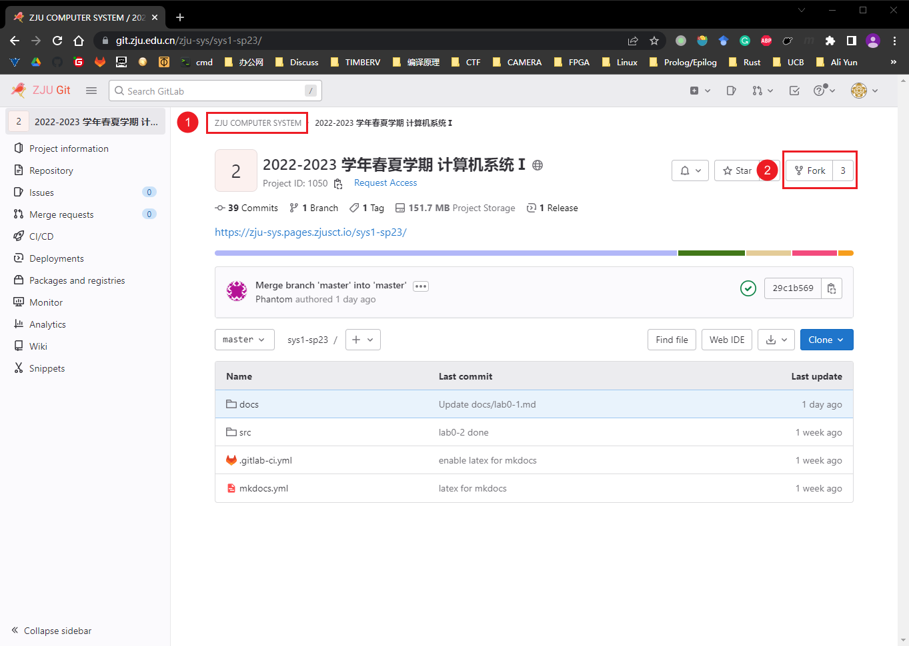
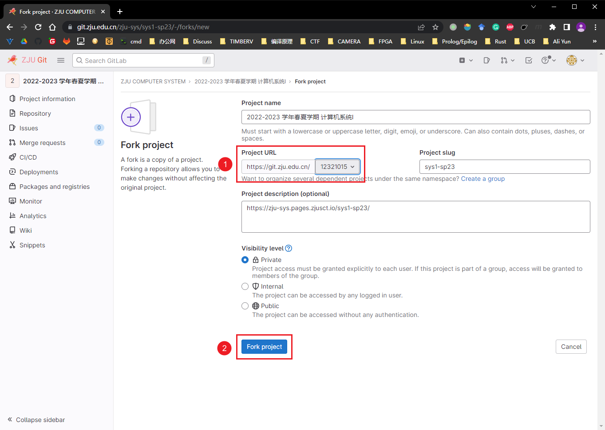
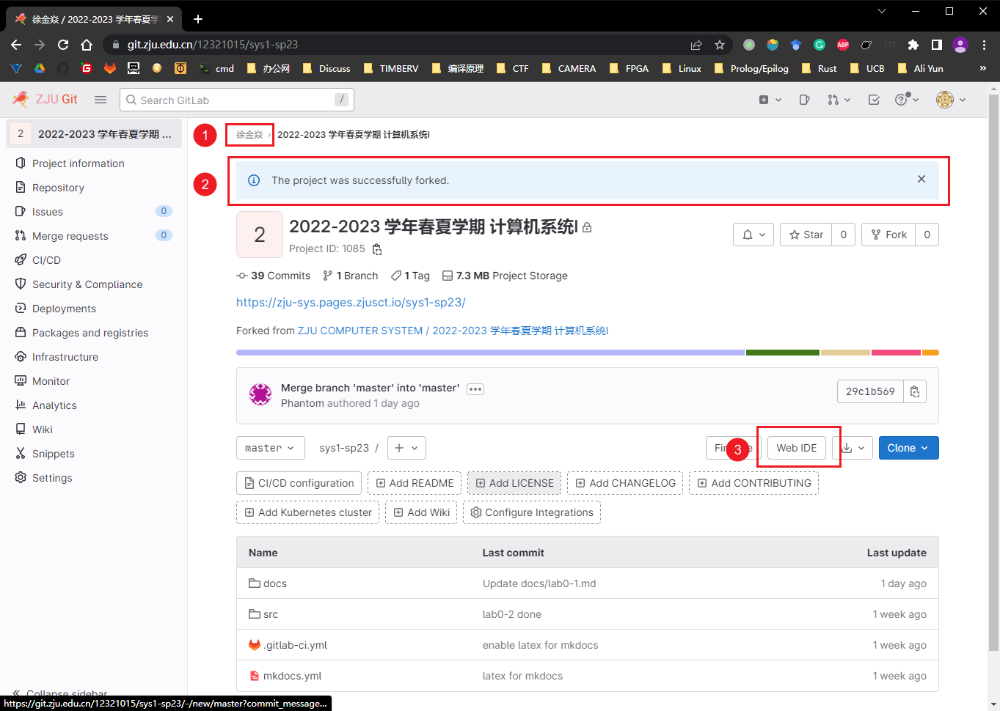
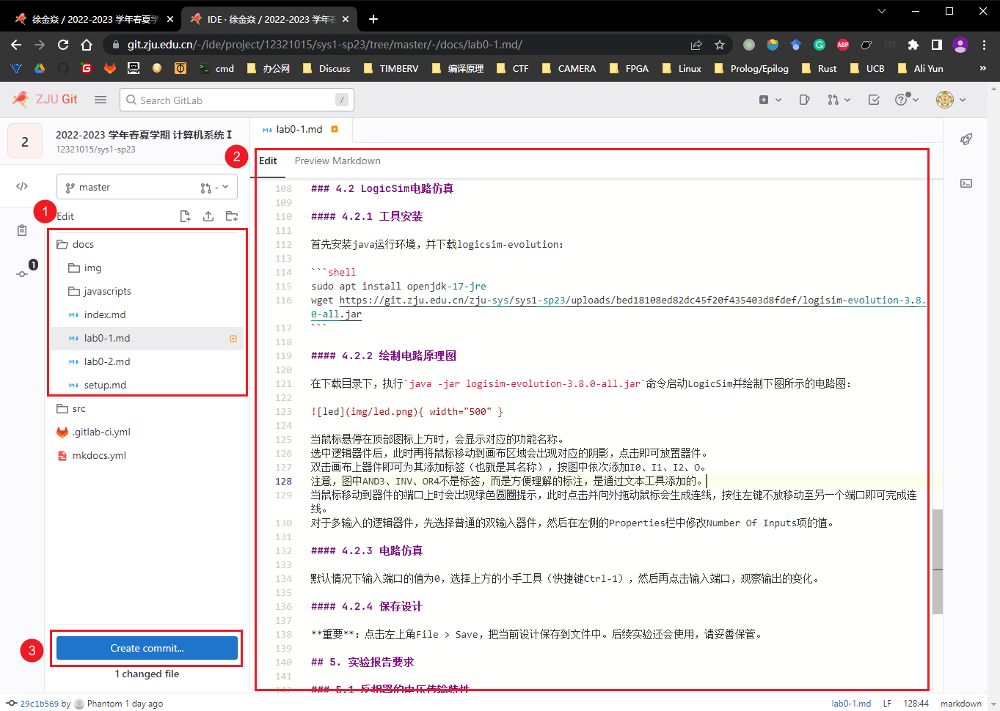
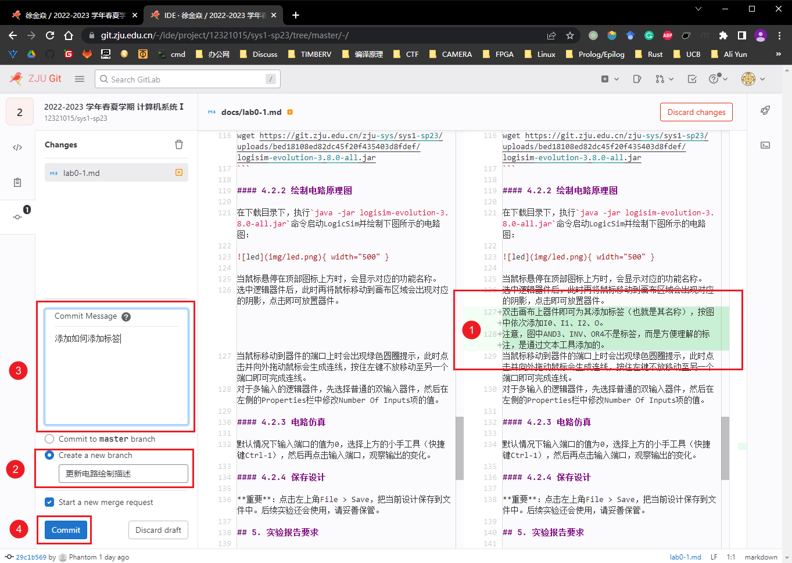
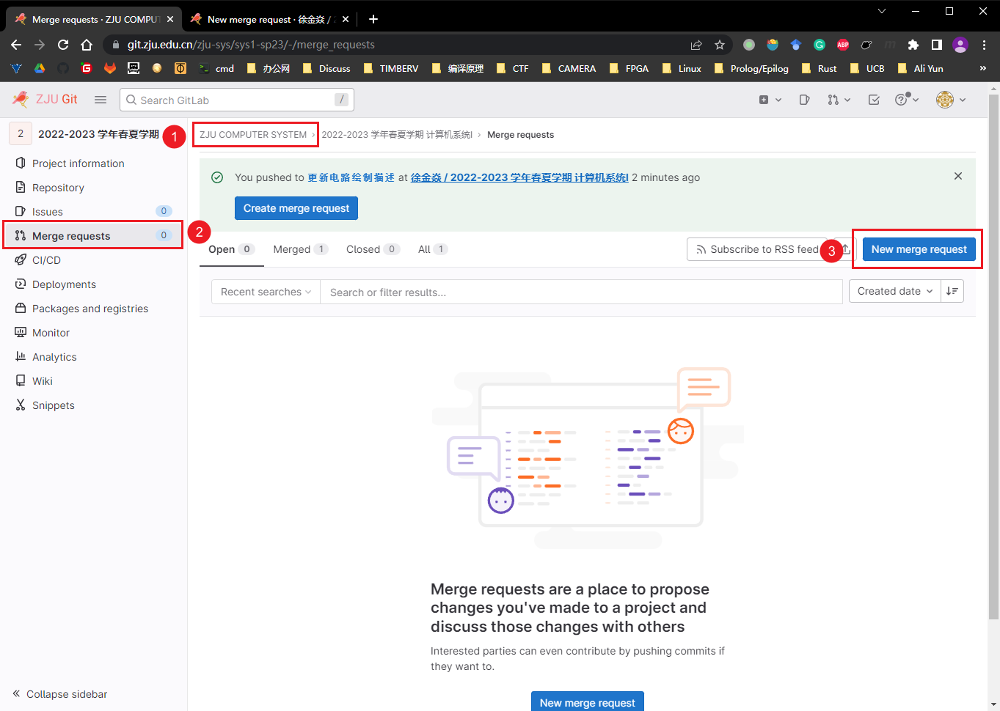
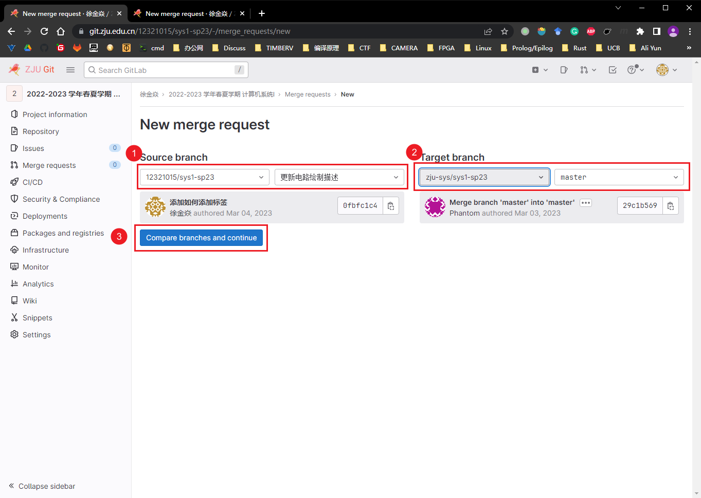
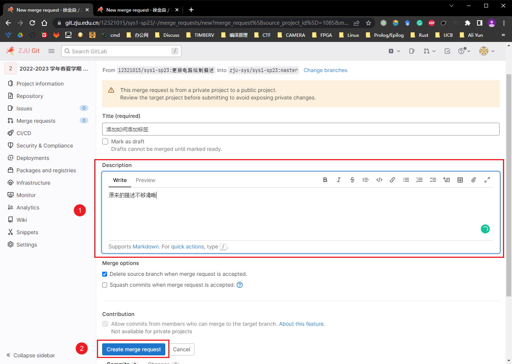

# 如何提交你的修改

首先，我们非常欢迎各位同学向本仓库贡献自己的代码，we ❤ contributor！

1. 在 [ZJU Git](https://git.zju.edu.cn/) 中注册一个账号
2. 接下来进入[仓库](https://git.zju.edu.cn/zju-sys/sys1/sys1-sp{{ year }})页面，我们 fork 一份仓库到你的账户中
    1. 首先检查当前你是否正在浏览 ZJU COMPUTER SYSTEM 账户下的仓库
    2. 无误的话，点击 Fork 按钮即可复刻一份官方仓库到你的账户下

    

3. 在弹出的页面中完成复刻
    1. 选择你的学号，`https://git.zju.edu.cn/<ID>`就是你自己账户下的空间
    2. 点击进入下一步

    

4. 进入网页编辑器
    1. 首先检查当前是否在你的账户下
    2. 你应该会看到复刻成功的消息
    3. 点击进入网页编辑器

    

5. 完成修改
    1. 我们实验手册的原文在`doc`目录下
    2. 在编辑器中添加你的修改
    3. 点击提交修改

    

6. 提交修改
    1. 再次检查你的修改是否无误
    2. 将你的修改提交到一个新的分支上，为这个分支命名
    3. 添加提交的具体信息
    4. 完成提交

    

7. 将你的提交发送到官方仓库
    1. 再次回到官方仓库的页面
    2. 进去 Merge requests 页面
    3. 发起一个和并请求

    

8. 创建和并请求
    1. 选择你的仓库以及你刚刚新建的分支
    2. 选择 zju-sys的sys1-sp{{ year }} 仓库下的 master 分支
    3. 发起请求

    

9. 进一步补充信息
    1. 描述这个和并请求的目的，以及你做了哪些修改
    2. 创建合并请求

    

10. 完成后一个和并请求就成功发起了，如果长时间没有得到 review 很可能是 TA 们没有收到邮件提醒，你可以钉钉私戳或是在合并请求中@他们

通常情况下，你的修改需要经过多次修改才会被上游接受。如果接收到修改意见，请返回第 4 步进行修改，但是不同的是在第 5 步时左上角选择你刚刚新建的分支，第 6 步直接提交到刚刚新建的分支不需要再创建新的了。
