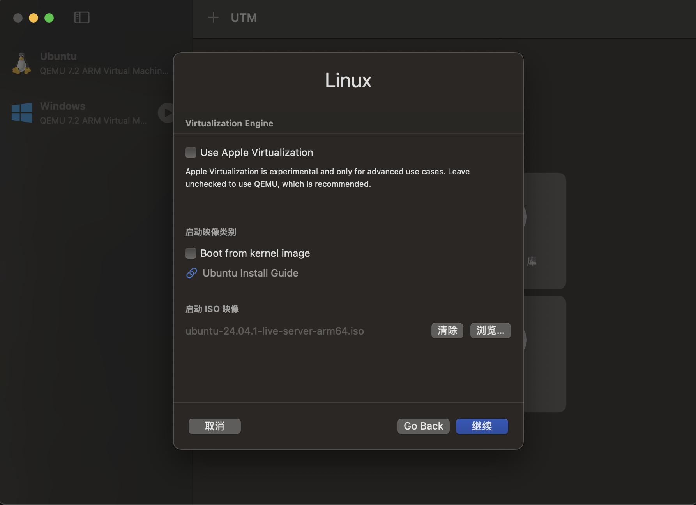
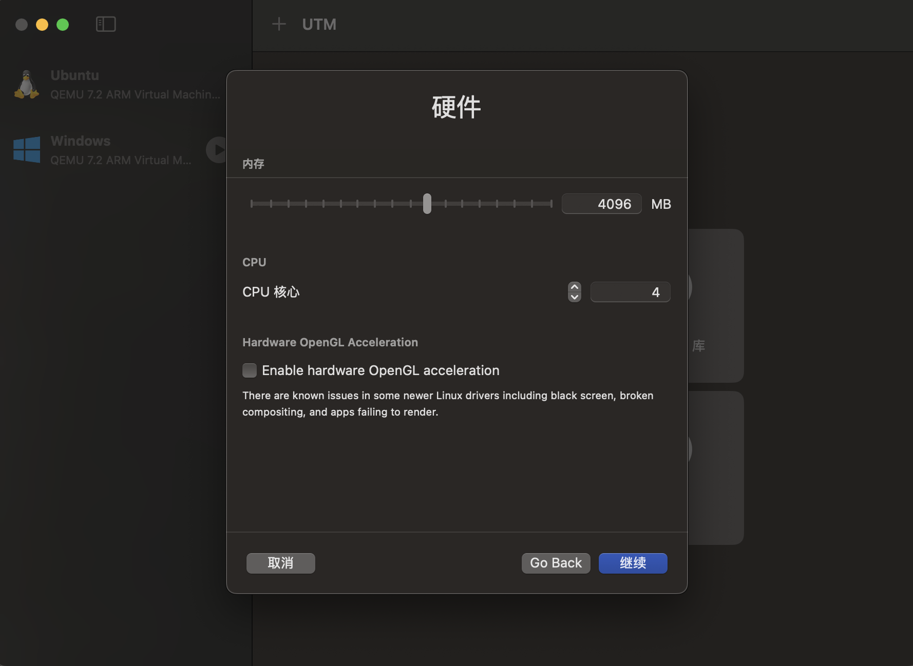
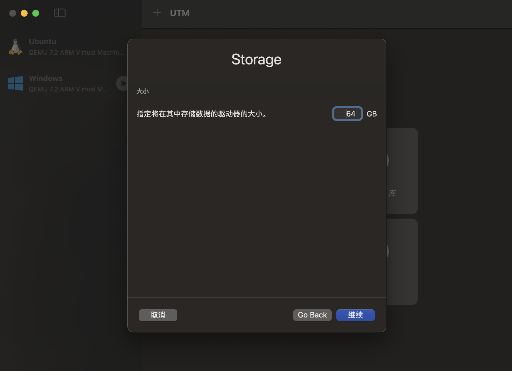
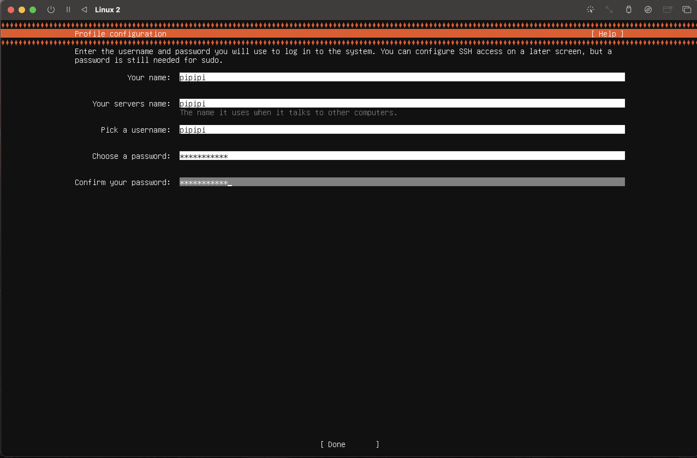
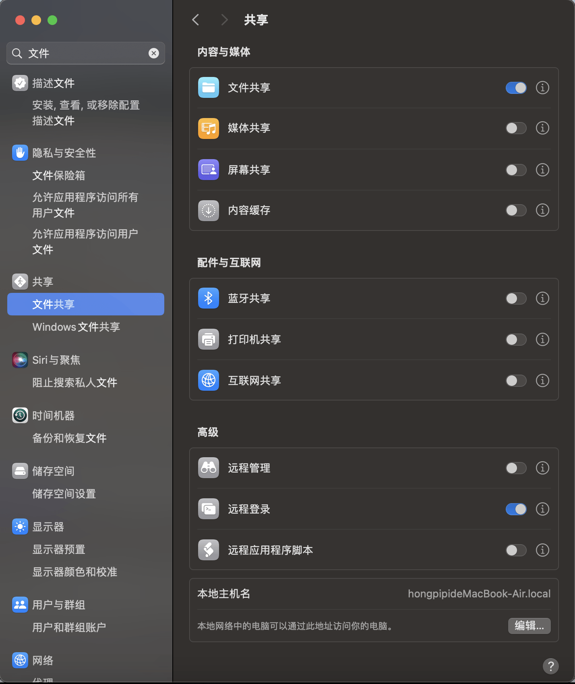
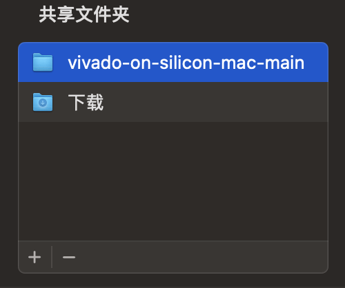
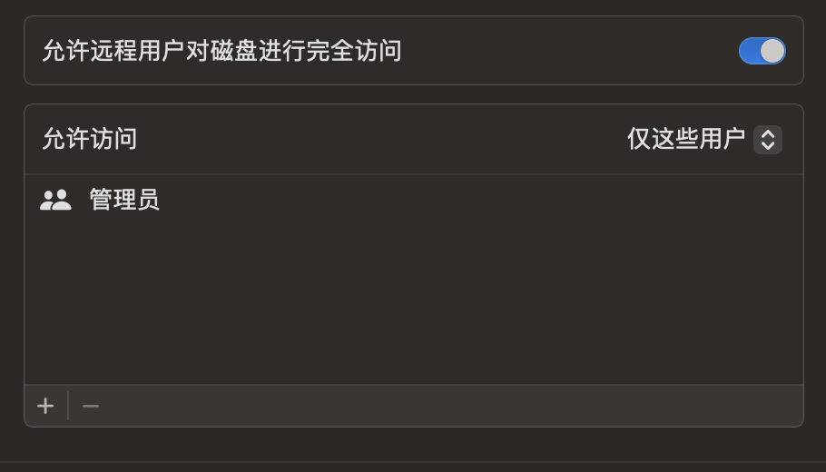
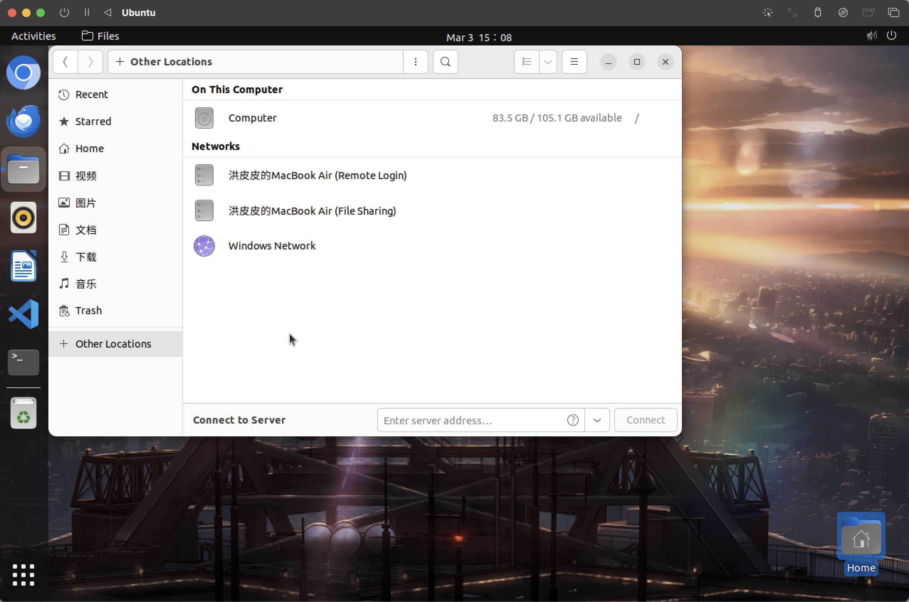
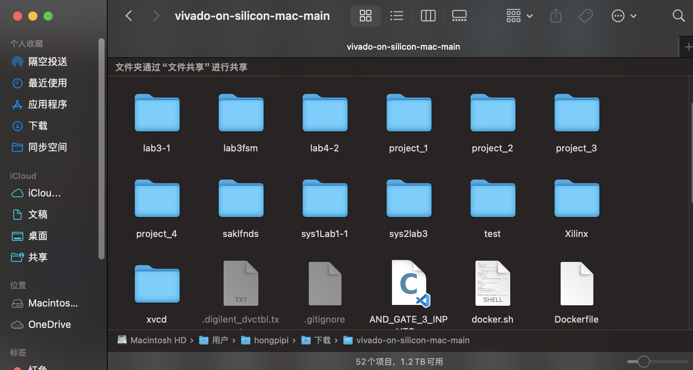
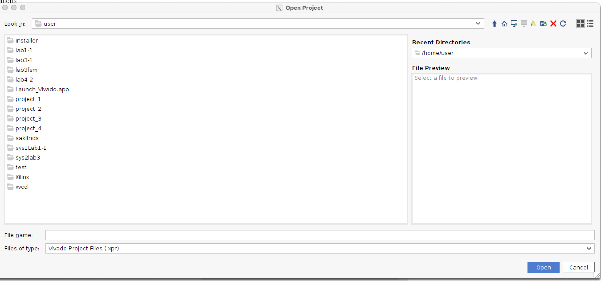

# 实验环境配置 for Apple silicon Mac

!!! Tip 
    这里的环境配置教程仅供参考。除以下介绍方式外也可以尝试使用虚拟机安装 Windows 镜像，此后配置过程可以继续参考 Windows 环境配置教程。

## 【Lab0-1】Linux 环境配置

1. 在 [UTM](https://mac.getutm.app/) 官网下载 UTM，相比起 Virtual Box 和 VMware Fusion，UTM 对 M 系列芯片有较好的支持并且免费开源，你也可以在 App Store 和 GitHub 上下载。**如果你计划使用如 24.04 等较新版本的 Ubuntu 镜像，请确定你同时使用较新版本的 UTM，避免碰到 QEMU 启动失败等问题。**

2. Ubuntu Desktop 的长期支持版目前还没有提供 ARM64 的支持，推荐在安装 Ubuntu Server ARM 后再在终端进行 GUI 的配置。

    === "Step 01"
         在 [Ubuntu](https://cn.ubuntu.com/download/server/arm) 官网下载所需版本的 Server 镜像，在 UTM 中选择创建一个新的虚拟机并选择下载的 ISO 文件。
         
    === "Step 02"
         完成基础配置，注意为了正常使用，你需要预留足够的 CPU 核和内存。此外后续本地文件会不断增加，请确保预留超过 60GB 的磁盘空间。
         
         
    === "Step 03"
         进入虚拟机后，如果没有需求不需要额外配置，一路回车即可。注意中间如寻找代理等过程需要等待后选择 Continue，记住你的用户名和密码。完成安装后选择 Reboot。
         
    === "Step 04"
         如果没有问题，此时会得到一个能够键入指令的终端。参考以下指令进行 GUI 的安装
         ``` shell
         sudo apt upgrade
         sudo apt install ubuntu-desktop
         reboot
         ```

3. 如果没有碰到其他问题，至此 Linux 基本环节配置完成，在 UTM 虚拟机启动界面清除 CD/DVD 内的镜像避免每次启动进入系统安装流程。接下来可以参考 Lab0-1 文档进行实验工具的配置。

!!! Question "设置语言后中文乱码"
    在设置中可以进行系统语言的切换，如果出现火狐浏览器中文乱码可以考虑使用 `sudo snap install chromium` 安装 chromium 进行替代。

## 【Lab0-2】Vivado 安装

!!! Warning
    Vivado 目前没有对 ARM 进行支持，因此使用现成项目已有的 Docker 环境进行转译，但是由于转译层效率等问题，该方案综合等速度较慢，仍建议使用 Windows 设备进行 FPGA 相关开发。可以完全按照 [vivado-on-silicon-mac](https://github.com/ichi4096/vivado-on-silicon-mac) 进行配置，以下仅简单介绍并提供一些可能碰到的问题的解答。

**你需要的环境：** [Docker®](https://www.docker.com/products/docker-desktop/)

1. **Docker需要的一些设置：** 

    - 在设置中第一个选项卡打开 “Use Virtualization Framework”  下的 “Use Rosetta for x86/amd64 emulation on Apple Silicon”，即通过 Apple Rosetta 进行 ARM64 与 x86_64 之间的转译。

    - 进入 Resources 选项卡确保你的 Swap 内存大于 2GB 并分配了足够的硬盘空间和合理的 CPU 核数。

2. **下载[该工具](https://github.com/ichi4096/vivado-on-silicon-mac/archive/refs/heads/main.zip)**，解压后运行以下指令，若出现网络连接和 Docker 镜像拉取错误请参考本节末尾解决方案：

    ```shell
    cd Downloads/vivado-on-silicon-mac-main
    caffeinate -dim zsh ./scripts/setup.sh
    ```


3. 此后只需要按照终端提示操作，结束依赖下载后，将 [Vivado 二进制安装文件](https://www.xilinx.com/support/download/index.html/content/xilinx/en/downloadNav/vivado-design-tools.html) 拖入终端并回车运行。**必须**选择 Linux Self Extracting Web Installer 下载。脚本安装使用 Vivado Batch，过程需要输入你完成注册的 AMD 账户。

4. 终端运行完成之后运行在 Docker 上的 Vivado 配置完成。


!!! Question "运行时工具提示网络连接失败的解决方案"
    === "脚本修改"

         你可能会碰到终端工具开始运行时提示网络连接失败，你可以采取以下两种方法后重试：1. 开启代理；2. 进入 `scripts/set.sh` 文件进行如下修改：

         ```shell
         # validate_internet
         # 在第24行注释掉上述联通性检测代码
         ```
    === "Docker源修改"
         
         上一步关闭了网络检测，但在校网拉取 Docker Ubuntu 镜像可能会出现无法访问的问题。推荐修改 Dockerfile 从镜像源拉取，也可以考虑自行修改 Docker 内的配置文件，这种方法这里不作说明。进入 `scripts/Dockerfile` 进行以下修改：

         ```shell
         # Container for running Vivado on M1/M2 macs
         # though it should work equally on Intel macs
         FROM --platform=linux/amd64 docker.m.daocloud.io/ubuntu:22.04
         # 修改为从镜像源拉取 Ubuntu，可以自己使用别的国内加速源，这里仅供参考
         ```

## 【上板&验收】Bitstream烧录

!!! Info
    在 Docker 里暂时无法直接与开发板通信，因此没法完成烧录 bitstream 的过程。[openFPGALoader](https://github.com/trabucayre/openFPGALoader) 是一个开源项目，实现了直接通过终端与开发板通信并烧录 bitstream。我们所使用的开发板在[支持列表](https://trabucayre.github.io/openFPGALoader/compatibility/board.html)中。

1. 确保你的开发板已经连接至 Mac，启动一个终端后执行以下指令：

```shell
#安装
brew install openfpgaloader
#烧录程序 以我们所使的FPGA开发板为例
sudo openFPGALoader -b nexys_a7_100 /path/to/name.bit #烧录进SRAM
sudo openFPGALoader -b nexys_a7_100 -f /path/to/name.bit #烧录进FLASH
#sudo并不是必须的，但是在不用sudo的情况下有一定概率产生访问拒绝报错
```

2. 此时再观察你的开发板，如果没有其他错误你应当发现程序已经被正确地烧写到了开发板上。

## 【日常使用】文件共享

!!! Info
    在上述的所有步骤中涉及了虚拟机, Docker, macOS 三种环境，接下来介绍如何在这三种环境下进行文件共享方便日常实验。

### Ubuntu 与 macOS 的文件共享

1. 进入 **设置 → 共享 → 文件共享/远程登录**，你可以打开这两个中的任意选项，如下所示，远程登录能够允许你直接访问整个硬盘，而文件共享则允许你访问特定的目录

    === "设置-共享"
 
          

    === "文件共享"

          

    ===  "远程登录"

        


2. 进入 Ubuntu 虚拟机，进入 **Home → Other Locations**，现在点击后输入 Mac 的用户密码即可直接访问 Mac 的文件系统，从而实现 macOS 与 Ubuntu 的文件共享。

    

### Docker Vivado 与 macOS 的文件共享

   Vivado 所运行的 Docker 容器将 `/path/to/vivado-on-silicon-mac` 挂载到了容器中的 `/user/home` 目录，在知道这个对应关系后，你可以很方便地转移数据。

===  "macOS"
    找到该 repo 在磁盘中的路径
    

===  "Vivado in Docker"
    可以看到 repo 目录被挂载到了 Docker 中的用户家目录
    


!!! Warning

     后续仓库中提供的 Vivado Batch 脚本并不能比较方便地用于这个封装的 Vivado 容器，因为对于这个 Docker 容器中的 Vivado，比较容易接触到的只有这个 GUI 界面。所以采用这种方式的同学可能需要参考 Lab0-2 手动进行导入源文件 - Synthensis - Implementation - Generate bitstream 的流程。
