# 实验环境配置

## 【Lab0-1】Linux 环境配置

!!! Tip 
    这里的环境配置教程仅供参考。网络上有很多关于 WSL/虚拟机的安装教程，可以根据自己的情况选择合适的方案。如果安装过程中遇到错误，可以参考[往届同学的问题(GitLab Issue)](https://git.zju.edu.cn/zju-sys/sys1/sys1-sp24/-/issues/?sort=created_date&state=all&first_page_size=20)。

以下两种方案任选其一：

### 方案一 WSL

1. 首先直接在应用商店中搜索 Ubuntu 24.04，安装如图所示的应用。

    === "Win11 商店示例"
         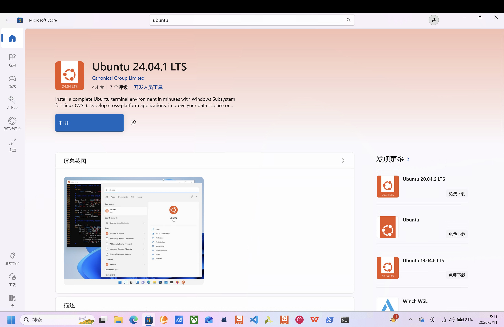
    === "Win10 商店示例"
        !!! Warning "注意" 
            请下载24.04版本而非图中的22.04版本！
         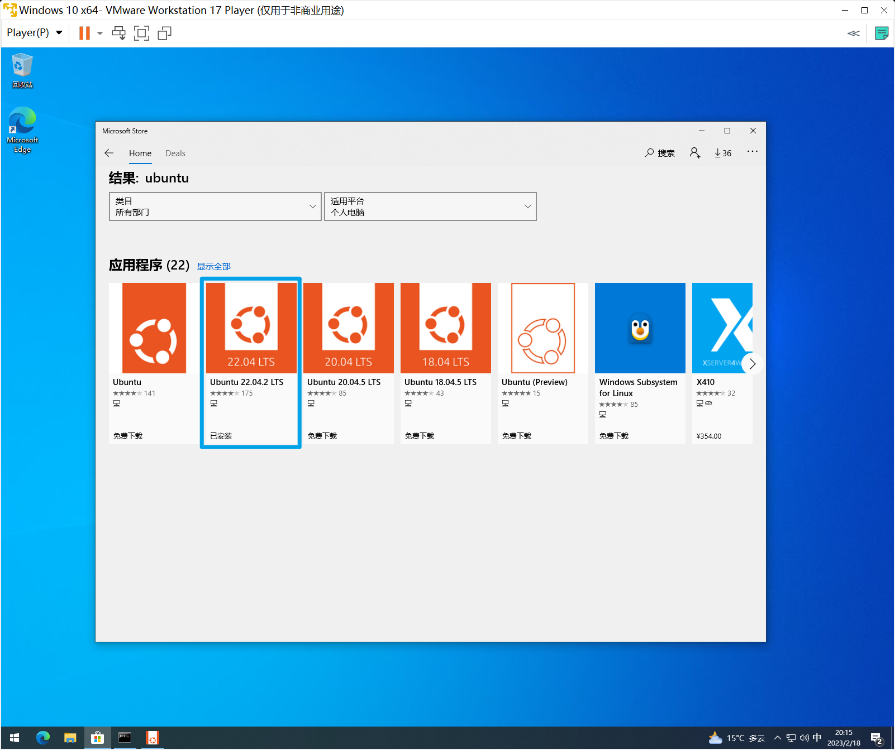

2. 启动 WSL 应用来进入 WSL 自带的终端界面：

    !!! Warning "如果终端出现错误代码"

        在这一步你可能会碰到一些带有 "0x..." 形式的错误代码。请注意，错误代码并不是 Magic Number，其存在是为了方便寻找解决方案，搜索错误代码通常能够很方便的找到你问题的解决方案。这里提供几个常见的错误代码的解决方案（仅供参考）：

        === "0x8007019e"

            你需要开启 Windows Subsystem for Linux，在 Powershell 输入以下指令中的任意一组：
            ``` shell
            dism.exe /online /enable-feature /featurename:Microsoft-Windows-Subsystem-Linux /all /norestart
            dism.exe /online /enable-feature /featurename:VirtualMachinePlatform /all /norestart
            :: Or
            Enable-WindowsOptionalFeature -Online -FeatureName VirtualMachinePlatform
            Enable-WindowsOptionalFeature -Online -FeatureName Microsoft-Windows-Subsystem-Linux
            ```

            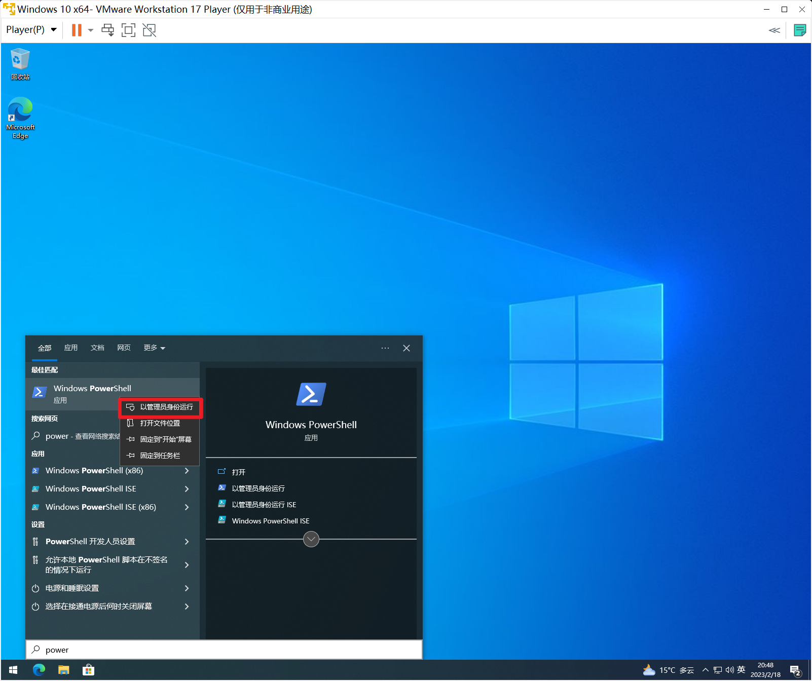

            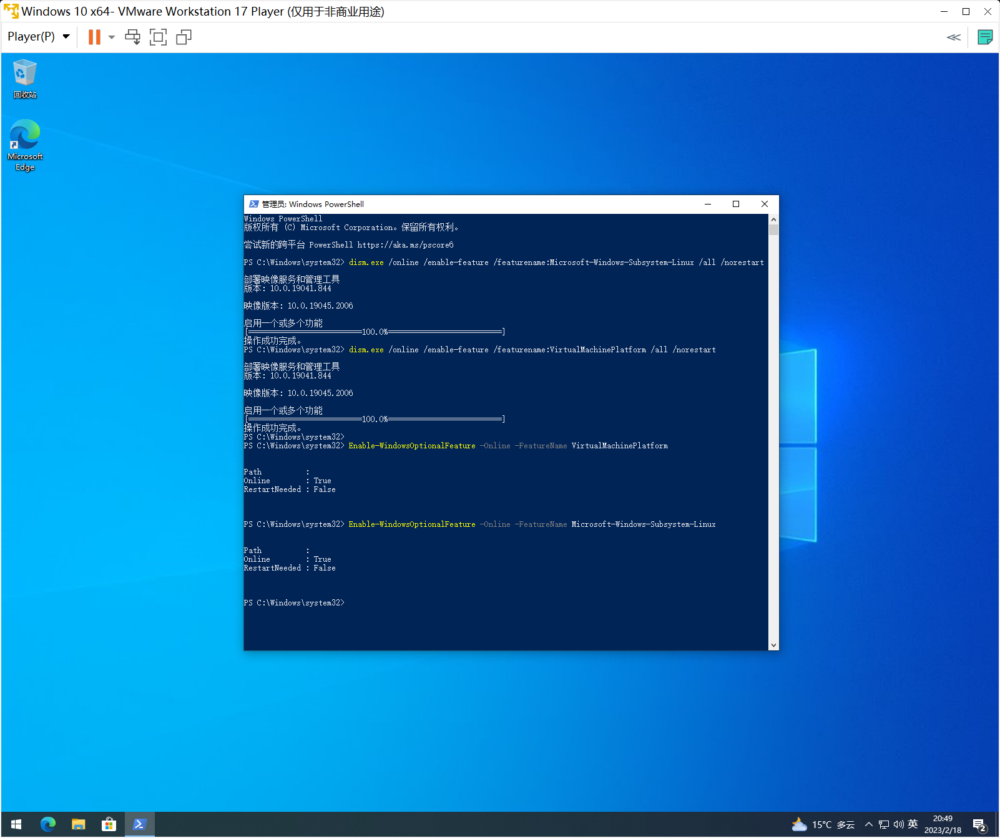
        === "0x800701bc"

            如果你在 Win11 设备上碰到这个问题，解决方案与前一个错误相同。如果无效，尝试使用 `wsl --update` 更新 WSL 版本。

    首次进入 WSL 需要设置默认用户，请记住你的用户名和密码，日后使用 `sudo` 指令时需要密码，如果你误设了密码在 Powershell 中通过以下指令来重置密码：

    ```shell
    wsl.exe --user root
    # 此时你应当以 root 身份进入了 WSL
    ls /home
    # home 目录底下的文件夹名字即为你的用户名
    passwd yourUserName
    ```

    如果没有其他错误，你会看到一个带有用户名、主机名以及当前路径提示的终端：


    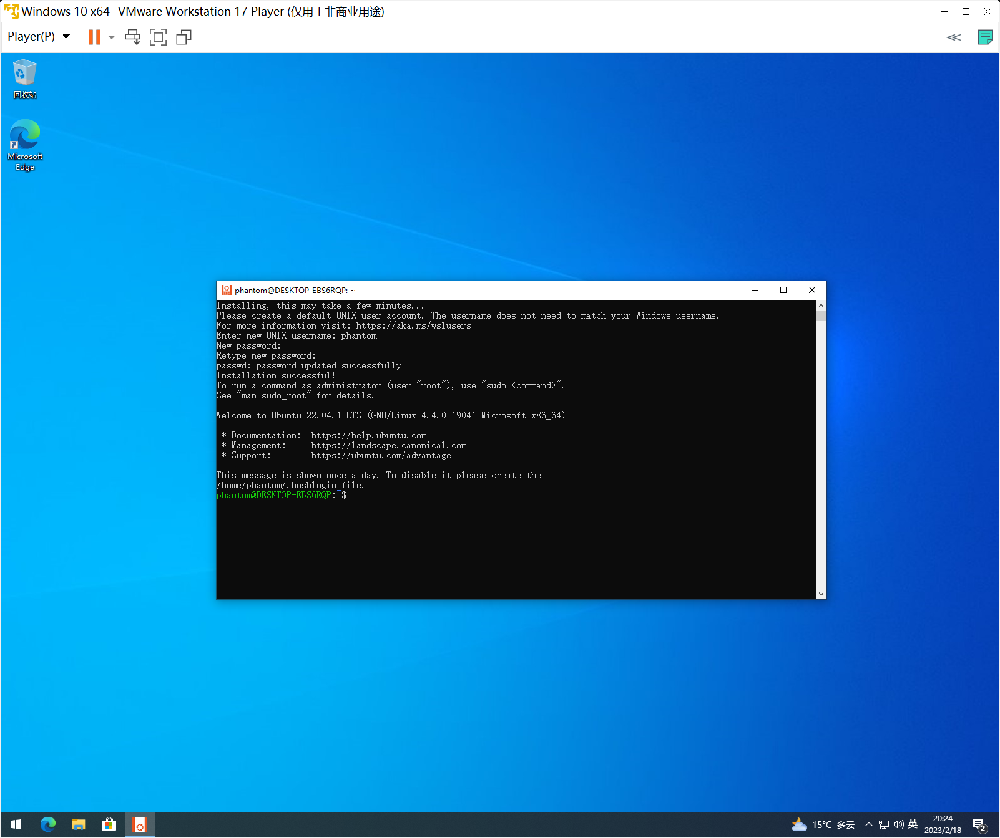

    !!! Tip "关于 Root 用户"
        你可能发现你的终端并非显示的 `username@xxx`，而是 `root@xxx`。这代表你的某些操作使你以 Root 身份进入了系统。Root 用户默认拥有最高权限，在我们的实验中并不会有任何影响。**但一直使用 Root 是不安全的**，缺少执行 `sudo` 指令前的确认可能造成严重的误操作，此外，虽然我们的实验环境不需要，但确实存在一些软件包是不允许在 Root 用户下安装的。你可以参照网络教程创建一个用户，并将其设为 WSL 的默认用


3. 接下来配置 WSL 的图形化界面，为了方便起见，我们选择升级 WSL1 为 WSL2 的方式。
    - 按顺序执行下面的指令，首先先检查下你的 WSL 的版本，如果是 WSL1 继续执行剩余命令；
    - 如果已经是 WSL2 了，越过第二条命令直接执行第三条命令即可，执行的过程中可能会报错要求你打开一个Windows的更新选项。

    ```
    wsl --list --verbose
    wsl --set-version Ubuntu-24.04 2
    wsl --update
    ```

    如果执行第二条指令遇到图中的错误，说明你需要进入 BIOS 中将处理器的虚拟化功能打开。
    
    请根据你正在使用的主板厂商自行检索如何进入 BIOS，进入 BIOS 后 AMD CPU 找 AMD Secure Virtual Machine (AMD SVM) 选项开启，Intel CPU 找 Intel Virtualization Technology (Intel VT-x) 选项开启。

    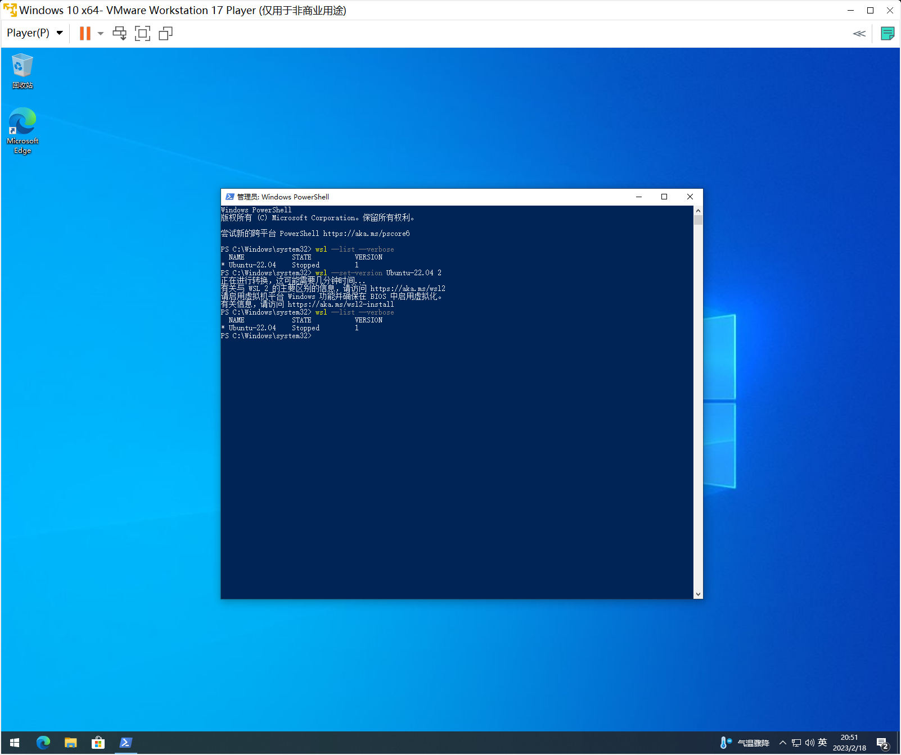


4. 接下来我们测试图形化功能是否生效，在 WSL 中输入以下命令：

    ```shell
    sudo apt update
    sudo apt install x11-apps
    xeyes
    ```

    如果没有错误结果如下：
    
    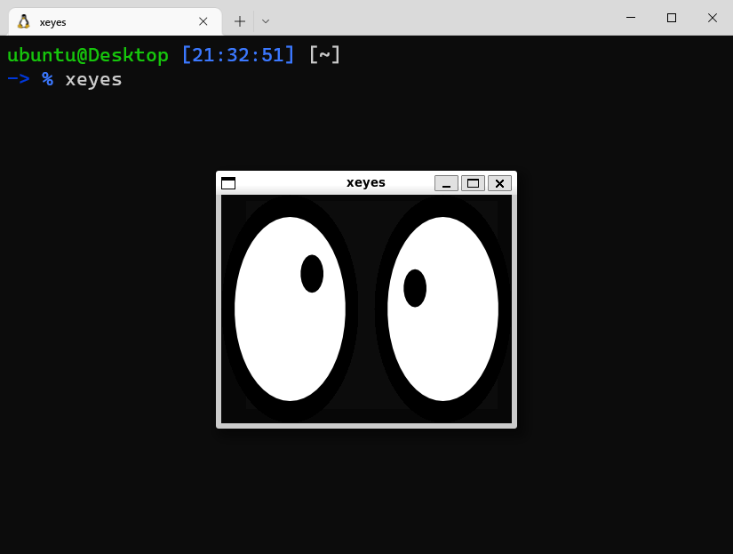

    如果产生 `Error: Can't open display:` 的报错，请确保你是否完成第三步。


### 方案二 虚拟机

1. 从[官网](https://releases.ubuntu.com/24.04/)下载[桌面版镜像](https://releases.ubuntu.com/24.04)
2. 下载虚拟机软件，[VMware Workstation Player](https://www.vmware.com/products/workstation-player/workstation-player-evaluation.html) 或者 [Virtual Box](https://www.virtualbox.org/wiki/Downloads) 均可。
3. 虚拟机软件的使用方法类似，下面以 VMware 为例。首先新建虚拟机，并选择下载的镜像文件：
    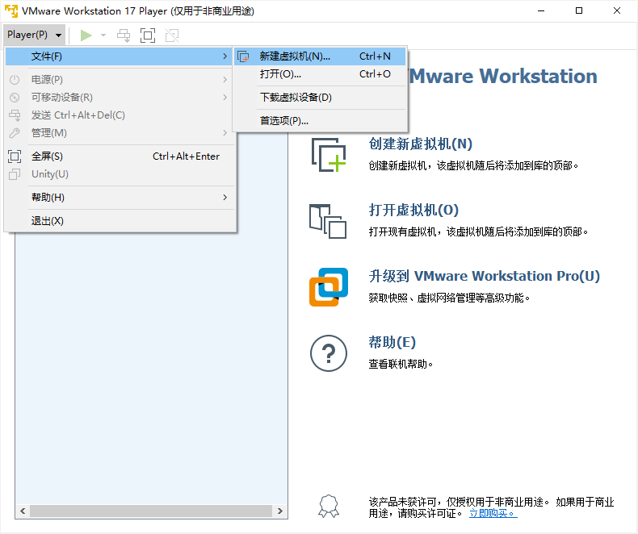
    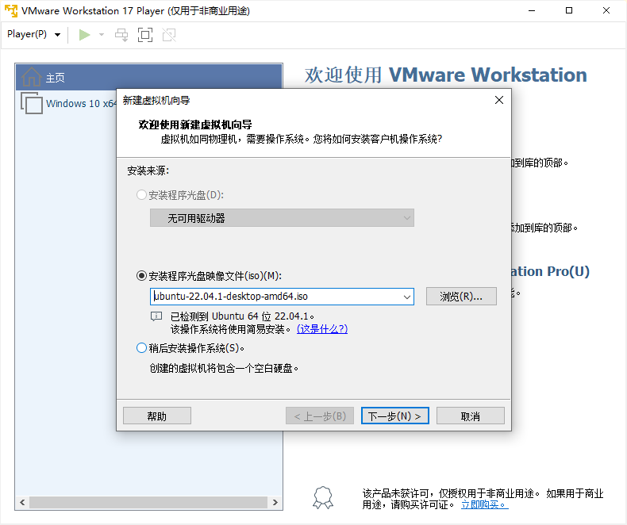
4. 有的软件可能会触发简易安装的功能，输入用户名和密码即可，
    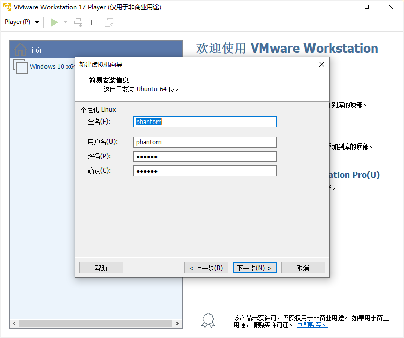
    如果使用其他软件没有触发此步也没关系，在后续的安装过程中会像下图一样要求你再次输入的，
    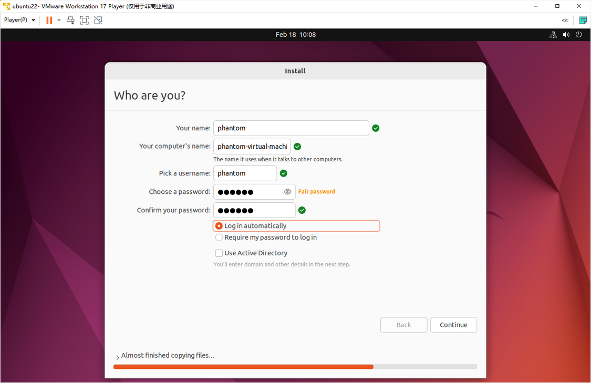
5. 将虚拟机的路径修改到空余空间较大的盘上，并且为它分配 50GB 以上的空间。如果你打算将 Vivado 安装到虚拟机上（使用 Mac 的同学必须这么选择），那么需要至少分配 100GB。等到空间不够再去扩容会比较麻烦，建议提前划分出足够的空间。
    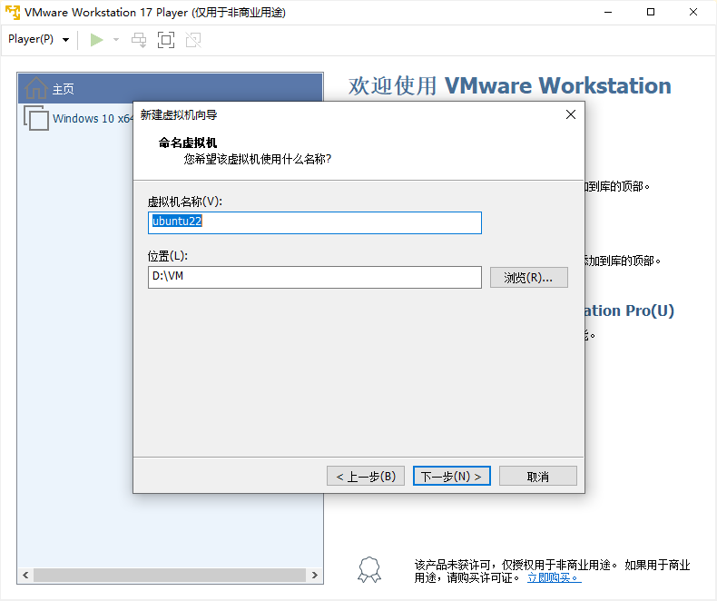
    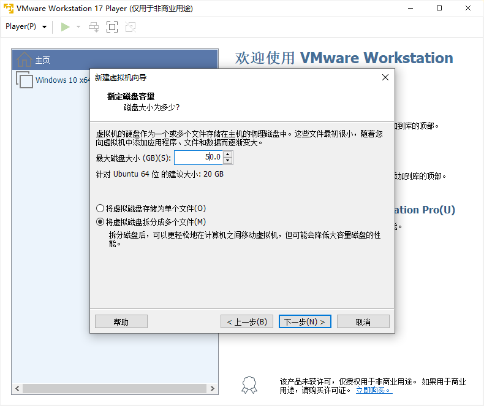
6. 选择最小化安装，并在下一步中选择擦除整个磁盘安装。
    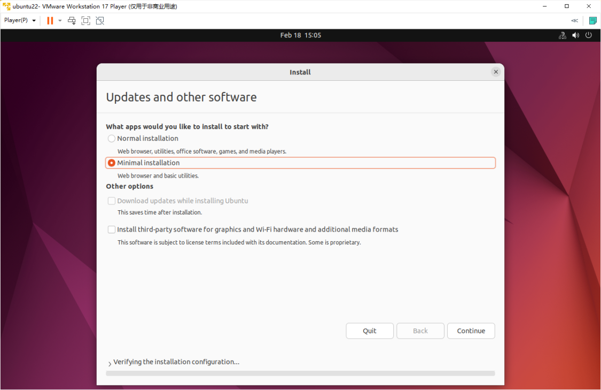
    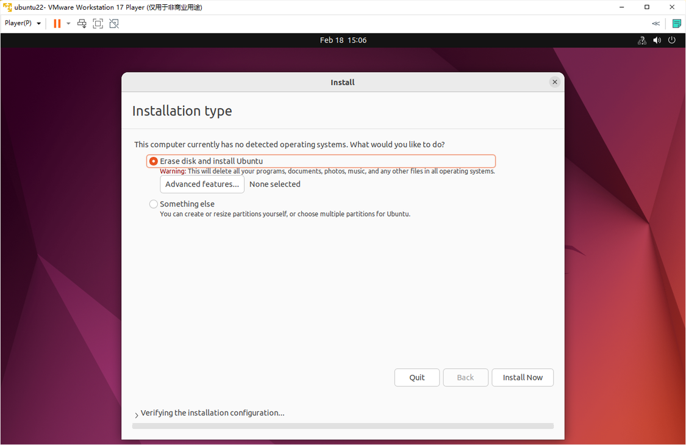
7. 安装成功后打开一个终端，执行命令 `xeyes`，效果如下：
    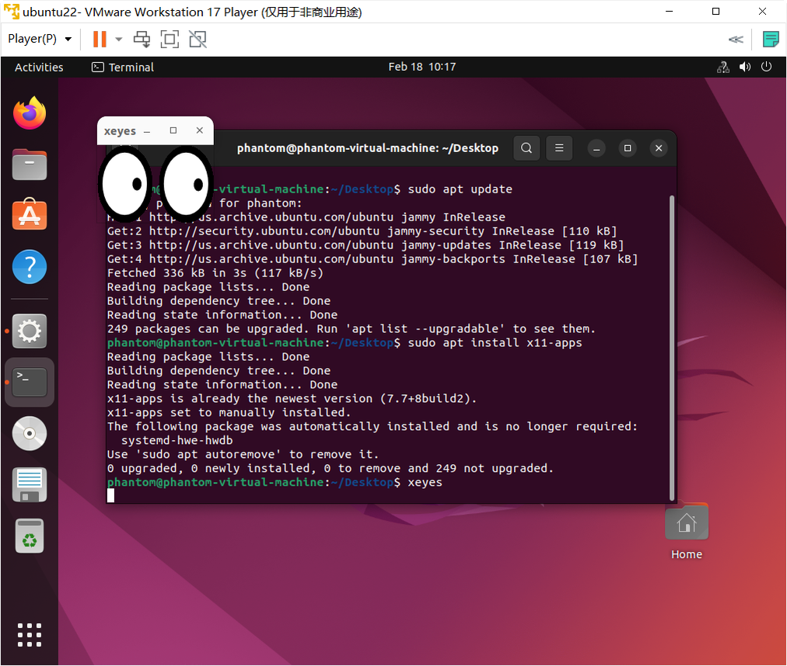

## 【Lab0-2】Vivado 安装

1. 从[官网](https://www.xilinx.com/support/download.html)下载 Vivado ML Edition 2022.2。
    - 如果系统空间不足，可以选择 Windows Self Extracting Web Installer 使用在线下载工具，下载过程需要保持联网。
    - Linux 下选择 Linux Self Extracting Web Installer，下载后在终端输入 `sh <download file name>.bin`，下载过程同样需要保持联网。
    - 如果空间足够，选择最大的 Xilinx Unified Installer，下载后进行解压，解压后双击 xsetup.exe 进行安装。
    - Linux 下在终端中执行 `sh xsetup`。若默认 shell 并非 bash 可能会遇到 `Bad substitution` 报错，可尝试 `bash xsetup` 或设置可执行后执行 `chmod +x xsetup && ./xsetup`。
2. 此处选择 Vivado。
    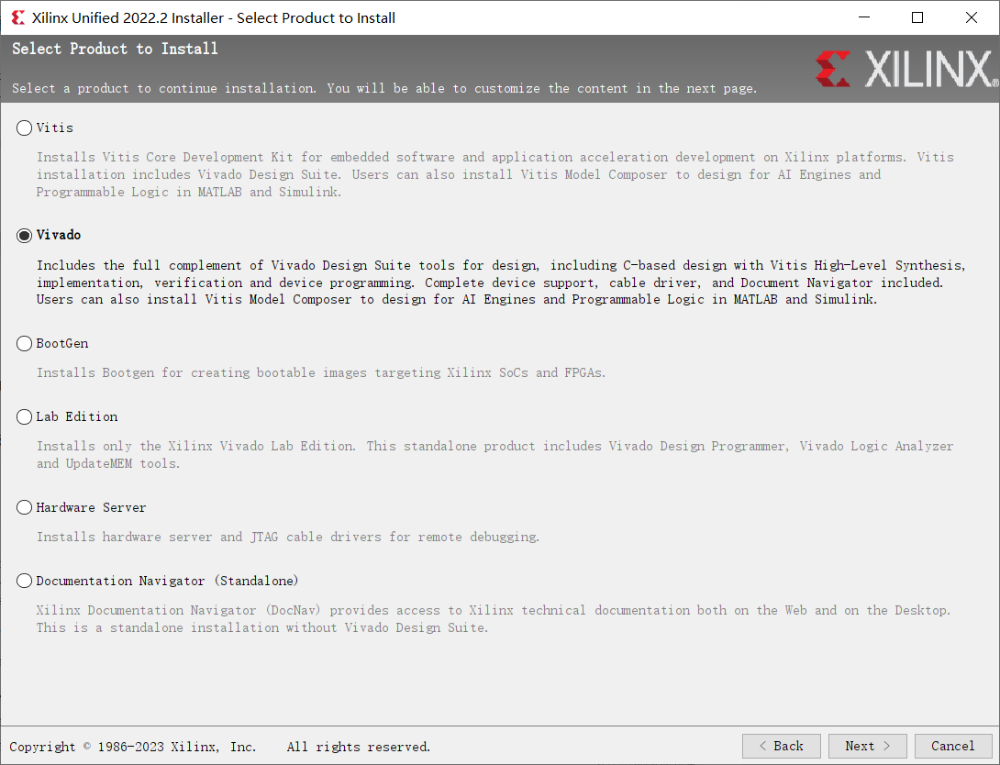
3. 此处选择 Standard。
    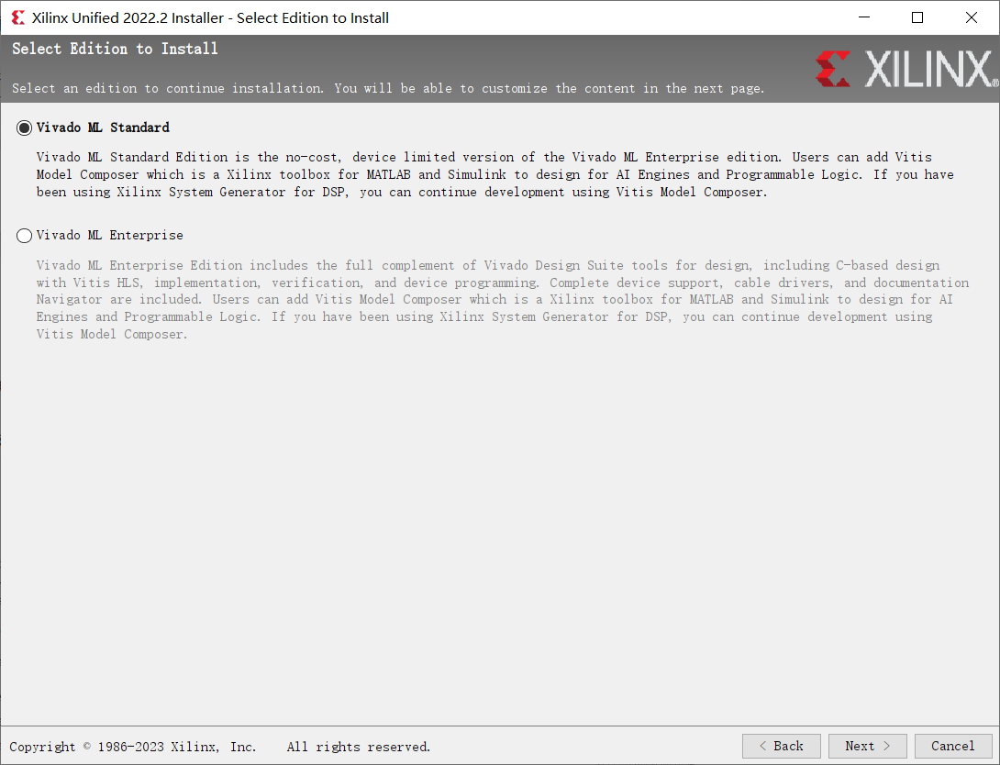
4. 选择需要的组件（以下为必须勾选）：Design Tools(Vivado Deign Suite, DocNav); **Devices(Artix-7)**; Installation Options(Install Cable Drivers)。如果你之后需要使用其他型号的设备，可以通过 installer 补充下载，不必要一次全部安装(可以查看 [Xilinx-Support-60112](https://support.xilinx.com/s/article/60112))。
4. 此处修改为你的路径。
    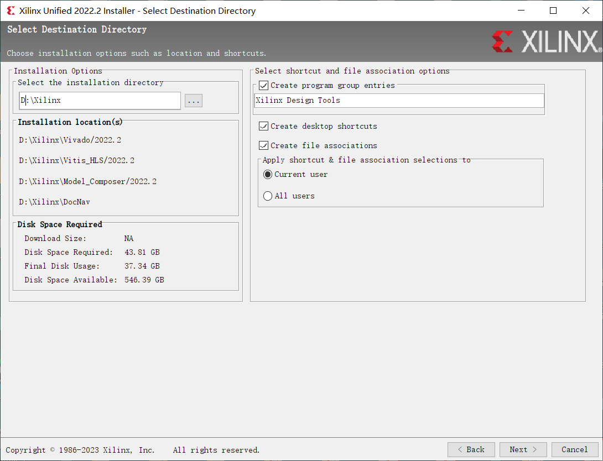
5. 安装完成，你可以直接从桌面的图标启动 Vivado。

我们后续的的实验主要使用命令行的方式，方式如下：

- Windows 在 CMD 中先加载 Vivado 安装目录下的设置文件 settings64.bat，Linux 下为 `source .../settings64.sh`。
- 然后直接输入 `vivado` 即可。

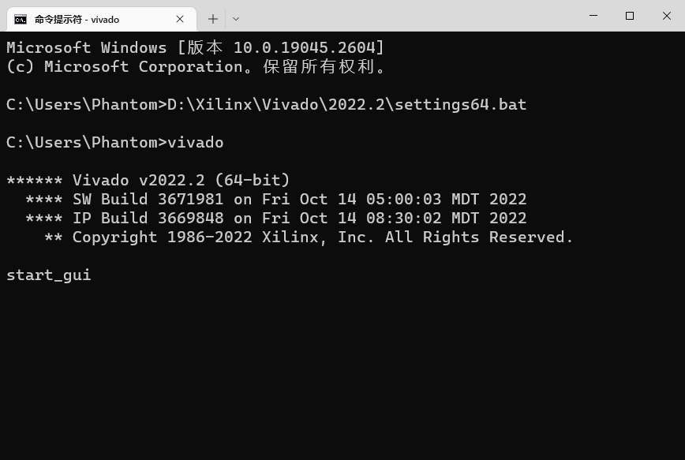